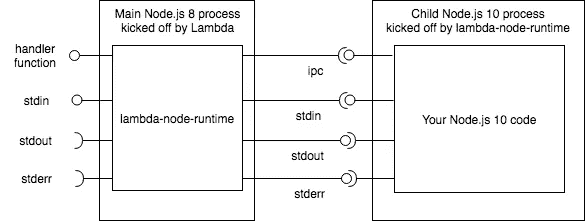

# 所以我还是不能在 AWS Lambda 上运行我的 Node.js 10 代码，是吗？

> 原文：<https://medium.com/hackernoon/so-i-still-cant-run-my-node-js-10-code-on-aws-lambda-or-can-i-d2a9e8b1eeec>

这是一个非常普通的工作日，在办公室里，我听到我的同事默默地抱怨，他希望他能在他的 AWS Lambda 代码中使用 async/await JS 语言特性。不好的是那个时候(2018 年 3 月)你只能在 Lambda 上运行 Node.js 4 和 6 代码。好消息是 Node.js 8 支持很快被引入 Lambda(那是 2018 年 4 月的 2^nd ),看起来这个问题已经消失了。但随后 Node.js 10 几乎立即推出(2018 年 4 月，24^th ),推出了另一组有吸引力的语言和运行时功能，如 ECMAScript 模块或工作线程。这次 Lambda 支持 Node.js 10 还要等多久？等等——看起来已经有办法在 Lambda 中使用 Node.js 10 了。让我带你去那里。

# 巴别塔不就是答案吗？

Babel 是一个伟大的项目，它支持最新的 JS 语言技巧，比如前面提到的 ECMAScript 模块。要使用它，你要为 Node.js 10 写一些代码，然后让 Babel 把它转换成当前 Lambda 能理解的东西。突然你意识到这并不容易。

下面是一段使用 async/await 的代码:

```
const { map } = require('async');const someFunction = async (users) => {
  const start = new Date();
  const results = await promisify(map)(users, (async user => {
    const promisedUser = await Promise.resolve(user);
    ...
    return something;
  }));
  return new Date() - start;
}
```

传输后，`start`变量被放入`async call`函数范围，并且对于`new Date() — start`表达式不可达。transpiled 代码还有更多类似的问题——非常类似于上面讨论的问题，有些只与 async/await 有关。我同意通过牺牲一些语法上的好处来克服所有这些问题是可能的。就我个人而言，每次我被迫这样做时，我都感觉很糟糕。

# 救援的第三方模块

我现在应该谈论在 Lambda 上启动 Node.js 10，然而，为了完成有人想要这样做的可能原因的列表，我必须简要地提到第三方模块。我的意思是，HTTP/2 是 Node.js 10 的顶级特性之一，然而，第三方 HTTP/2 模块已经存在 5 年了。还有第三方模块可以覆盖工作线程或保证你的回调函数。另一方面，从长远来看，现在选择其中一个模块可能不是一个好的决定。最后，只有最新的 Node.js 版本才可能需要使用最新的 V8 或 libuv 版本。

# 而不是那个幼稚的 Node.js 子进程

因此，让我们最后来看一下我之前尝试在 Lambda 中生成子进程的要点。例如，我可以在 Lambda 的子进程中启动 Headless Chromium。当然，这种方法的问题是 Chromium 二进制文件的大小超过 50 MB(不适合 Lambda 部署包)，所以一旦 Lambda 函数启动，它就必须从 S3 下载二进制文件，这意味着整个过程变得很慢。更不用说铬工艺要消耗几百 MB 内存。好的一面是 Node.js 不是 Chromium，它看起来可能与 Chromium 不同，足以在子进程中高效运行。

Node.js 很小。它的压缩大小小于 10 MB。在 Lambda 术语中，有超过 40 MB 的空间留给你的代码(Lambda 包的限制是 50 MB)。

Node.js 起步快。我找不到任何好的资料来支持这种说法，但从少量的[核心模块](https://nodejs.org/dist/latest-v8.x/docs/api/)和广泛使用的第三方模块如`[nodemon](https://www.npmjs.com/package/nodemon)`来看，这应该是显而易见的。用 Lambda 术语来说:新进程一启动，我的 JS 代码就被执行。

Node.js 只消耗运行应用程序所需的内存。如果应用程序很小—内存消耗很小。我在我的 Linux 机器上运行了`node`命令(打开 Node.js shell ),它消耗了 7.5 MB。用 Lambda 术语来说:7.5 MB 与你的函数可以分配的最小内存量(128 MB)相比并不算多。

现在让我们把和平结合在一起:

1.  Node.js 10 与您的 js 代码捆绑在一起，成为一个 Lambda 部署包。
2.  在最初执行 Lambda 函数时，会产生一个子进程来启动捆绑的 Node.js 10 运行时。
3.  Node.js 10 子进程执行你的 js 代码。

我敢肯定，相当多的 Lambda 粉丝已经想到了这个想法，但是，我在网上找不到任何形式的这个想法(确切地说是 NPM)。因此，我很自豪地向您介绍一个名为`lambda-node-runtime`的开源 NPM 模块。

[](https://www.npmjs.com/package/lambda-node-runtime) [## λ-节点-运行时

### 在 AWS Lambda 上运行任何节点版本

www.npmjs.com](https://www.npmjs.com/package/lambda-node-runtime) 

下面的模式总结了`lambda-node-runtime`的架构。它充当代理，使用 IPC 和通过 stdin、stdout 和 stderr 通道的所有 I/O 流量(Lambda 在 Linux 环境中运行您的代码)，将处理程序函数调用传递到您的 Node.js 10 代码。由于代理的透明性，你的代码感觉像是由 Lambda 直接运行的。



lambda-node-runtime spawns a Node.js 10 child process and proxies handler function invocation (via IPC) and all I/O transparently

请随意在 [README.md](https://www.npmjs.com/package/lambda-node-runtime) 或源代码(真的没有那么多)中找到所有具体细节，以了解 Lambda 函数的适用性。有一些事情你需要知道，所以[基准](https://www.npmjs.com/package/lambda-node-runtime#benchmarks)部分讨论了在你的 Lambda 函数中使用模块的一些含义。

# 它有前途吗？

Node.js 10 最终会来到 Lambda，所以请所有等待的人(最新的 LTS Node.js 版本的介绍是在连续两年的 4 月进行的，所以很有可能在明年 4 月在 Lambda 中看到 Node.js 10)。矛盾的是，JS 语言发展很快，因此 Node.js 不断发布新版本。看来 Lambda 的粉丝将不得不一次又一次地在 Lambda“门口”排队等待最新的 Node.js 版本。直到事情稳定下来。在等待的同时，让我们看看 Lambda 用户是否会发现`lambda-node-runtime`模块有用。