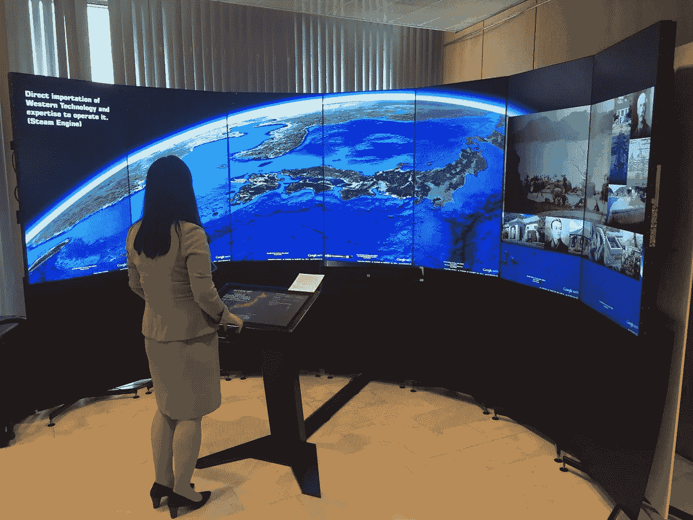

# 所以我刚刚决定参加谷歌代码…

> 原文：<https://medium.com/hackernoon/so-id-just-decided-to-participate-in-google-code-in-da7f8674e14d>

…最后赢了。或者成为赢家之一。呃，随便吧。

等等，谷歌代码——到底是什么？

[代码输入](https://codein.withgoogle.com)。我们只能说这是一场非常、非常、非常、非常(我想你明白了)棒极了，更重要的是，有趣的比赛，通过它你可以赢得 t 恤、帽衫，甚至是去加州[谷歌](https://hackernoon.com/tagged/google)总部的旅行。；)

但是最好的部分不是这些…

什么？告诉我！

…它开始了解一种叫做[开源](https://en.wikipedia.org/wiki/Open-source_software)的东西。

**‘凯’。这是什么？**

开源软件是源代码[是“开放”的软件。或者更确切地说，提供给“研究、改变和分配”。为开源做贡献不仅有趣——你还可以结识新朋友，看到你的代码在一个“真正的”项目中工作——实际上可能有数百万人在使用它！](https://hackernoon.com/tagged/code)

**那么，你参与的时候要做什么呢？**

任务。他们通常有 3 天的分配时间，并围绕 5 个领域中的一个或多个——代码、用户界面、文档/培训、质量保证、推广/研究。因此，即使你一生中没有写过一行代码，或者刚刚开始编写代码，Code-In 也是最好的学习场所！

有很多不同的组织，你可以选择他们的工作。

我大部分时间都在与 [**液态银河**](http://liquidgalaxy.org/) 合作，这是一个为这样的设备开发软件的组织

很棒，对吧？

这是我做的一些很酷的东西—

*   [制作液体星系的 Docker 容器图像](https://codein.withgoogle.com/archive/2017/t/6031027761840128/)
*   [外部化外部项目的创建在 Android 控制器上启动任务](https://codein.withgoogle.com/archive/2017/t/6484885713715200/)
*   [通过 Android 控制器以类似于 3d 控制器的方式控制液体星系:四处移动、缩放等](https://codein.withgoogle.com/archive/2017/t/5998111132483584/)
*   [改进安装脚本，只在一个脚本中安装所有节点(同时执行)](https://codein.withgoogle.com/archive/2017/t/5358985806872576/)
*   [安装基本的液态银河并重新创建原始的视频设置](https://codein.withgoogle.com/archive/2017/t/5958831676850176/)
*   [蓝牙通信](https://codein.withgoogle.com/archive/2017/t/6211822531117056/)

最棒的是——这很有趣，尤其是因为我从大约一年前就开始认真地学习编码。我花在一项任务上的时间最多是 10 天，另一项可能是 6 天(分配给一项任务的平均时间通常是 3 天——我不得不不断请求延期。*咳嗽*安卓控制器和安装脚本*咳嗽*)。

那 50 天相当难熬。我的时间表大概是这样的——早上 6 点起床，去学校，下午 3 点回来，吃午饭，睡两个小时，试着假装我在做学校的工作——当我实际上在试图找出另一种方法来实现这个功能的时候，花几个小时，然后开始等待的部分——工作到凌晨 3 点，然后睡觉。或者在`sudo apt-get update`的时候睡着。

> 我爱它的每一点。

我相信你也会——所以总结一下，如果你是 13-17 岁，去谷歌代码！试着开始为开源做贡献吧！(另一篇文章中有更多相关内容)。