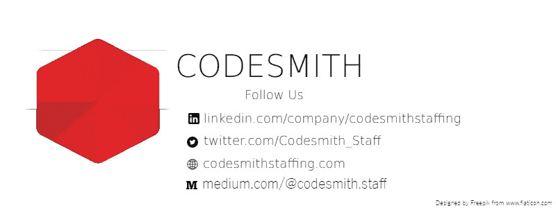

# “那么，说说你自己吧”

> 原文：<https://medium.com/hackernoon/so-tell-me-about-yourself-ed51d1155567>

## 关于一个常见的公开面试问题的叙述

[**Vecteezy**](https://www.vecteezy.com/vector-art/171823-man-and-woman-discussion-illustration)

你接到了招聘人员期待已久的电话。最后，你想。你安排了面试。约定的日子到了。喝着咖啡，你找到了那栋楼。在办公室里，你和面试官握手，希望你不会因为手心出汗而被扣分。你现在坐好了，背部挺直，展现了你的个性。

然后，面试官背诵道，“那么，跟我说说你自己吧。

你做过一些调查，所以你知道**面试官最不想知道的是你的生活经历**。面试官现在并不真正关心你，因为面试官已经和 10 号候选人安排了另一场面试。你知道的。当然，一旦你证明自己是一个可行的候选人，面试官会关心你，但现在你是一张在精心整理的简历上用黑色列出名字和一些证书的脸。

尽管如此，你知道**给面试官概述你的整个简历只是浪费你们两个人的时间。除非面试官有严重的健忘症，否则他现在应该已经看过你的简历了，而且已经拿到手了。**

你想留下不可磨灭的印记。所以，你想，你该怎么说？

你知道的。

1.  你的回答应该突出简历中最重要的方面。你在学校和工作中取得了哪些值得一提的成就，你如何将其与你的优势联系起来？
2.  你应该提到一种激情，这表明你是一个积极主动的人。为了成长，你在业余时间都做了些什么？你想炫耀你学东西很快，所以也许你应该告诉面试官你学了什么新语言，以便和你想去的那个国家的当地人交流。这是一个展示你的怪癖和兴趣的好机会，以便与面试官交流。
3.  你应该明确地以你为什么坐在这里作为结尾。你的成就、优势和兴趣应该是你认为自己非常适合这份工作的原因。你希望面试官认为，“哇，我真的认为这可能是一个。我可能不需要回答我所有的问题。事实上，我可能是今天被面试的人。”

你已经做好了准备工作。你已经做过模拟面试了。现在是回答问题的时候了。

你好。如果你喜欢这种叙事风格，请在下面评论！有任何建议，也请在下面留下你的想法。

[被录用！](http://codesmithstaffing.com/#contact)

