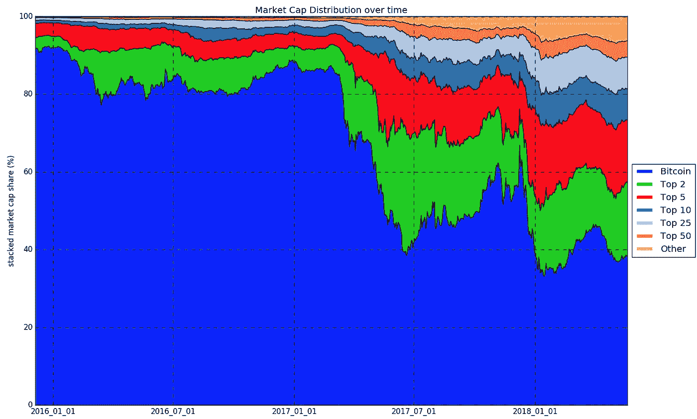

# 所以你想交易加密——市值分布和替代硬币的兴起(第四部分)

> 原文：<https://medium.com/hackernoon/so-you-want-to-trade-crypto-market-cap-distribution-and-rise-of-altcoins-part-4-64e1f2003ffa>

Photo by [Marco Bianchetti](https://unsplash.com/photos/UOAD9U-TYxc?utm_source=unsplash&utm_medium=referral&utm_content=creditCopyText) on [Unsplash](https://unsplash.com/search/photos/many-blocks?utm_source=unsplash&utm_medium=referral&utm_content=creditCopyText)

# 比特币独霸> 90%的市场总价值到<40%

From the start of 2016 to the end of 2017, we’ve gone from [比特币](https://hackernoon.com/tagged/bitcoin)独霸> 90%的市场总价值到< 40%。

这种资本流动导致了替代加密货币的繁荣，这种货币提供了更新的技术和更广泛的使用案例。

# 市值误解

要解决的第一点是当应用于[加密货币](https://hackernoon.com/tagged/cryptocurrency)时，以市值作为衡量标准的问题。对于股票，市值的计算方法如下:

> **每股价格*已发行股份**

这是有道理的，因为每股代表公司资产和利润的一部分。同样的计算也适用于加密货币:

> **每代币价格*可用代币**

这开始引起问题，因为可以很容易地制作新令牌并将其添加到几十个小交换机中的一个。

如果有人创造了一种总供应量为 1000 亿的新硬币，并设法让它在一个小交易所上市，并以每枚 1 美元的价格与朋友交易几次，从技术上讲，这种硬币的市值为 1000 亿美元。但事实上，它没有真正的价值，也没有交易量来承受任何抛售压力。

# 维持人为膨胀的市值

除此之外，有许多硬币**确实**有很大的日交易量，同时保持着人为膨胀的市值，因为大部分供应被开发商锁定，不可交易。这就提出了一个严重的问题，即投资者和交易者如何对代币的总供应量进行定价，以及一个项目的理论价值是否与现实相符。

很多人也误解了市值在资本流动方面的含义。

如前所述，1000 亿美元的市值并不意味着 1000 亿美元已经被投资到代币中。一个代币的市值从 1000 亿美元变成 1500 亿美元或 500 亿美元，也不意味着 500 亿美元的资本已经易手。

# 系统中没有足够的钱来兑换每个代币

加密货币投资的利润应该被视为“账面收益”，直到套现或对冲——系统中根本没有足够的资金将每一枚代币赎回到接近其市值的任何地方。

尽管如此，对于一个有足够交易量和足够年龄的密码，市值可以用于粗略的比较，但要确保总是有所保留。

# 市值分布的变化

(Market Cap Values from [coinmarketcap.com](https://coinmarketcap.com/))

正如我们所见，过去几年对比特币在加密市场的历史主导地位并不友好，许多新项目在 2017 年上半年起飞。

多年来，比特币一直保持着“先发优势”。然而，围绕比特币发展的政治问题导致进步放缓——为大量替代硬币创造了一个空白。

# “ICO 热”的结果

在过去的一年里，这种新的发展加速了，智能合约平台占据了许多领先位置。2017 年还见证了“ICO 狂热”的兴起，数十个新的代币和项目获得了寻求更高股本收益率的投机者的投资。

从长期来看，比特币的市场份额可能会继续下降，因为它的旧技术根本无法与新产品竞争。只要围绕发展的政治问题继续存在，这种情况就不会改变。比特币是一个极好的概念证明，但如果它不能适应，它就有可能成为加密世界的 Myspace。

# 交易比特币热潮

随着替代币在市场份额上的持续增长和比特币发展的相对停滞，比特币可能会在未来几年内(如果不是更早的话)从第一的位置上跌落，取而代之的是新一代的加密货币。

这种转变可能会导致整个市场的态度和构成发生巨大变化，因为每个人都试图涌入新的顶级硬币和相关技术，以便他们可以乘坐炒作列车。

和往常一样，最好保持头脑冷静，坚持自己的交易和投资策略。对各种加密货币的基础技术和使用案例的深刻理解将有助于您充分利用这一转变。

# 有各种各样的项目都有它们的用例

虽然专注于智能合约的区块链目前是一些领导者，但从长远来看，他们的价值和成功将由运行在他们之上的应用程序和业务来衡量。与此同时，我们不应该忘记区块链的其他用途，例如供应链的总账、审计甚至物联网设备。有各种各样的项目都有它们的用例。

加密货币投资应该像股票投资组合一样管理。你不会把你的全部价值放在一只股票上，同样，你也不应该过分看重一枚硬币。均衡持有不同领域的不同项目有助于对冲市场中的黑天鹅事件，同时从加密作为一种资产类别的广泛增长中获利。

马修·特威德

***感谢阅读！请跟随*** [***羊驼***](/@alpacahq) ***和*** [***自动化生成***](https://medium.com/automation-generation) ***获取金融市场、算法交易、技术方面的新鲜帖子。你可以找我们***[***@羊驼 HQ***](https://twitter.com/AlpacaHQ) ***，如果你用 twitter 的话。***

如果你是一名黑客，并且能够创造出在金融市场上运行的很酷的东西，**请查看我们的项目“** [**免佣金股票交易 API**](https://alpaca.markets/?utm_source=medium&utm_medium=blog&utm_campaign=strategy_list&utm_content=part1) **”，在那里我们免费提供简单的 REST 交易 API 和实时市场数据。**

经纪服务由 FINRA/SIPC 成员羊驼证券有限责任公司([羊驼市场](https://alpaca.markets/?utm_source=medium&utm_medium=blog&utm_campaign=strategy_list&utm_content=part1))提供。羊驼证券有限责任公司是 AlpacaDB，Inc .的全资子公司。