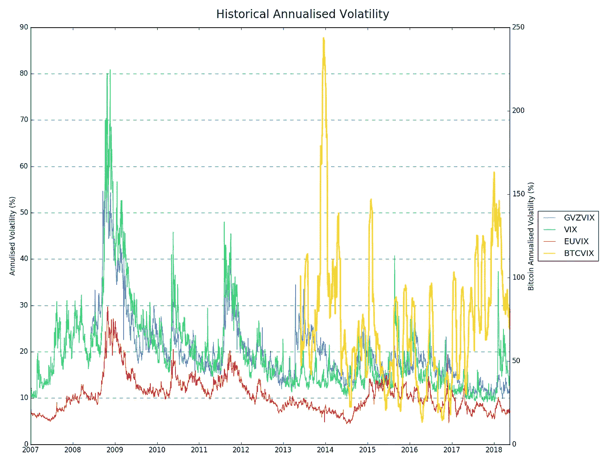

# 所以你想交易加密波动性(第二部分)

> 原文：<https://medium.com/hackernoon/so-you-want-to-trade-crypto-volatility-part-2-4dc5ca23ba15>

Photo by [Priscilla Du Preez](https://unsplash.com/photos/FOsina4f7qM?utm_source=unsplash&utm_medium=referral&utm_content=creditCopyText) on [Unsplash](https://unsplash.com/search/photos/loop?utm_source=unsplash&utm_medium=referral&utm_content=creditCopyText)

[加密货币](https://hackernoon.com/tagged/cryptocurrency)市场非常新，尚未随着更大的监管和机构参与而成熟，随着市场的增长，这导致了剧烈的波动和高波动性。**这是一把双刃剑**——对于寻求刺激的日内交易者来说是天堂，同时也给那些希望长期交易的人增加了巨大的风险。

# 历史波动

资产类别的历史波动性比较。

*   **GVZVIX** —黄金 CBOE 波动率指数
*   **VIX** —标准普尔 500 指数的 CBOE 波动率指数&
*   **EUVIX** —欧元/美元对的 CBOE 波动率指数
*   **BTCVIX** — [比特币](https://hackernoon.com/tagged/bitcoin) 30 天历史波动率(比特币波动率在右轴，因为它高得多)

正如我们所见，更传统的交易资产的波动性之间存在明显的相关性，尤其是在 2009 年反弹等事件期间。另一方面，即使剔除平均波动性的巨大差异，比特币似乎与这些其他类别的产品相关性有限。

甚至股票的波动性(目前 VIX 为 13.4%)也完全相形见绌，比特币的波动性为 70%(低于今年早些时候的 150%)——比特币在历史上是波动性较小的加密货币之一。**加密货币市场代表着一个巨大的转变，在带来更大回报的同时也带来了更多的风险。**

# 如何管理波动性

管理下行风险是任何成功交易策略的重要组成部分，在加密货币的极端波动性中更是如此。我个人倾向于在每次交易前定义一个硬止损水平，然而一个“软”的软损失/退出参数就足够了，取决于交易策略的频率。

目前很少有加密交易所迎合更高频率的交易，这使得更快的交易策略更加困难，在许多情况下甚至不可能。高频做市或刷单策略不太关心硬止损，因为方向风险敞口极短。

随着每笔交易的持有持续时间缩短到几分钟，在大多数情况下，绝对风险仍然相对有限。然而，和任何市场一样，波动性偶尔会出现峰值，但这些峰值也会被放大。

(12th Apr 2018 — A move of $1200 — greater than the entire span of previous 2 weeks)

## 除了成功率之外，每笔交易的风险:回报比率是盈利交易系统的一个重要因素。

如果没有风险管理的计划，一个黑天鹅事件(如上面看到的保证金瀑布)可能会抵消一周的利润，甚至抹去一个账户。

## 转向长期策略，比如摇摆交易。

波动性让普通策略变得更加棘手。降低交易风险的最简单的方法是减少低信心信号的头寸规模。例如，在外汇交易中，杠杆被广泛用于在相对较小的波动中有效利用资本。与此同时，在秘密交易中采用这种杠杆水平是疯狂的。只要对波动性进行调整，不同资产类别之间的风险不一定会更高。

从积极的交易策略到指数化，加密货币市场在过去几年中提供了巨大的回报，[总市值](https://coinmarketcap.com/charts/)从 2017 年初的 183 亿美元上升到 2018 年初的 6130 亿美元，增长超过 3000%。不幸的是，过去的表现并不能预示未来的回报——以这样的速度持续下去是不可能的。在 2018 年 1 月至 2018 年 4 月期间，出现了 60%的回调，我们仍在恢复之中。

自动重新平衡的加密货币指数基金可以提供一种简单而有效的方式来获得多元化的市场敞口，但要注意的是，你必须能够承受高额提款的可能性。

# 波动性和投机资产

[正如我在本系列的第一篇文章](https://blog.alpaca.markets/blog/2018/5/22/so-you-want-to-trade-crypto-fundamentals-part1)中提到的，加密货币不能像传统资产一样进行分析。你没有与价格相关的实物或公司股份。你的代币的整体估价是基于对未来需求的预期，因此很容易受到情绪变化的影响。

一只股票的定价将高于其股息和资产的价值，以反映企业随着时间推移的预期增长。然而，在市场低迷时期，随着经济紧缩，压低价格，投资者对未来变得不那么乐观。企业本身可能会损失一些收入，因为消费者的现金支出减少了，但仍有一个有价值的正常运转的企业。

与此同时，加密货币的整体成功取决于项目吸引企业和开发者使用该平台的能力。投机者押注项目将在长期内成功实现这一目标，但如果项目失败或市场情绪转向不利于项目，则没有有形资产可以保值。

## 这是加密货币市场与任何其他资产类别相比仍然如此不稳定的主要原因之一。

虽然这种影响会随着时间的推移而减弱，但随着成功的应用和业务在生态系统中的形成，这不会是一个快速或容易的过程。

*作者马修·特威德*

## 金融市场、算法交易、技术方面的新岗位请关注[羊驼](/@alpacahq)和[自动化世代](https://medium.com/automation-generation)。

## 如果你使用 twitter，你可以找到我们[@羊驼队](https://twitter.com/AlpacaHQ)。

如果你是一名黑客，并且可以创造一些在金融市场上工作的很酷的东西，**请查看我们的项目“** [**免佣金股票交易 API**](https://alpaca.markets/?utm_source=medium&utm_medium=blog&utm_campaign=strategy_list&utm_content=part1) **”,在那里我们免费提供简单的 REST 交易 API 和实时市场数据。**

经纪服务由 FINRA/SIPC 成员 Alpaca Securities LLC([Alpaca . markets](https://alpaca.markets/?utm_source=medium&utm_medium=blog&utm_campaign=strategy_list&utm_content=part1))提供。羊驼证券有限责任公司是 AlpacaDB，Inc .的全资子公司。