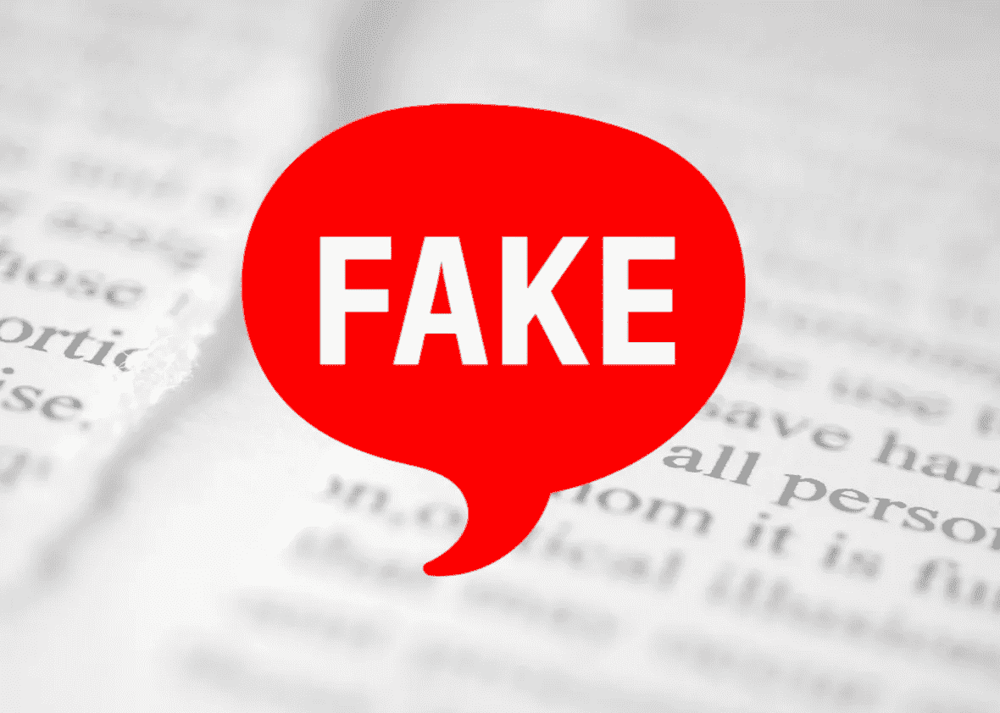

# 关于假新闻本质的社交媒体平台

> 原文：<https://medium.com/hackernoon/social-media-platforms-on-the-nature-of-fake-news-d3a2ba8ca1d4>

## 今天国会山的听证会不仅仅是关于监管，也是关于真相的定义。

(Credits: photo illustration by *Slate)*

在国会山众议院司法委员会的最近一次听证会上，众议员普拉米拉·贾亚帕尔的一个有趣的评论引起了我的注意。

“这里的挑战是，很难准确确定什么可以被定义为虚假新闻。但对我来说，更大的问题是，不知何故，我们达成了一个标准，即真相是相对的，”她在谈到当前关于社交媒体上假新闻和错误信息的辩论时说。

> 真理不是相对的。苹果就是苹果。不可能明天是番茄，昨天是梨。这是一个苹果。

作为回应，脸书全球政策管理负责人莫妮卡·比克特(Monika Bickert)解释说，她的平台在面对这个问题时会做一些不同的事情，她是听证会上与谷歌和 Twitter 一起的三名证人之一。

事实上，脸书承认，“我们在社交媒体上看到的大部分虚假新闻往往来自垃圾邮件发送者和有经济动机的演员。”

“这违反了我们的政策，”比克特说。“我们有技术手段来检测并删除这些账户。过去几年，我们取得了很大进步。”

她补充说:“还有一些内容人们可能不同意，或者可能被广泛认为是虚假的。我们确实听到反馈说，人们不想让私人公司来决定什么是真的，什么是假的。但我们知道，如果我们认为有信号——如第三方事实检查员——表明内容是虚假的，我们可以做的是通过降级帖子并向人们提供额外信息，以便他们可以看到文章是否与互联网上其他主流来源所说的一致。”

在回答之前由众议员[泰德·坡](https://medium.com/u/5a0e8e6addd0?source=post_page-----d3a2ba8ca1d4--------------------------------)提出的关于假新闻性质的问题时，比克特强调“我们没有消除假新闻的政策。”

她补充说:“我们所做的是，如果人们将内容标记为虚假，或者如果我们的技术，或者如果评论和其他信号检测到内容可能是虚假的，那么我们会将其发送给这些事实核查组织。”

听证会早些时候提到了与脸书合作的事实核查组织。它们包括美联社、政治报、T2、每周标准报、FactCheck.org 和 Snopes。

“如果他们认为这些内容是假的——但没有一个人认为是真的——那么我们将减少这些内容的传播，并添加相关文章，”Bickert 说。

在议员的催促下，她再次强调:“分享虚假信息并不违反我们的政策。”

假新闻的定义和本质继续引发围绕社交媒体的辩论。识别假新闻仍然是脸书、谷歌和推特等平台的重点，他们今天的证词(见下文的书面证词)和对众议院司法委员会的答复中强调了他们打击这一现象的行动。

但是关于假新闻性质的问题在听证会上出现了几次。

谷歌在 Youtube 的公共政策和政府关系全球主管朱尼伯·唐斯(Juniper Downs)确定了一个频谱，以回应众议员迈克·约翰逊。

“假新闻是一个用来定义内容范围的术语，”她回答道。“一方面，我们有恶意的、欺骗性的内容，这些内容通常由巨魔农场传播。该内容将违反我们的政策，我们将迅速采取行动删除该内容和/或传播该内容的账户。在中间，你有可能是低质量的错误信息。这就是我们的算法开始提升更权威的内容和降级较低质量的内容。当然，你也听说过这个词指的是主流媒体，在这种情况下，我们什么都不做。我们在那种情况下不接受这个术语。”

脸书和谷歌都提到，当内容被删除时，用户会得到通知，并被允许上诉。

全球政策管理负责人 Monika Bickert 的脸书证词:

Youtube 公共政策和政府关系全球主管 Juniper Downs 的证词:

T4 推特公共政策高级策略师尼克·皮克尔斯的推特证词: