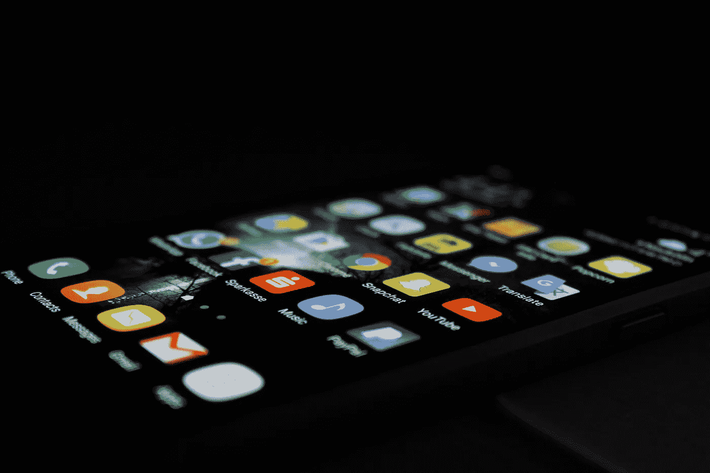
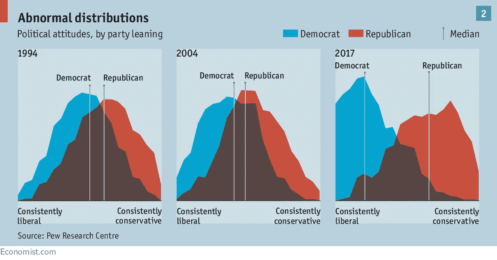

# 社交媒体、隐私和全球警察国家

> 原文：<https://medium.com/hackernoon/social-media-privacy-and-the-world-wide-police-state-10cee3554ab5>

This image seemed to work — [https://unsplash.com/photos/w33-zg-dNL4](https://unsplash.com/photos/w33-zg-dNL4)

你的历史在网上，这是否让我们对自己的行为和态度更加警惕？

它必须改变我们的整体行为。当你能够在会议前在 Linkedin 上查找某人，或者在见到某人之前查看他的个人资料，这改变了我们在脑海中塑造他人的方式。

我们看到某人是运动健将，或者喜欢某项活动或某件特定的事情，我们就专注于这一点，并把谈话引向先入为主的观念。

另一方面，我们知道人们会这样做，我们会那样做，所以我们呈现出完美的自我。也许不一定，画面完美，但我们确实以一种光呈现自己，使我们看起来像我们想象的那样。这是基于我们对他人的感知。

这是一个反馈循环。或者甚至是我们之间的博弈。

这并不是说它是消极的，在某些情况下，它使我们能够进行我们可能从未有过的对话和互动！

但在某些情况下，通过专注于某些事情，它会阻止本来可能会发生的对话。这让我害怕，或者说让我难过——这些**错过的对话**。

但另一方面，如果我们只是在进行那些错过的对话，我们可能找不到我们本来会找到的共同点。有点像在和我自己玩魔鬼代言人游戏。

这不是一篇关于如何放弃社交媒体并让自己自由的自助文章。这只是我们在与世界各地的人发展新老关系时需要认识到的一个观察结果。

然而，也许一个真正消极的因素是社会两极分化。越来越明显的是，人们的观点严重倾向于某些方面，一如既往，但速度更快，范围更广。当然有多种因素，但一个非常明显的因素是*确认偏差*，即当你不同意与你自己不匹配的选项时，你同意那些匹配的选项。

一直以来都是这样，所以这不是一个新现象，但是在新闻和喜欢的时代，我们比以往任何时候都更快地接触到我们喜欢或同意的事物，并因此将其拒之门外，或阻止其重现。

这是极化如何随时间变化的一个例子。

United States Political Polarization — [http://econ.st/2hxNLuk](http://econ.st/2hxNLuk)

没有什么要补充的，除了，意识到双方，因为人们理解和观点的基础是有价值的。

> 也许，仅仅是也许，我们都能从彼此的角度学到一些东西。

话说回来——你读这篇文章是因为你同意我的观点并考虑了社交媒体的影响吗？我写这篇文章是因为我看到我的朋友同意我的观点，还是因为我有一个回应和鼓励这些想法的新闻源？

我们永远不会知道，界限都很模糊。

Banksy — One Nation Under CCTV. **What an artist.**

# 隐私与全球警察国家

我经常想知道的另一件事是，当我们知道我们中的很多人都在网上，我们必须维护声誉，等等。这会让我们变得更加拘谨吗？

我们都喜欢找乐子，而有时候这种找乐子有点太危险了。在公共场合或私人场合，不断回头看会改变这些动态。

前几天我和一个同事在讨论，我们谈到了区块链的人民信息，以及当它完全实施时，如何确保每个人都能访问他们自己的历史和信息等等。然后他说了一件事:

> 如果一切都被永久记录下来，那就意味着没有人有第二次机会。

这真的让我难以忘怀，并引发了各种各样的问题。在所有的好处中，需要警惕的东西实在太多了。

但它现在是我们的一部分，我们如何处理它并将其融入我们的生活是我们自己的选择，没有对错——只有观点(可能会偏向你的信仰！).现在不完全是 1984 年，但以它自己的方式，有点像。

问