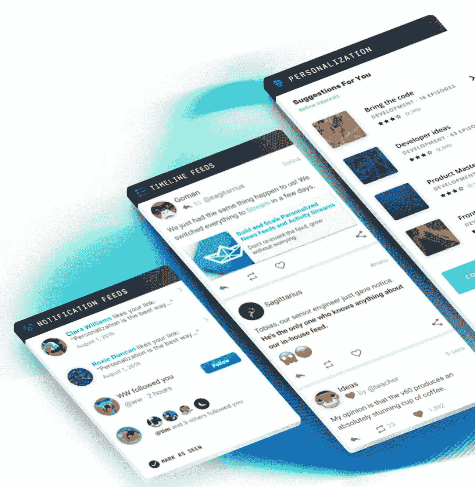

# 由 Stream 的 API 支持的社交网络

> 原文：<https://medium.com/hackernoon/social-networks-powered-by-streams-api-51b5b60ea2b>

> 披露: [Stream](https://goo.gl/LxzcfX) ，可扩展提要的 API，之前赞助过 Hacker Noon。

为像 Stream 这样的公司工作最令人兴奋的部分之一是看到我们的客户用我们的 [API](https://hackernoon.com/tagged/api) 构建了什么。许多公司带着同样的问题来找我们，如可扩展性、成本、时间限制等。事实上，之所以创建 Stream，是因为我们的 CEO 在之前的公司面临许多相同的问题。这篇文章讲述了三个不同的公司使用 Stream 构建 feed 技术的故事。

# 产品搜索

> *“Stream API 就是这么工作的——我们很感激我们根本不用担心它。对我们来说，添加新的通知很简单，而且它可以随我们一起扩展。这让我们有时间专注于其他优先事项。”—* [排名特性](https://medium.com/u/ac19e2880d0c#custom_ranking)以及 API 可以覆盖许多用例的事实印象尤为深刻。Dubsmash 并排使用了几种排名方法。他们的 admin 中的提要是严格按照时间存储的，向用户显示的提要考虑了流行度和时间衰减。内部构建需要几周的开发时间，而用 API 实现需要一天半。有了 Stream，他们只是“不需要为此担心！”