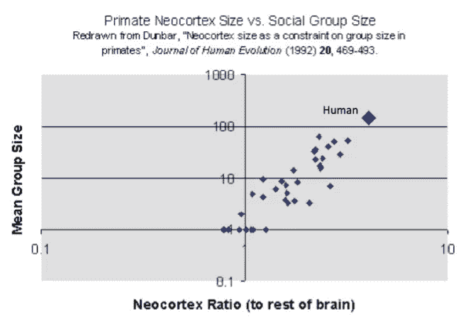
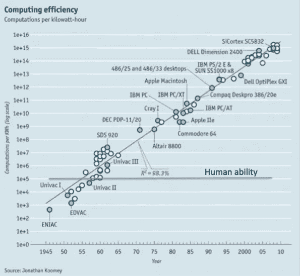

# 社会可扩展性:加密货币中最重要的理念？

> 原文：<https://medium.com/hackernoon/social-scalability-the-most-important-idea-in-cryptocurrency-73d60e08b85a>

> 我们应该培养思考我们正在做的事情的习惯，这是一个极其错误的真理，所有的教科书和名人在演讲时都在重复这个真理。情况恰恰相反。文明的进步是通过增加我们不用思考就能完成的重要操作的数量。*——****【阿尔弗雷德·诺斯·怀特海】***

70，000 年前，有 6 到 10 种人属物种。当然，现在只有一个人:智人。为什么*智人*胜过其他物种，比如*尼安德特人*？

所有人都认为尼安德特人在身体上比人类强壮得多。

关键的区别是智人有能力组成群体和协调活动。一个协调的智人群体可以直接通过战斗或间接通过控制稀缺资源来战胜一个更强大的个体。

*智人*因为他们的协调能力而胜出，这创造了[研究员 Nick Szabo 所说的社会可伸缩性](http://unenumerated.blogspot.com/2017/02/money-blockchains-and-social-scalability.html):智人进化的一个组成部分，允许他们“*扩展重要操作的数量，他们可以不用思考这些操作*

新皮质体积的增加导致了越来越大的群体之间的协调能力。智人的大脑已经被证明能够发明其他外部结构来促进社会的可扩展性。

[source](https://4.bp.blogspot.com/-NABYF35qED8/WJwE5C88pOI/AAAAAAAAAfo/lsvszu54YzwTzUj4iM0-oXDUn0ioT279QCLcB/s1600/MBSS0.png)

# 什么是社会可扩展性，为什么它很重要？

各种各样的创新减少了我们对其他参与者、中介和局外人的脆弱性。

这些创新中的每一项都降低了我们花费稀缺的认知能力来担心日益庞大和多样化的人群可能会如何表现的需求。

语言可能是通过允许人类交流来最大程度地增加社会可扩展性的技术，但是从那以后，人类已经进化出许多其他技术来增加社会可扩展性。

文化，无论是在一个公司还是一个民族国家，通过允许个人更好地预测该文化中其他人的行为，增加了社会的可伸缩性。

复式簿记是另一项技术，它通过让我们信任他人来扩大我们的协调能力。在复式簿记之前，每笔交易只有一份副本由中心方保管，这使得债务记录很容易丢失、删除或修改。复式簿记通过保留你自己的交易副本，减少了你对交易对手的信任。

所有这些创新共同促成了过去几百年来的经济奇迹。

所有这些方法的基本组成部分是信任最小化。现代法律体系极大地增加了社会的可扩展性，因为这意味着任何人都可以与任何人签订合同，并且总是可以诉诸法院，而不必与他们发展个人关系。

当你从商店购买时，你不需要担心你的早餐果汁被下毒或变质，因为大量的技术和社会创新强烈刺激供应商提供安全的产品。

在最近的记忆中，社交可扩展性的最大改进之一是通过在线评级系统对匹配的改进:

*   亚马逊匹配消费者和制造商
*   在线约会网站为那些原本不会见面但更合得来的人牵线搭桥
*   Lyft 和优步匹配司机和骑手
*   AirBnB 为旅行者和房主匹配空余房间

这些平台的评级系统降低了每笔交易所需的信任度。在进入 Lyft 或优步之前，我不需要进行背景调查，因为我可以看到数百名其他乘客认为这位司机安全可靠。

区块链有可能通过货币和市场的广泛应用来最小化信任和增加社会可伸缩性。

从历史上看，货币和市场的结合通过以下方式降低了交易成本:

*   牵线搭桥(撮合买卖双方)，
*   信任减少(信任自己的利益，而不是陌生人的利他主义)
*   可扩展的性能(通过金钱，一种广泛接受且可重复使用的反性能介质)
*   质量信息流(市场价格)。

亚当·斯密对市场如何促进难以置信的社会可扩展性给出了这样的解释:

> “例如，披在日工身上的毛料大衣，尽管看起来粗糙，却是众多工人共同劳动的产物。
> 
> 牧羊人、羊毛分拣员、羊毛精梳机或梳理工、染色工、涂鸦工、纺纱工、织布工、漂布工、服装师，以及许多其他人，都必须加入他们不同的艺术，以完成这种平凡的生产。
> 
> 此外，要雇用多少商人和承运人来把这些材料从这些工人手中运送给那些经常住在这个国家很远的地方的人呢！
> 
> 多少商业和航海，多少造船者，水手，制帆者，制绳者，必须被雇佣来把染匠使用的不同的药物结合起来，这些药物通常来自世界上最遥远的角落！"

利用市场，人们能够从他人的劳动中获益，而不一定需要信任他们。羊毛大衣的购买者不需要亲自了解和信任在将染料从印度带回英国的船上制造船帆的船帆制造商。

市场并不仅仅依赖于血缘关系，而是创造了一种方式，让一个庞大的相互遗忘的人网络为我们的利益而行动:

> “在文明社会中，人总是需要大多数人的合作和帮助，而他的一生却不足以获得几个人的友谊……我们并不是从屠夫、酿酒师或面包师的仁慈中得到晚餐，而是从他们对自己利益的关心中得到的。”

这是在工业革命的连续浪潮之前，工业革命多次细化、阐述和扩展了劳动分工和市场范围。

今天，与亚当·斯密在 18 世纪记录的供应链相比，你衣柜里的外套所涉及的供应链和不同的参与者要大得多。

金钱通过解决需求的一致性问题促进了社会的可扩展性。如果你做鞋，我做面包，但你要面包，我不要鞋，我们就用货币作为交换媒介、价值储存手段和记账单位来促进交易。

通过这种方式，货币使得更大范围的人群之间更多种类的商品和服务的交换成为可能，增加了社会的可扩展性。

人类最早使用的货币是像贝壳和石头这样的收藏品。贵金属随后成为货币，然后是纸张。今天，大多数货币都是电子化的。我们在世界各地的计算机和服务器上运行的程序和协议促进了大多数美元交易

这极大地改善了匹配和信息流，但代价是易受攻击。

传统的计算机安全没有很好的社会可扩展性，因为它依赖于一个可信的第三方来监控你的数据。在当前的互联网架构下，我们完全信任另一端的人以及可能获得访问权限的内部人员和黑客。

但是，对于这些机构中的大多数来说，正如最近从 Equifax 到 Cambridge Analytica 的一系列数据泄露所表明的那样，您的安全并不是他们的首要任务。

为了增加社会的可扩展性，我们需要扩展世界各地的市场。为了扩大全球市场，我们需要可扩展的资金。在 21 世纪，可扩展的资金需要可扩展的计算机安全。

If you’re looking for more about blockchain and cryptocurrency for business, [click here to access my personal resource lists](http://bit.ly/2KqvNXr) of where I’ve found the best and most reliable information.

# 是什么赋予了比特币价值？

2009 年，一个名为“*中本聪*”的个人或团体创造了历史上社会规模最大的货币。比特币不是完全依赖单个可信的中介，而是依赖一群分散的中介。

当我们可以通过计算机科学而不是会计师、监管者、警察和律师来保护金融网络时，我们就从一个手动的、局部的、不太安全的系统转向了一个自动化的、全球化的、更安全的系统。

如果操作得当，加密货币可以用一大群计算机代替一大群金融中介。

由于加密货币的核心运营独立于现有机构，并且可以跨越传统边界(机构和国家)无缝运营，因此它提供了高度的安全性和可靠性，无需人工干预。

在过去的一个世纪里，为了通过全球化实现更高水平的社会可扩展性，我们不得不扩展人类机构。要以可靠和安全的方式做到这一点，需要越来越多的会计师、律师、监管者和警察。

1870 年，美国经济的交易部门(会计师、律师、监管者和警察)占国民生产总值(GNP)的 24%。[到 1970 年，它占了国民生产总值的 46%](http://citeseerx.ist.psu.edu/viewdoc/download?doi=10.1.1.361.77&rep=rep1&type=pdf)。

我们需要越来越多的人类认知能力来监控这些交易。今天的人类没有比 1950 年更好的能力来提升他们的认知能力，但是计算机比现在强大了许多数量级。

[source](https://www.google.com/url?q=https://4.bp.blogspot.com/-6Vugc9NrCJo/WJwE7MhnjoI/AAAAAAAAAf4/VYoX29oK1Uo_u5qQ25-rbJQ3uI-vQl6iwCEw/s1600/MBSS2.png&sa=D&ust=1525204027329000&usg=AFQjCNE-ACVm5Cea7XpdlaKGhIpWyco4TQ)

然而，在计算机科学中，安全性和性能之间存在着根本性的权衡。让加密货币具有社会可扩展性所需的安全性代价很高:它的资源使用，主要是采矿中使用的电力。

这种安全对于任何要成为货币的东西都是必要的。任何参与者或中介都很难伪造货币。黄金之所以有价值，部分是因为它很难开采，而且数量有限，所以没有办法迅速增加产量。

加密货币安全的好处在于，过去需要大量中介的交易，比如从曼谷向马拉维汇款，现在可以在任何有互联网连接的双方之间完成。

加密货币为了提高社会可扩展性，牺牲了计算可扩展性。计算效率低下(用电量和使用的大量处理能力)使其具有社会可扩展性(两个假名方跨越机构和国家边界进行交易的能力)。

不可能计算出这种社会可伸缩性增长的价值，但似乎有理由将其与互联网促成的婚姻相提并论。

随着计算能力和可再生电力资源的成本持续下降，而人类的认知能力保持不变，这种权衡越来越有益。

这并不是说让我们的机构适应这种新模式很容易，也不是说我们正在走向某种乌托邦。但是，加密货币开辟了扩展人类独特性的可能性，并带来了我们在过去几个世纪中看到的收益——社会可扩展性。

*鸣谢:这篇文章大部分只是 Nick Szabo 文章的摘要:* [*金钱，区块链，和社会可扩展性*](https://unenumerated.blogspot.com/2017/02/money-blockchains-and-social-scalability.html) *因为我想要更短的东西来派人解释这个想法。这篇文章非常值得全文阅读。所有的错误和遗漏都是我的。*

泰勒皮尔森是《乔布斯的终结》一书的作者，他写了关于企业家精神、历史、复杂性和区块链技术的文章。 [*报名领取他的热门简讯*](http://bit.ly/2rfq7rj) *。*

*如果你正在寻找更多关于区块链和商业加密货币的信息，* [***点击这里进入我的个人资源列表***](http://bit.ly/2KqvNXr) *，在这里我可以找到最好、最可靠的信息。*