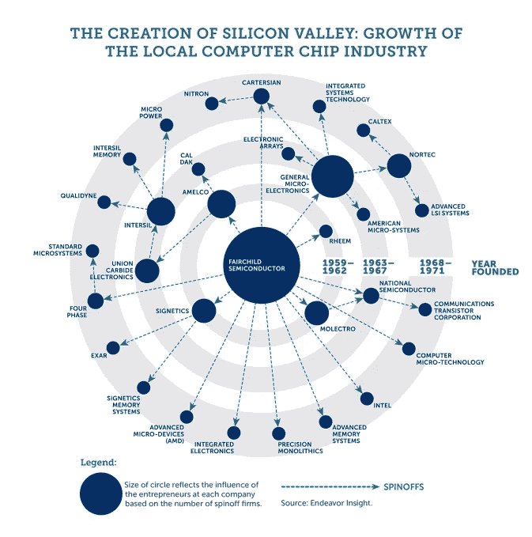
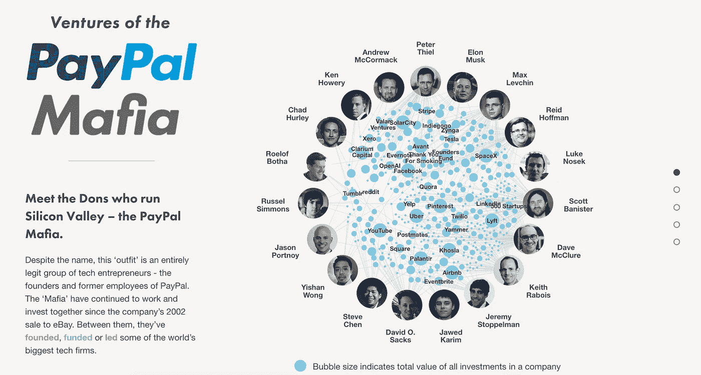

# 软银正在扼杀企业家精神

> 原文：<https://medium.com/hackernoon/softbank-is-stifling-entrepreneurship-11938fed397b>

硅谷的故事是一个有规律的循环。一家公司成立了，迅速扩大，它的员工开始自己的公司，循环往复。

第一个周期始于 1965 年，肖克利半导体公司是湾区第一家硅基高科技公司。在不到两年的时间里，公司取得了许多突破，八名员工，绰号[叛逆八人](https://en.wikipedia.org/wiki/Traitorous_eight)，离开并成立了他们自己的公司——飞兆半导体。在短短三年时间里，飞兆经历了爆炸式增长，年收入超过 2000 万美元，相当于现在的十倍以上。随着其员工参与到这一巨大的财富创造中，他们开始独立发展，公司数量和创造的价值都呈指数级增长。

The “Fairchildren”. Graphic courtesy of [Techcrunch](https://techcrunch.com/2014/07/26/the-first-trillion-dollar-startup/)

随着势头迅速超过东海岸的同行，硅谷周期开始重复。一些飞兆半导体衍生产品(亲切地称为“Fairchildren”)能够复制他们所在公司的成功，让他们的员工像他们的创始人一样工作，并从衍生产品中衍生出来。

这就是硅谷持续发展和创新的方式。员工离开去创建公司，其中一些公司做得非常好，然后他们的员工套现去创建他们自己的公司。现代谈论最多的例子是贝宝(那些离开的人被统称为“贝宝黑手党”)，但这也发生在[脸书](https://www.cbinsights.com/research/facebook-mafia/)和 [Twitter](https://www.cbinsights.com/research/twitter-mafia/) 等公司身上。

Image courtesy of [Fleximize](https://fleximize.com/paypal-mafia/)

如此循环往复…直到现在。软银(SoftBank)1000 亿美元的愿景基金(Vision Fund)等大型基金最近的崛起，意味着企业保持私有化的时间会更长。正如 TechCrunch 生动地描述的那样，那些原本会拿走自己挣来的股权、离开公司创办自己的企业的员工反而被带上了****:****

> **“如果你有能力出售一部分股份来缴税，那是一回事，”一名长期在优步工作的员工表示。“但是你不能。所以，除非你已经赚了很多钱，或者想放弃非常有价值的股票，否则你就留下来。”**

**一些员工甚至面临彻底失去股权的风险！正如《信息报道》的阿尔弗雷德·李所说，创业公司使用的大多数股权补偿都有到期日。当首次公开募股的平均时间为 5-7 年时，这是有道理的，你不希望自己的资产负债表上出现无止境的负债，所以你会在 10 年的到期日之前充满信心地认为，到那时，该公司要么上市，要么死亡。但是，随着软银和其他晚期大型基金提供以前只能在公开市场上获得的大量资本，情况不再是这样了——AirBnb 下个月就 10 岁了，优步将在 3 月份庆祝它的 10 岁生日，而 [Palantir 已经 15 岁了，可能永远不会上市](https://www.cnbc.com/2018/02/28/ken-langone-doesnt-want-palantir-to-ever-go-public.html)。**

**如果公司从一开始就计划好了这一点，向员工传达他们希望保持更长时间(或许是无限期)私有的意图，并适当调整他们的股权薪酬结构，这是一回事。但他们没有，你也不能因此责怪他们。当这些公司刚起步时，它们就像之前的所有公司一样，一心想要上市，但晚期大型基金还不存在。然而现在这个循环被打破了，我们已经进入了独角兽之地，没有人知道它会把我们带到哪里。**

**因此，虽然我们不能责怪公司没有预料到保持这么长时间的私有，但我们绝对可以责怪他们没有采取足够的措施来改善它对员工的影响。**

**因此，独角兽们，是时候为你们的员工和创业生态系统做正确的事情了，你们的成功建立在这个生态系统之上。**让你的员工轻松兑现他们的股权，并祝愿他们在创业过程中一切顺利**。见鬼，更进一步，投资他们！你认为他们作为雇员为你挣了很多钱，看看他们自己为你做了什么。看看凯鹏华盈(Kleiner Perkins)就知道了，他是有史以来最成功的投资者之一，他是从一位创始人投资于他公司的员工开始的。**