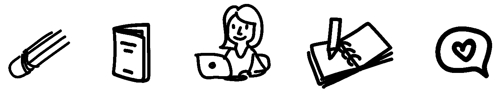

# 软件和讲故事的人

> 原文：<https://medium.com/hackernoon/software-and-the-storyteller-f671fb3b1876>

## 从前，一个讲故事的人成了一名软件工程师。

我总是看着这个世界，想知道事情是如何运作的。事情意味着什么。他们的故事是什么。小时候，我如饥似渴地阅读一本书又一本书。去过一千个不同的世界，过一千种不同的生活。学会了如何透过他人的眼睛看世界，理解他人的想法和感受。

不仅如此，我还觉得有必要解决一些事情。让事情变得更好。这是一颗工程师的心，我自然而然地陷入了软件工程，仿佛这一直是我应该做的事情。

人们告诉我，我想得太多了，但也许有可能想得不够多，错过了一切讲述的故事。“这没有任何意义”，他们说。但这也讲述了一个故事。也许是一个粗心大意的故事，也许是一个方便的故事。一切都有意义。一切都有故事。如果你能看到这个故事，你就能看到结局是如何改变的。不仅事情应该变得更好，T2 也应该变得更好——以及如何做到这一点。

当人们想到故事时，他们会想到书或电影，甚至可能是谈话。他们忘记了生活中的一切都是一个故事——每一个选择，每一次互动。为什么你有一个和家里其他东西都不相配的书架。你如何向别人解释你的想法。我们的一生就是一个故事。

我以写软件为生，我认为把它当作工程让我看不到软件对我来说只是另一种讲故事的媒介。就像写作或说话一样，我的软件讲述了一个故事。界面的每一部分，业务逻辑的每一行，架构的每一部分，都在讲述一个故事。一个关于用户的*故事。当你看软件的时候，它应该告诉你它为什么存在的故事。用户想要什么。我关心的是软件写得好，应用程序设计得好，因为故事讲得好对我来说很重要。*

当软件运行时，它会做其他事情——它讲述了另一个故事。一个故事*给*你的用户。它不应该*只是*工作，它应该是美好的。这个故事表明你了解用户，你预见到了他们的需求。也可能不是。也许你没有写一个好故事，也许它有情节漏洞和令人困惑的叙述。但是软件是一个奇妙的媒介，因为这个故事是互动的，用户告诉你一个故事。一个你需要听的故事。

最近，我从 web 开发转向了对话界面。对话应该是最自然的故事——它建立关系，将我们与他人联系起来。对于一个讲故事的人来说，使用语言与技术互动应该很简单——语音互动承载着如此丰富的意义。但是我已经听到有人批评语音界面比图形界面更具局限性。他们说一张照片胜过千言万语，但我想知道是否相反。每一个单词都承载着一千幅图片——一个微小的链接，链接到一个巨大的相互联系的思想和想法的织锦，这些思想和想法在你的头脑之外永远不会被充分地表现出来。

语言让我们得以一窥人类的思维，当我们用语言与计算机交流时，它也让我们得以一窥计算机是如何思考的。而且不好看。还没有。计算机需要人类的帮助来进行良好的对话，来消除技术的冷漠，来让故事变得更好。

然而，比这更重要的是，软件界面正在消失，融入我们周围的世界。他们需要讲述的故事——说他们理解我们并预测我们的需求的故事——将是一个重要的故事。让它成为一个美丽的城市将会很难，但也并非不可能。

> 人工智能世界中的软件工程师都需要成为故事讲述者。我们都需要理解我们的软件已经在讲述的故事——我们都需要学会通过它写出更好的故事。

从前，一个讲故事的人成了一名软件工程师。现在，软件工程师必须成为故事讲述者。

如果您觉得这篇文章有用或有趣，请👏下面还是分享给别人吧。你也可以在这里关注我，或者在 twitter 上关注[*@ virtualgill*](https://twitter.com/virtualgill)*。*