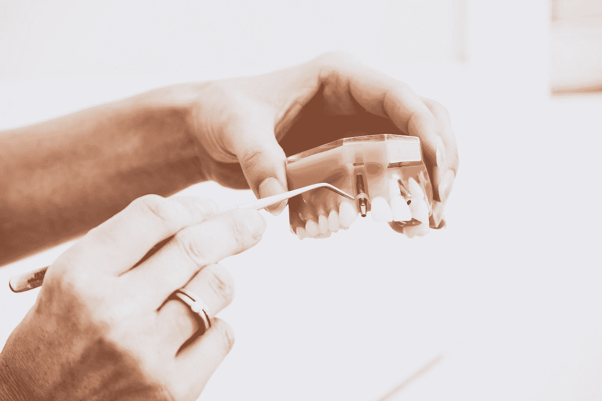

# 软件牙齿护理

> 原文：<https://medium.com/hackernoon/software-dental-care-cc3340e2a679>

当你可以等着去看牙医，让他们每六个月帮你清洁一次的时候，你为什么还要刷牙呢？因为最终你的嘴开始有味道，而且变得明显。这就是当我们没有持续改进我们的开发实践、架构和过程时所发生的事情。像我们的牙齿一样，软件开始腐烂。气味缠身，我们的嘴(代码)开始发臭(变得难以维持)。最终牙齿(项目)需要被拔掉和替换(报废和重写)。

“person wearing silver-colored ring while holding denture” by [Peter Kasprzyk](https://unsplash.com/@petekasprzyk?utm_source=medium&utm_medium=referral) on [Unsplash](https://unsplash.com?utm_source=medium&utm_medium=referral)

请务必每天刷牙。重构您的代码，直到它可读。手动测试你的代码，并通过自动化测试，直到你知道你写的东西是可行的，并且运行良好。遵循最佳实践，如应用有用的设计模式，并始终关注改进。了解技术债务以及避免和还清债务的方法。成为软件维护最佳实践协会的积极成员。这些是我们刷牙、使用牙线和漱口水的行为。保持牙齿清洁是值得的。