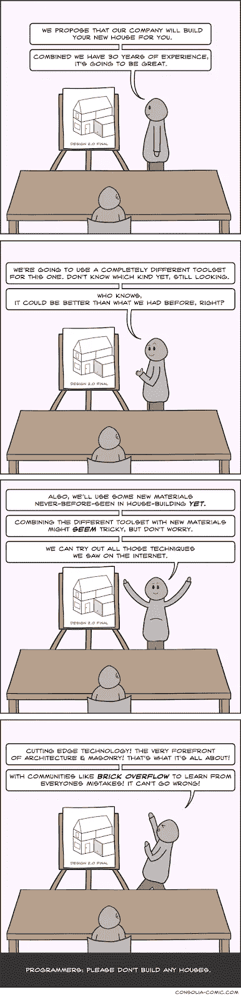

# 软件工程 vs 软件“工程”

> 原文：<https://medium.com/hackernoon/software-engineering-vs-software-engineering-6e600521253c>

/via [http://mibt.edu.au/certificate-iii-in-concreting-cpc30313/](http://mibt.edu.au/certificate-iii-in-concreting-cpc30313/)

你听说过“*浇筑混凝土*”吧？不，我不是指“混凝土”这个名词的措辞，我实际上是指[围绕铺设混凝土的施工过程](http://www.cityu.edu.hk/CIVCAL/production/traditional/concreting.html)。这是一个专业术语，指的是让混凝土[尽可能接近其最终位置](http://www.texconreadymix.com/top-16-mistakes-people-make-installing-concrete/)，尽可能快地[尽可能高效地](/@aussie.mic.foley/10-efficiency-tips-for-concrete-mixers-47316bdfa385)，以确保[能够完全压实](https://civilblog.org/2016/02/17/compaction-of-concrete-purpose-process-effect/)，并且[没有离析](https://civilread.com/segregation-bleeding-concrete/)。

关于混凝土的事情是，[这是工程](https://study.com/articles/Concrete_Engineer_Job_Description_Duties_and_Requirements.html)。你不会某天醒来，对自己说“是的，我想我要打粉底了”，然后开始做。更重要的是，即使你开始做这件事，没有一个头脑正常的人会(或者应该！)居然雇你来实际做。最重要的是，如果你想出了(你相信的是！)一种新的、改进的浇注混凝土的方法，*证明这种方法有效的举证责任在于你。不，这不是关于那个压制你的人，而是关于不对称风险。未经证实的事情的负面风险(天桥倒塌导致 XXX 人死亡)远远高于正面回报。*

/via [https://xpressreo.com.au/](https://xpressreo.com.au/)

综上所述，经验在混凝土工程中也发挥着巨大的作用！考虑钢筋的放置——混凝土浇注的钢筋网格。钢筋全部绑在一起，并用扎丝和塑料支架定位，这些*应*将东西固定到位。然而，当混凝土被浇注、振动、夯实等等时，时不时会有一些纽带断裂，其中一根钢筋会弹出来，漫不经心地用它的自由姿态嘲笑每个人。

问题是，你不能准确地移除混凝土，找到断裂的拉杆，并重新连接材料——现场的工程师通常必须做出判断，并找出在哪里连接松动的钢筋。有时这是一个简单的决定("*)很明显就是这里的那个！*”)，有时候就没那么多了(*为什么这个位置居然还有免费的酒吧？*))

这就是经验发挥作用的地方——工程师从事的工作越多，与他们合作的团队越多，他们就越有可能找到正确的补丁。这可能是一个成功的设置和一个需要拆除并在未来重做的设置之间的差异。

看到我在最后一段做了什么吗？请注意，这一点在成功部署软件系统和具体实施时是多么的适用？
我的朋友们，这就是软件 ***工程*** 和软件 ***【工程】*** 之间的区别，后者是[#牛仔开发者](http://dieswaytoofast.blogspot.com/2018/03/the-complete-cowboydeveloper.html)的领域，他们不断地坚持他们的催款——克鲁格灌输的优越感坚定地蔑视客观现实。

/via [https://consolia-comic.com/comics/house](https://consolia-comic.com/comics/house)

推定在大多数(所有？)其他形式的工程是，你只有在经历了一定数量的正式约束后，才能成为一名工程师。这些环可能来自麻省理工学院，或者凤凰城大学——这并不特别重要，只要这个机构被认可，证书是合法的，等等。对于软件，OTOH，现有的风气是对权威的不信任。硅谷神话——*斗志昂扬的创业公司是成功之路*——深深植根于我们的社会，并与[英雄的旅程](https://dieswaytoofast.blogspot.com/2018/10/devops-is-not-heros-journey.html)以及#TechBro 文化融合在一个邪恶的三位一体的非功能性中。

因为优秀的编码而被雇佣要容易得多("*看看我能让 python 做什么！*))比作工程训练(*我懂正规方法，但没人管他妈的*)。一旦被录用，n00b 们很可能会接受培训，其中可能只涉及[把他们扔进深水区](https://dieswaytoofast.blogspot.com/2018/09/do-you-know-what-your-system-actually.html?q=deep+end)，或者如果他们幸运的话，他们会和比他们年长的人配对学习。即使他们很幸运，下一次雇佣也不一定如此。即使*他们*也很幸运，他们与*不同的*高级开发人员配对，并且每个人最终得到的技能、工具和经验都将是不同的。甚至*也没有开始触及人类的偏见(*是的，Toto，基于性别…* )、情境差异等等，对待人们的方式可能会有所不同。
总之，*这不是学徒*。我们可能认为它是，或者假装它是，但它真的不是。*

*我们需要更加认真地对待软件*工程，把它当作一个实际的领域，而不是一个我们都可以即兴发挥的领域。更重要的是，我们需要关注那些已经这样做的人，并开始向他们学习。鉴于软件在我们生活中的重要性已经非常巨大，而且还在不断增加，我们的未来取决于它！**

***(* [*这篇文章也出现在我的博客上*](https://dieswaytoofast.blogspot.com/2018/10/software-engineering-vs-software.html) *)***