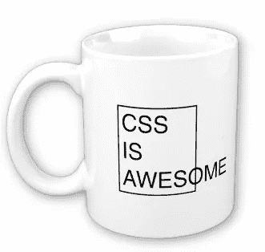

# “软件容易，人难”

> 原文：<https://medium.com/hackernoon/software-is-easy-people-are-hard-f529bb980a6d>

是(也许不是这样？)令人惊讶的是，上述说法会引起如此大的争议。向大多数人提出这个问题，并期待一系列的回应，其中一端由讨厌管理概念的自由主义者组成，另一端由独裁的混蛋组成，他们相信只要人们完全按照项目计划中的要求去做，事情就会变得很好！！！

事情是，在上面的陈述中*是*的一个真实元素，这取决于*软件*和*人*到底是如何定义的。和所有事情一样，语义很重要🙄。

所以，让我们把*软件*分成两类

*   ***工程*** :为手头的问题寻找合适的解决方案的过程。通常，这也包括首先找出问题所在！
*   ***编码*** :实施上述*工程*步骤中确定的解决方案。

当像这样被打破时，*编码*是“硬的”,因为其中涉及到技巧。可能需要几年的时间，或者 10000 个小时的时间，才能在这方面变得出色，但这在很大程度上仍然是一个时间因素。
*工程*则相反，*只是普通的硬！成为一名优秀工程师的很大一部分包括解决这个领域和其他领域的多个问题，学习处理问题的正式方法，严格的纪律，分类和识别解决方案空间，避免兔子洞，坦白地说，通过搞砸很多事情(我们确实从错误中学到了更多！).
编码*是通过深度掌握的，而工程是通过广度掌握的。**

但是(而且是一个巨大的“但是”！)，我们处理的绝大多数*工程*问题都是非常直接的。哦，我们愿意认为我们花时间实现支付协议的形式验证器，但现实是我们大多数人只是试图找出如何让愚蠢的 CSS 元素向左移动一点点😨。
所以耶，*软件*很容易。请注意，软件容易也意味着很容易做真正愚蠢的事情，并最终进入一个维护 CSS 是一场超越所有凡人理解的噩梦的世界，但是，嘿，这就是突破口。

综上所述，考虑一下让一群*工程师*和*程序员*为一个共同的目标一起工作需要什么。在一个完全理性的世界里，这很简单，但是，嘿，这不是那个世界！要完成任何事情，您需要数据

*   *激励他们中的每一个人。他们中的一些人会对一种或多种基本原罪(欲望、贪婪、嫉妒等)做出反应。)而另一些人更喜欢美德(善良、耐心、勤奋等。).上帝禁止你混淆动机模式！*
*   作为一个群体激励他们。确保那些需要互动的人得到他们，那些不需要的人被关起来了，那些负担过重的人不会把他们的意愿强加给其他人，等等。所有这些互动都会导致他们自己的反馈循环，这可能会影响个人的动机("*为什么 Bob 会领导这个组件？爱丽丝更适合！现在我很沮丧，打算生闷气*

不幸的是，与养猫不同，这是一项永无止境的工作。此外，要记住的是，我们谈论的是人类。人类，他们的需求，欲望，等等。不断变化。不管你支持哪种管理方法——独裁还是培养——你仍然需要了解和处理这些动机，才能取得成功。(*当然，除非人家是你的炮灰，在这种情况下请走开，我没时间理你*😡)

所以是的，鉴于上述语义，*软件容易，人难*。

*(* [*这篇文章也出现在我的博客上*](https://dieswaytoofast.blogspot.com/2018/10/software-is-easy-people-are-hard.html) *)*