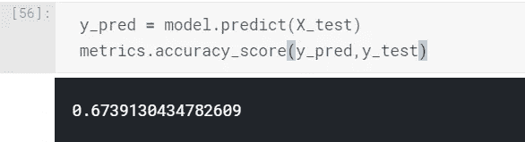
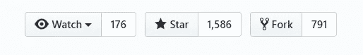
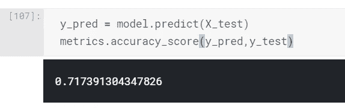
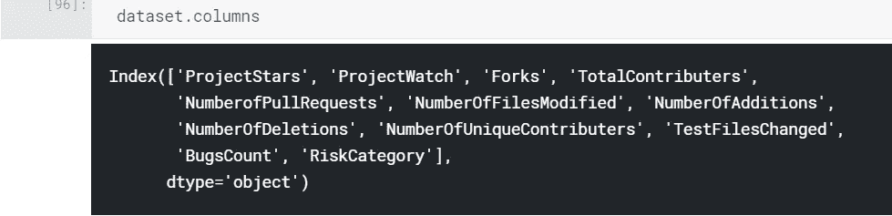
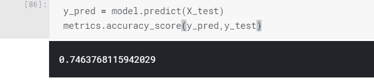
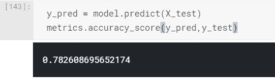
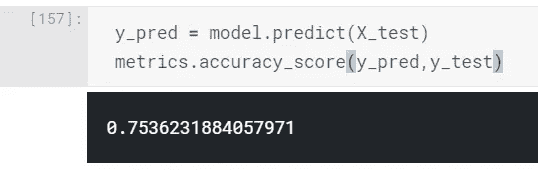

# 软件发布生命周期——一种机器学习方法

> 原文：<https://medium.com/hackernoon/software-release-life-cycles-a-machine-learning-approach-d485592263b5>

Photo by [Markus Spiske](https://unsplash.com/@markusspiske?utm_source=medium&utm_medium=referral) on [Unsplash](https://unsplash.com?utm_source=medium&utm_medium=referral)

# 背景

我觉得学习的最好方法是做并选择一个你热爱的项目。你可以观看所有的课程和 MOOC，但如果你不把它们付诸实践，那就没用了。所以最近，我开始做一个有趣的项目来分析开源软件版本，并试图预测一个软件版本是有很多错误还是只有很少的错误。显然，这是一个简单的二元分类问题(0 和 1)。机器学习模型可以帮助发布经理和项目经理根据可用资源更好地规划他们的软件发布。

# 数据工程

Photo by [David Rangel](https://unsplash.com/@rangel?utm_source=medium&utm_medium=referral) on [Unsplash](https://unsplash.com?utm_source=medium&utm_medium=referral)

不幸的是，我找不到任何包含软件发布数据的数据集，这些数据包含有关发布的信息，如提交的数量、更改的文件以及发布后出现的错误，因此我决定创建一个。我的第一选择是从 [GitHub](https://github.com/) 获取数据，他们也有一个不错的 [API](https://developer.github.com/v3/) 。你可以在这里找到我的 GitHub 库[,它将帮助你开始导出一个项目的所有发布以及提出的问题到一个 csv 中。](https://github.com/AnoojNair/ExportReleaseData)

# 探索性数据分析

更好地理解数据的一个好方法是做 EDA。在每个独立变量(特征)之间以及每个独立变量和目标之间绘制尽可能多的图。从二元分类的角度来看，了解数据中是否存在类别不平衡问题非常重要。我更喜欢用 [Tableau](https://www.tableau.com/) 来执行 EDA，想知道更多如何执行 EDA，请参考这篇[文章](https://towardsdatascience.com/tableau-for-exploratory-data-analysis-eda-c503aa84515a)。

要查看我为此练习执行的 EDA，请查看此[链接](https://public.tableau.com/profile/anooj4274#!/vizhome/ReleaseAnalysis-EDA/UTvsBugs)

# 特征生成和建模

Photo by [Franki Chamaki](https://unsplash.com/@franki?utm_source=medium&utm_medium=referral) on [Unsplash](https://unsplash.com?utm_source=medium&utm_medium=referral)

现在进入练习中最有趣的部分，特征生成和机器学习。我从以下我认为可以预测发布质量的特性开始。

1.  **修改的文件数量**
2.  **增加的行数(新增加的代码)**
3.  **行删除数(代码删除)**
4.  **拉取请求的数量(介绍新增功能)**
5.  **此版本的贡献者人数。**

我用这 5 个特征训练了一个 [Xgboost](https://www.datacamp.com/community/tutorials/xgboost-in-python) 分类器模型，以获得一个基线，正如我想象的那样，它并没有那么好。

显然，这里有很多假设，如项目的复杂性、规模和涉及的贡献者，因此我决定挖掘更多的功能，以某种方式帮助我理解项目的复杂性和受欢迎程度。我添加了以下特性，这些特性预示着这个项目的受欢迎程度。

GitHub social links

1.  **项目明星**
2.  **项目观察**
3.  **叉子**
4.  **存储库的总贡献者**

现在让我们检查一下准确度是否提高了。看起来很有希望，4%的涨幅。我们继续吧。

# 单元测试怎么样？

软件开发的最佳实践之一是**单元测试**。但是我们如何将单元测试量化成一个数字。**统计一下 tests 文件夹下修改过的文件或者统计一下修改过的有 test 字样的文件**怎么样？每个项目都有不同的单元测试命名约定。我手动检查了我的数据集中的每个单独的项目是如何进行单元测试的，并编写了模式来计算一个版本中所有更改的测试文件，这些就是我拥有的功能。

让我们看看为单元测试增加一个特性是否能提高我们的准确度，它确实提高了。

# 发布的顺序有影响吗？

软件发布正在进行中。从一个版本到下一个版本，功能不断增加，缺陷不断修复。发布的顺序对产生的 bug 数量有影响吗？最初的版本有更多的错误吗？让我们看看将发布的顺序添加到数据集是否会以任何方式提高准确性。

看来确实对养出来的虫子有影响。

# **将贡献者的经验量化为一个特征**

你如何将某人的经验和技能量化成一个数字，这是非常主观的。我决定计算某个特定版本的贡献者之前所做贡献的总数，将其作为一个特性添加进来，并检查是否可以提高准确性。正如你在下面看到的，添加这个功能似乎不是一个好主意，我决定把它退回去。

你可以在这里找到我创建的 python 笔记本[和样本数据集](https://github.com/AnoojNair/SoftwareReleaseDataAnalysis)。下一步将执行[超参数调整](https://en.wikipedia.org/wiki/Hyperparameter_optimization)以获得更好的精度。

# 结论

这个练习向我证明了领域知识在数据科学中的价值，因为我对软件开发知之甚少，我可以添加新的特性来提高模型的准确性。总的来说，学习概念并付诸实践是一项有趣的练习。我真的觉得这是一种提高技能的有趣方式，我希望每个正在学习机器学习的人，都能选择一个他们热爱的项目，创造一些美好的东西。

*如有任何反馈或问题，欢迎随时联系我* [*LinkedIn*](https://www.linkedin.com/in/anooj-j-54a08551)