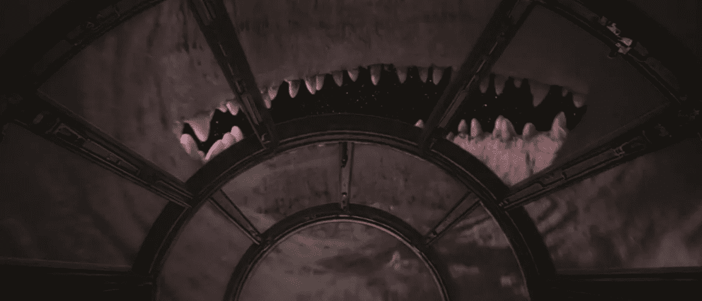
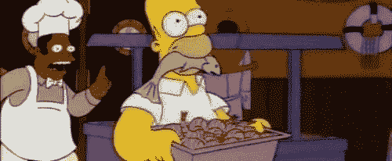
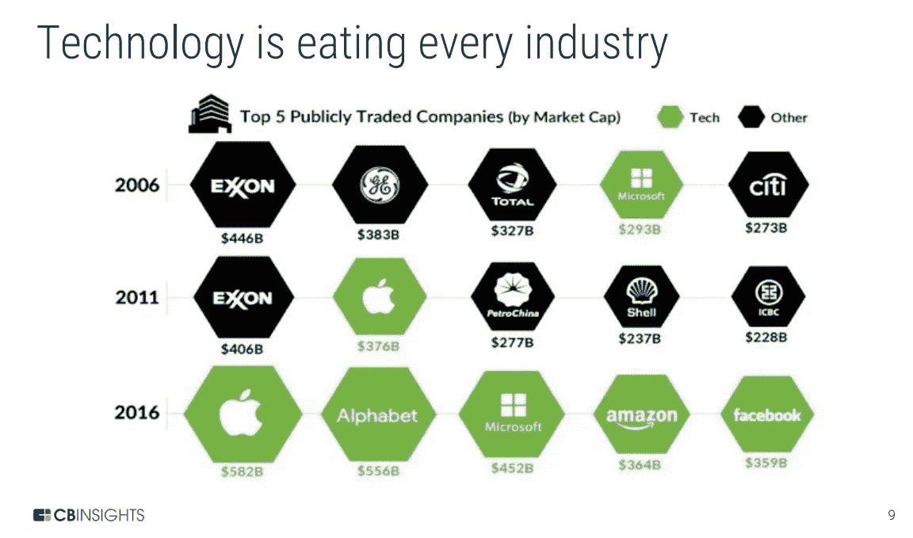
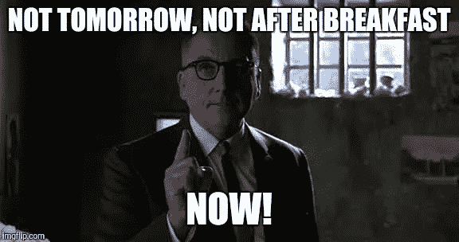
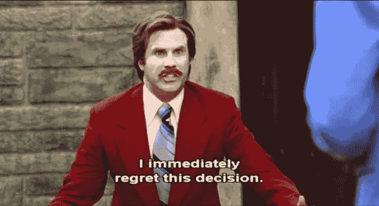
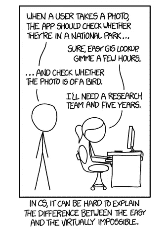
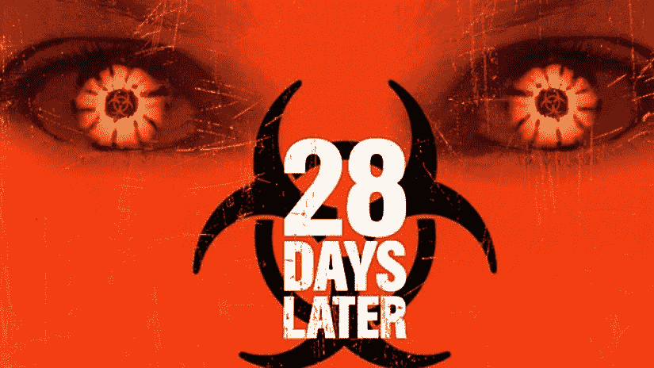
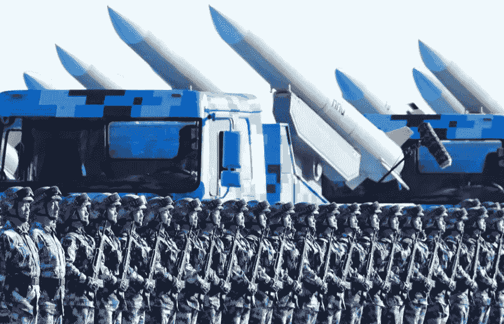
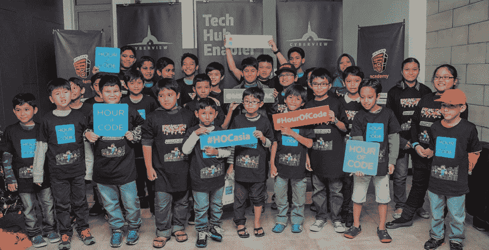

# 软件:正在吞噬我们所有人的不可阻挡的怪物

> 原文：<https://medium.com/hackernoon/software-the-monster-thats-eating-us-all-b7c3bbe0b0d7>

如果你觉得[脸书](https://hackernoon.com/tagged/facebook)很恐怖，那就把你的眼睛从 AI 上遮起来。我们该怎么处理？

“this is no cave”

惊喜！脸书很了解我们。但事实证明，我们对它们知之甚少。我们同意服务条款，我们不会在不知道发生了什么的情况下通过脸书阅读和注册应用程序。因此，在剑桥分析扫描事件之后，国会请马克·扎克伯格就他们使用数据的性质作证。如果我们不太了解脸书，国会*真的不太了解脸书。扎克伯格在很大程度上没有经过[的考验](http://money.cnn.com/2018/04/10/technology/senate-mark-zuckerberg-testimony/index.html)，因为[有时会搞笑](https://mashable.com/2018/04/10/mr-zuckerberg-meme-senate-hearing-facebook/#3tEXOhVh3Zq6)参议院的技术盲(举个例子，这个家伙*主持*参议院共和党**高科技**特别工作组):*

 [## 参议院的技术盲如何拯救了马克·扎克伯格

### 马克·扎克伯格周二在国会作证的第一天，所有报道都暗示他…

www.cnn.com](https://www.cnn.com/2018/04/10/politics/mark-zuckerberg-senate-hearing-tech-illiteracy-analysis/index.html) 

脸书是一个非常强大的野兽，但如果你有任何种类的技术知识，它不会过于复杂。然而，负责监管这种动物的人完全不知道它有什么样的能力，或者为什么会有这种能力。这太可怕了。

he didn’t really ask this, but man…I wish he did

所以现在想象一下，有什么东西知道脸书所知道的一切，加上所有其他软件公司联合起来，以指数方式学习，以实现设计不佳的目标。那真是*非常*恐怖。这将是一个怪物，这是一个实际的可能性。这就是为什么你会看到像[埃隆·马斯克警告人工智能可能创造一个“我们永远无法逃脱的不朽独裁者”这样的标题](https://www.cnbc.com/2018/04/06/elon-musk-warns-ai-could-create-immortal-dictator-in-documentary.html)

没那么好笑。

## 美丽新世界

正如科技巨头马克·安德里森(Marc Andreesen)的著名论断，“软件正在吞噬世界”你可以说我守旧，但是当有什么东西在吞噬我的时候，我通常想知道是什么东西。毫无疑问，他是对的……他在 2011 年写了这篇文章，从那以后软件就没有离开过自助餐。

优步、Airbnb 和亚马逊都是颠覆传统实体产业的软件公司。自他 2011 年宣布以来，埃克森美孚、中石油、壳牌和工行已被 Alphabet、微软、亚马逊和脸书取代，成为前五大上市公司(腾讯在经历公关噩梦后取代了脸书，但它们也主要是一家软件公司)。

但是仍然有一个二进制(😉认为自己是技术人员的人和不认为自己是技术人员的人之间的差距，就像印刷机发明后不久，有文化的精英和其他人之间的差距一样。但是这场革命远比 16 世纪在欧洲传播的书籍更重要，更具变革性，也更(潜在)危险。它有能力*实际上*吃掉我们。在《T4:我们最终的发明:人工智能和人类时代的终结》一书中(我看了之后并没有被它吃掉)，詹姆斯·巴拉特说:

> 我写这本书是为了警告你，人工智能可能会导致人类灭绝，并解释这种灾难性的结果不仅是可能的，而且如果我们现在不开始非常仔细地准备，这种可能性也很大。

注意那个词，*现在是*。

正如亚历山大·舒尔金所写的那样——“诺亚建造方舟的时候，天还没有下雨。”

## 数字鸿沟

然而，正如脸书的数据灾难告诉我们所有人的那样……很少有人知道技术是如何工作的，哪怕是一点点线索。

大家*都在用*技术，但真正懂的却少之又少。每个人都存储密码，通过互联网进行交易，人们听说网络中立和自动驾驶汽车。每个公司都有网站、文件存储系统和 IT 基础设施。

这是否意味着每个人都应该学习编码？我不这么认为。但是每个人都应该拥有代码的“结构知识”吗？我确实这样认为。

正如 Pedro Domingos 在[主算法:对终极学习机器的探索将如何重塑我们的世界中所说的那样](https://www.amazon.com/Master-Algorithm-Ultimate-Learning-Machine/dp/1501299387):

> 只有工程师和机械师需要知道汽车的发动机是如何工作的，但每个司机都需要知道转动方向盘会改变汽车的方向，踩刹车会使汽车停下来。今天很少有人知道学习者的相应要素是什么，更不用说如何使用它们了。心理学家唐·诺曼(Don Norman)创造了“概念模型”这个术语，指的是我们为了有效地使用某项技术而需要的粗略知识。

结构知识本质上是这样的:你不需要能够杀死狮子，你只需要知道狮子可以杀死你。所以不入坑。

what we don’t want to be saying after unleashing AI

现在，我们像悬崖边的旅鼠一样，盲目地一个接一个地跳进坑里…我们懒得去读法律术语，放弃了比我们想象中更多的隐私。现在我们惊讶于狮子正在吃我们。

用技术术语来说，我相信这意味着每个人都应该知道什么是 **hash** ，即使他们不在乎在程序中编写或使用它。每个人都应该知道什么是**饼干**，为什么它会在那里，等等。

多明戈斯继续说道:

> 当一项新技术像机器学习一样无处不在并不断改变游戏规则时，让它保持黑箱状态是不明智的。不透明为错误和误用打开了大门。亚马逊的算法，比任何一个人都更能决定当今世界读什么书。国家安全局的算法决定你是否是潜在的恐怖分子。气候模型决定了大气中二氧化碳的安全水平。选股模型比我们大多数人更能驱动经济。你不能控制你不理解的东西，这就是为什么你需要理解机器学习——作为一个公民，一个专业人士，一个从事追求幸福的人。

大多数人不知道这种区别…这不是一件好事:

然而，我们仍然没有在学校教授大多数孩子数字读写技能。皮尤研究中心报告称，只有 17%的人对 T4 的数字化做好了准备。

## 指数速度

吃我们的怪物正在长牙齿，每天越来越多。这是技术的复合力量，就像金融一样。如果你今天有一便士，每天翻倍，28 天后你就会有超过一百万美元。[巧合](https://en.wikipedia.org/wiki/28_Days_Later)？：

这就是为什么你会看到比尔·盖茨和埃隆·马斯克这样的技术领袖对人工智能的发展方向持怀疑态度。

我们目前拥有狭义智能，即计算机在国际象棋中击败我们的能力。人工智能在智力有限的任务中击败人类的能力正在迅速提高——人工智能已经学会了面部识别和声音识别，并在游戏中击败了最伟大的人类[围棋](https://www.youtube.com/watch?v=8tq1C8spV_g)比大多数专家预测的要快得多。

接下来我们有**通用人工智能**——在它被训练做的各种事情上击败我们。这类似于计算器和计算机之间的区别…第一个设计得很好，第二个设计得很好。

一旦实现了普遍智能，这可能会很快导致人工超级智能，这将使人类远远脱离智能联盟，我们就像试图参加波士顿马拉松比赛的蚂蚁一样。

尤瓦尔·诺亚·哈拉里称农业革命是人类最大的骗局，因为它将我们奴役在土地上，而土地扩张的速度之快足以确保我们无法回到狩猎采集的生活方式。这一直是科技的一个主题，现在可以在互联网、智能手机和电子邮件上看到。我们是它的奴隶，我们不能回去。因此，数字革命可能被证明是一个更大的骗局。但是已经没有回头路了。#deletefacebook 可能是一个可爱的，但我没有看到一大波人删除他们的帐户。这在我们太多人的生活中根深蒂固。我们已经让技术超越了我们的存在，一切的数字化可能会成为我们的败笔。即使人工智能没有创造脸书，它在我们潜在灭亡中的作用(超级智能人工智能拥有的关于我们意图的所有数字数据)可能是非常真实的。

所以如果我们回不去了，主要问题是…我们给人工智能什么动机和目标？

## 我们准备好做出这些决定了吗？

正如蒂姆·厄本在他的网站上发表的关于人工智能的精彩的两部分系列文章中所说的,“等待，但是为什么?”？，"*在对数百名科学家进行的一项调查中，他们认为我们很有可能到达 AGI 的时间的中间值是 2040 年*，"或者说是在我们有生之年。

我们如何处理这个问题将是世界历史上最具决定性的决定之一。具体来说，我们给 AI 什么动机/目标。正如牛津大学的尼克·博斯特罗姆在《超级智慧》中所说:

> 这很可能是人类有史以来面临的最重要和最艰巨的挑战。无论我们成功还是失败，这可能是我们面临的最后一个挑战。

***人类有史以来面临的最重要、最艰巨的挑战？！？***

然而我们的政府甚至连他妈的预算都凑不到。我们不能互相交谈或建设性地合作。我们完全没有意识到自己的[虚伪和偏见](/thinking-is-hard/4-conundrums-of-intelligence-2ab78d90740f)。负责做出这些决定的人的技术素养可能会非常可怕。奥巴马[说](https://www.technologyreview.com/s/602612/obama-my-successor-will-govern-a-country-being-transformed-by-ai/):

> “我的继任者将管理一个被人工智能改造的国家”

😨:

successor

我们过去能够跟上技术创新——事情发展得足够慢，以至于我们能够理解变化。广播、电视改变了世界，但你不能告诉我当时的每个立法者都知道这意味着什么(或多或少)。你可以向艾森豪威尔解释什么是彩色电视，他会明白的。纺织工人可以接受再培训成为织机操作员，但卡车司机不会有时间学习构建机器学习应用程序。

 [## 美国政府不仅仅是技术盲。这是技术无能

### 2016 年 2 月，里兹万·赛义德·法鲁克在加州圣贝纳迪诺杀害 14 人两个月后，联邦调查局局长…

www.wired.com](https://www.wired.com/2017/05/real-threat-government-tech-illiteracy/) 

随着人工智能抢走工作，愤怒的人群将会越来越多。他们会很大声。他们将会非常无知，不知道到底发生了什么。

许多法律决策将由对技术知之甚少的人做出——区块链、网络中立等。以及与之相关的伦理、价值观和目标。正如尤瓦尔·诺亚·哈拉里在《德乌斯人:明日简史》中所说:

> 正是因为技术发展如此之快，议会和独裁者都被他们无法快速处理的数据淹没了，今天的政治家们思考的范围比他们一个世纪前的前辈要小得多。因此，在 21 世纪初，政治缺乏宏大的愿景。政府已经变成纯粹的行政管理。它管理国家，但不再领导国家。政府确保教师按时拿到工资，污水系统不会溢出，但它不知道这个国家在 20 年后会变成什么样子。

也许我们应该感谢 FB 无意中给了我们一脚，让我们意识到我们可能都需要学习更多的技术。

Armies we have, armies we need.

恐龙被一颗他们没有预见到的小行星毁灭了。恐怕我们政府的科技盲恐龙们在为浴室账单争吵的时候，看不到什么会毁灭我们。这就是为什么蒂姆·厄本把人工智能比作《权力的游戏》——当一个伟大的未知可能会毁灭我们的时候，我们自己却在犹豫不决。

has anyone seen my dragon glass laying around?

## 前进道路

耐心是一种美德。正如马克斯·泰格马克在《T2 人生》3.0 版中引用艾萨克·阿西莫夫的话:

> 现在生活中最可悲的一面是，科学积累知识的速度比社会积累智慧的速度还要快——艾萨克·阿西莫夫

我们正在设计一个对我们来说不可想象的世界，这个世界有着不完美的思想和动机，让我们不太可能真正审视我们所建造的东西的后果。

我们需要退后一步，了解我们在处理什么，而不是像一个刚刚发现一个仓库的迷幻药和旧平克·弗洛伊德黑胶的瘾君子一样向前冲。对我们来说什么是重要的？幸福？永生？和平？平等？去真正理解现实？如果这是幸福，那是不是意味着我们把大脑放在一桶桶的粘液里，把我们的快乐感受器和多巴胺 IV 连接起来？如果是根除癌症，人工智能是否意识到最简单的方法就是摧毁所有生物？每条路都有自己的后果。

也许是时候回顾和重构我们的人类目标，看看我们到目前为止做了些什么。人类个体在预测什么会让我们快乐方面非常[糟糕。作为一个社会，我们有什么进步吗？科技让我们更幸福了吗？这当然挽救了生命，但如果我们不只是想把我们的大脑放进梅森罐子里，那么痛苦难道不是人类经历中不可避免的一部分吗？科技是否减少了工作时间？感觉不像。它让我们和周围的人联系更紧密了吗？还是我们只是不停地工作，查看电子邮件，盯着发光的矩形看？是汽车和飞机拉近了我们的距离，还是因为这种新的便利，我们现在住得更远了？](https://www.amazon.com/Stumbling-Happiness-Daniel-Gilbert/dp/1400077427)

和大多数人一样，我认为我们不能回头。为时已晚。如果是这样的话，我们必须与技术融合，否则就有可能变得无关紧要。这就是为什么马斯克创建了神经链接(Neuralink)和许多其他人(T2)正在努力确保一条安全的前进道路(T3)。我们应该倾听。我们需要非常缓慢地进行*。我将引用博斯特罗姆早些时候说过的一句话来结束我的发言:*

> 无论我们成功还是失败，这可能是我们面临的最后一个挑战。

我们就像托马斯·杰斐逊写《独立宣言》，只是这一次我们写的是我们整个物种的命运规则。我们不会得到任何修正。

 [## 罗伯特·蒙丁格(@rmundragon) |推特

### 罗伯特·蒙丁格的最新推文(@rmundragon)。科技，城市，教育等无聊的东西。创建者…

twitter.com](https://twitter.com/rmundragon)