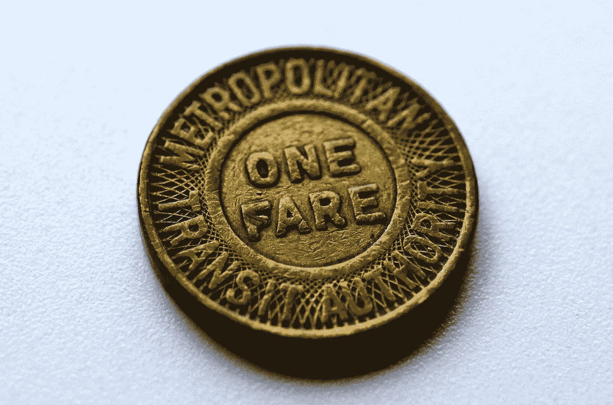

# 软件、网站和令牌

> 原文：<https://medium.com/hackernoon/software-websites-and-tokens-7c70c86c8e6>

## 这是关于区块链浪潮系列故事的第三部分，也是最后一部分。

在第一部分，我提出了一个案例，我们正在见证一个新的技术浪潮的开始，类似于 40 年和 20 年前的个人电脑和网络浪潮。[在第二部分](/@julien51/printing-bibles-bc829983bddd)，我认为我们不应该期望这一新浪潮会竞争或取代以前的建筑。

PC 浪潮的最大赢家是微软，它能够建立一个平台，让本地的*(当时还不叫“应用程序”)能够茁壮成长。谷歌，而不是脸书，是网络浪潮的真正赢家，它建立了一个平台，允许网站的发现和后来的(付费)分发。*

*我们可以看到，PC 和 web 浪潮的代码“容器”分别是**软件**和**网站**，这两者的胜出平台已经建立了一个良性循环，生态系统越大，平台就越有用，平台被使用得越多，生态系统就越能成长。*

*在[区块链](https://hackernoon.com/tagged/blockchain)世界中，代码容器被称为“**智能契约**”。你可能会说，以大多数标准衡量，比特币是最大的区块链，但它不支持智能合约，但我要指出的是，在实践中，BTC 交易实际上是一个基本的智能合约，它保证所述交易是有效的(没有重复消费)。正如 PC 软件可以采取多种形式一样，从命令行应用程序到全屏沉浸式游戏体验，智能合约通常带有“附加”令牌，有多种形式:从计算机存储货币到加密工具包…*

**

*Contrary to popular belief, tokens existed before the internet ;)*

*如果说 2017 年有什么不同的话，那就是“代币”数量的爆炸。现在有成千上万家这样的公司，而且增长速度似乎没有放缓。甚至经常很难跟踪它们的核心特征(见菲尔·格雷泽 [在这方面的工作](https://hackernoon.com/the-token-handbook-a80244a6aacb) ): *可替换、可分割、可转让、供应有限、预先开采、可燃烧、主动、被动*……他们可以从投资的角度对它们进行分类，因为这就是 ICO 的全部，但也不是不可能想象出其他类型的非安全代币，它们将代表所有权、使用权甚至身份。*

*从拥有[盘古](https://medium.com/u/7d9a5f7f05c0?source=post_page-----7c70c86c8e6--------------------------------)的房地产到通过 [CryptoKitties](https://medium.com/u/c8b1419b5d28?source=post_page-----7c70c86c8e6--------------------------------) 的收藏品，令牌化正在进行中。马克·安德森有句名言:软件正在吞噬世界:令牌很可能就是实现这一目标的刀叉！*

*这种爆炸带来了很多挑战，从保管(如何跟踪一个我的几百个代币？)，到互操作性(我怎么能用我的 crypto-kitten 去赌预测市场？)，通过治理(谁在管，实际上有没有人在管？).*

*这些大问题中的每一个都可能有多个相互竞争的解决方案。区块链世界已经有几十个钱包试图解决托管挑战，数百个交易所试图带来流动性，但**也许另一个挑战一旦解开，将证明对代币生态系统的增长更有成效**。*

*关于区块链技术，我听到最多的一个评论就是“太晚了”。当然，对于一些人来说，这是短期的财务收益，但有时，其他人认为技术格局已经开始稳定，今天的赢家将继续成为明天的赢家。*

*历史表明，过早往往比过晚更糟糕。毕竟，谷歌是已经包括十几个搜索引擎的名单上的又一个搜索引擎。但更重要的是，区块链生态系统目前的规模比我们许多人最终预期的要小几个数量级。同样，牛顿物理学在“人类”尺度上有效，但无法解释原子尺度上的现象，我们应该预料到，随着令牌生态系统的发展超出其早期采用者群体，新的问题和挑战将会出现。*