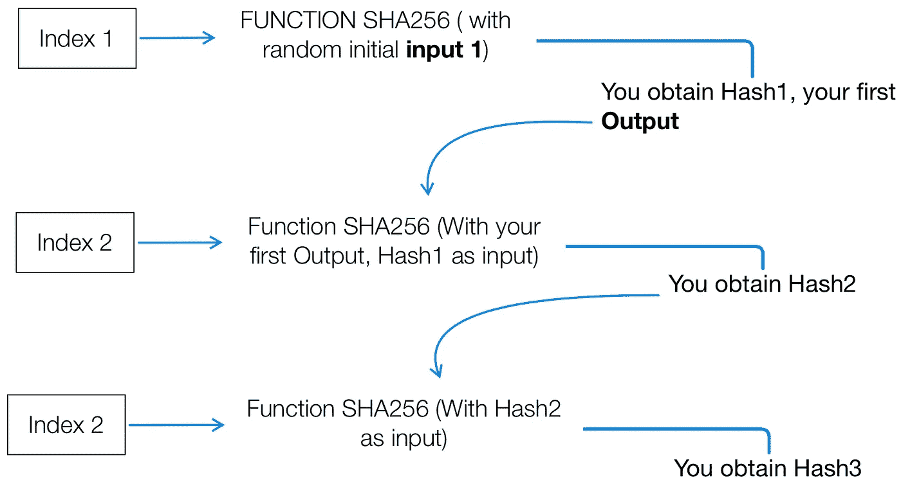

# Solana ICO 评论—重新设计高性能区块链

> 原文：<https://medium.com/hackernoon/solana-ico-review-redesigning-the-high-performance-blockchain-5e051297bb7d>

不能在时间上达成一致是一个棘手的问题，不仅在区块链，在互联网上也是如此。同步时钟在分布式系统中的实际用途是提高分布式算法的性能。

其他项目如 [Hashgraph](https://www.hederahashgraph.com/) (带有“中间”时间戳)或 [FOAM](https://www.foam.space/) (带有无线电收发器的部署信标之间的时钟同步，以确保位置证明)正在努力解决“时间协议”问题。

索拉纳:“历史的证明”决定了区块链未来的可扩展性。

为了创建一个带有编码的不可信时间流逝的账本， [SOLANA](http://www.solana.io/) 设计了**历史证明**，一个用于验证特定事件之间的顺序和时间流逝的证明。

历史证明将与工作证明(除其他外，[比特币](https://bitcoin.org/en/)使用的共识算法)或利益证明(以太坊的 Casper 使用的算法)一起工作。这可以减少导致亚秒终结时间的消息传递开销。

除此之外，Solana 还致力于在没有数据分区的情况下，基于 1 gb 网络，每秒产生高达 710，000 个事务。你想知道他们计划如何取得这一伟大的胜利吗？

# 问题

在开发高吞吐量(tps)和高度安全的区块链的竞赛中，团队正在设计新的方法来创建高度可扩展的解决方案，以实现目前在现有区块链中可用的每秒高事务处理。

**“时间问题**”。在这个计算和信息的时代，有一个基本的需求等待被解决。 ***事件之间不公平的协调*** 。它的意思是:例如，当一台计算机向另一台计算机发送消息时，它们需要同步事务之间的时间。因此，这意味着，如果他们每个人都有自己的生物钟，他们可能会，也可能不会，适当地协调。

用时间戳协调事件不仅是系统的需要，而且在金钱、人员和努力方面也是巨大的成本。

开发人员已经开始使用一种技术来提高链的整体吞吐量，这就是分片。分片是一种用于改善整个链 TPS 的技术，并且被证明是成功的，但是它本身并不是一个完整的解决方案，因为这可能会引入漏洞。

最大的漏洞是交易的分割，如果处理不好，可能会导致欺诈交易、重复消费或同一交易的不同部分之间缺乏共享知识

举个大概的例子，Google Spanner (Google 的可扩展、多版本、全球分布、*同步复制的*数据库，支持读写事务、只读事务和快照读取)花费了大量资源来同步数据中心之间的原子钟。

它们需要精确地维护，一大群工程师在为此努力。协调时间似乎是一件容易的事情，但事实并非如此，这就是索拉纳提出历史证明解决方案的原因。

通过启用可信时间协调，Solana 不仅可以在速度和可靠性方面提高其区块链吞吐量，还可以降低平均成本。

成功解决这个问题的团队可能会高度采用区块链。

# 解决办法

索拉纳正在他们的区块链内实施一个新的基于时间的方法来达成共识。

他们的方法基于“历史证明”,是一种创新的达成共识的方法，不需要网络中的所有节点确认交易，如(BTC 或瑞士联邦理工学院),只需要所有节点都同意事件 A 发生在事件 b 之前

为了解决这个问题，索拉纳设计了一个新的区块链建筑。这一新概念整合了所谓的“历史证明”(转到“技术概述”以获得更深入、更易于理解的顺序解释)，并将提高可扩展性(如图所示)和降低成本。

如果你看一下上面的图片序列，如果你是漫威大片的影迷，你当然可以想象自己在电影院看这些电影中的一部。你会同意，如果你参加了其中的一场首映式，没有人会否认你是在*钢铁侠*的首映式之后看了**【复仇者联盟】* **，而是在**之前看了**复仇者联盟 3：无限战争。能够记录历史上的事件，并将这些事件作为时间的滴答。***

*这些图片带有特定的时间信息。你不需要花费资源去寻找这些信息，因为这些信息是照片所固有的，是照片自带的，是每个人都认同的，也很容易被验证。这与这个新的区块链架构试图为密码世界提供的东西类似(在上面的例子中)。*

*高效可靠的区块链时钟，每笔交易的时间戳。因此，通过创建一个有组织的、完全可验证的历史记录，Solana 将允许他们的区块链的用户信任某一特定事件的顺序和特定时刻。正如我们将在下一节中看到的，这种验证可以用比生成它少得多的时间来完成。*

# *主要功能—技术概述*

*对索拉纳提出的解决方案的深入研究提出了一些问题，例如，历史证明是如何在区块链实施的，索拉纳到底是如何工作的，他们使用的是什么工具？*

*首先，我们需要了解网络是如何设计的，它由什么组成。下图总结了这一点，这是一个自上而下的 Solana 网络设计的可视化演示。*

**

*历史的**证明**是高频[可验证延迟功能](https://www.youtube.com/watch?v=qUoagL7OZ1k)。这意味着需要评估确定的**数量的相关步骤**。但另一方面，这些步骤最终会产生一个**唯一输出**，易于验证。*

*在解决方案部分，我们讨论了 Solana 如何增加 txn/s 的数量，以及如何减少运行它们所需的资源。如何做到这一点的解释与散列函数的解释是紧密相关的。*

*哈希函数作为压缩数据的一种方式，因此较大数量的数据最终可以压缩成较小的比特集，这有助于减轻 tx 权重，从而实现更有效、更快速的序列。*

**

*如上所述，历史序列的证明被设计成与 [**密码散列函数**](https://www.lifewire.com/cryptographic-hash-function-2625832) 一起工作。*

*与加密哈希函数特别相关的是，如果不从一开始就使用原始的**输入**执行整个函数，就不可能预测最终会得到什么结果(**输出**)。因此，获得输入并试图预测输出是不可能的，您将需要运行该函数来获得结果。*

*考虑到这一点，想象这个散列函数从某个随机的起点(初始输入)开始运行，一旦这个过程完成，您就获得了第一个输出(hash 1)。这就是有趣的地方，将之前运行函数得到的输出输入到下一个散列的输入中，如下图所示:*

**

*现在，如果我们重复这个过程…例如 300 次。您可以开始看到我们已经创建了一个单线程进程，其中最终输出(hash 300)是完全不可访问的，除非那些执行整个线程的人。*

*这种将输出与生成的数据一起反馈到下一个函数的输入的循环，然后被表示为时间的流逝和历史的创造，用索拉纳的话来说就是*滴答*。每个输出都包含详细信息，不运行该函数就无法预测。就像上面例子中漫威传奇中的电影一样，每一个输出都代表了一个时间点，这个时间点正好在连续时间线中的位置上*

*因此，Solana 建议不要使用不可靠的时间，而是使用这些顺序有序且不可预测的输出来确定时间中的特定时刻，我们可以称之为**历史**的线程化过程中的特定时刻。*

***雪崩:索拉纳的拥堵解决方案***

*Solana 在 1 GB 网络上的高事务输出是通过 Solana 开发的名为 Avalanche 的架构完成的。与 torrent 网络类似，分类帐的完整副本不一定在任何特定节点都可用，但完整副本总是可用的，并且可以通过收集每个片段并重建它来传递。*

**

*在上图中，您可以观察到指定的领导者节点的块数据被分成两部分。它第一次跳到第二层，然后第二次跳到它的对等节点。在第三跳之后，该块进行第四跳回到领导节点以报告它的投票。随着⅔ + 1 多数票的通过，该区块到达终点，并进入下一区块。*

*由于只需在对等方之间共享一半的块数据，因此极大地减少了网络中的带宽和数据使用*

***诚实的方法***

*为了让 Solana 保持节点和验证者的诚实，历史证明生成器会有意地以随机的间隔发送一个无效的散列。由于节点有验证它们接收到的任何散列的动机，Solana 确保任何验证无效散列的验证者将被削减。*

***股权证明***

*索拉纳使用一致同意的赌注证明(POS ),因此它具有许多与其他基于 POS 的硬币相同的特征。作为复习，以下是 POS 硬币的一些主要特征:*

*   *赌注硬币的证明使用验证器*
*   *利害关系的证据可以通过以下方式证明*

1.  *把硬币锁在钱包里*
2.  *将硬币锁定在主节点中并有助于链的稳定性*

*   *支付顺序由下注硬币或主节点的“年龄”决定*
*   *每个赌注钱包或主节点接收铸造或新伪造的硬币*
*   *太长时间离线的钱包或主节点不再是“可支付的”,并且可以从网络中移除*
*   *POS 通过使破坏网络安全变得不值得来防止不良行为者将无效交易引入网络*
*   *对“坏演员”的惩罚可以是损失赌注硬币和奖励*
*   *只要证明利害关系的回报大于欺诈获利的机会，就能确保信任*

*Solana 有非常相似结构，但是以稍微不同的方式实现了他们的利害关系证明。*

*   *Solana 从那些已经绑定的节点中选择一个验证器(例如，已经押了一枚硬币)*
*   *然后，验证器的投票和选择由最长或最紧密结合的节点决定*
*   *索拉纳依赖快速确认；如果一个节点在指定的时间内没有响应，它将被标记为过时并从投票中删除，如果该节点当时是验证者，则举行新的选举来选择新的验证者*
*   *如果超级多数(2/3 的节点)在该超时内投票，则该分支被认为是有效的*
*   *划片是使债券无效的行为，防止验证者进行欺诈或试图验证多个节点，因为债券硬币将会丢失*
*   *一个主要的区别是次选节点的概念。一旦选定，在网络中断或其他故障的情况下，辅助节点可以接管主要角色。*

# *路标*

**

*   *【2017 年 11 月 —概念和白皮书草案*
*   *【2018 年 2 月 —白皮书发布和 Testnet 1.0*
*   *【2018 年 6 月 — Testnet 2.0 及公开演示*
*   *【2018 年 9 月 —公测发布*
*   ***2018 年第四季度**—mainnet 发布*
*   ***Q1 2019** —代币分销和合作伙伴关系*

# *潜在考虑因素*

*在测试期间，1gb 网络上最大 txn/秒达到了 400k。*

# *团队和顾问*

**

*[**Anatoly Yakovenko**](https://www.linkedin.com/in/anatoly-yakovenko/) **—** *Founder and CEO**

*   *在高通领导操作系统的开发，在中间层领导分布式系统，在 Dropbox 领导压缩。*
*   *是 BREW 的核心内核开发人员，BREW 为每部 CDMA 翻盖手机(超过 1 亿部设备)提供支持，并领导了技术开发，使 Project Tango (VR/AR)在高通手机上成为可能。*
*   *拥有 2 项高性能操作系统协议专利*

**

*[**Greg Fitzgerald**](https://www.linkedin.com/in/gregoryrfitzgerald/)— *Co-Founder and CTO**

*   *前高级软件工程师，在高通工作了 12 年，在 JavaScript、Python、C++和 Haskell 方面拥有丰富的经验。*
*   *曾是高通大学 web 和消息传递基础设施团队的技术主管，专门从事特定领域语言的设计和实现。*

**

*[**Eric Williams, PhD**](https://www.linkedin.com/in/sciencethedata/) **—** *Co-Founder and Chief Scientist**

*   *领导数据科学部门和 token economics。*
*   *当希格斯粒子在欧洲粒子物理研究所搜寻时，他在伯克利学习粒子物理，并在哥伦比亚大学获得博士学位。*
*   *在纪念斯隆-凯特琳癌症中心大学完成医学物理学博士后研究，后来在奥马达健康中心领导数据科学。*

**

*[**Raj Gokal**](https://www.linkedin.com/in/rajgokal/) — *Co-Founder and Head of Operations, Product and Finance**

*   *10 年产品管理和财务经验。*
*   *General Catalyst 的风险投资者，创办了消费医疗设备公司 Sano，吸引了超过 2000 万美元的投资，并在 Omada Health 增长十倍时领导其产品管理。*

**

*[**Alan Yu**](https://www.linkedin.com/in/alan-yu/)— *Co-Founder and Head of Strategy, BD, Marketing**

*   *在谷歌的销售和营销部门工作了 10 年，在任职期间赢得了几个奖项。*
*   *多年来一直活跃在加密社区，致力于定义空间的未来。*

**

*[**斯蒂芬·阿克里奇**](https://www.linkedin.com/in/stephenakridge/) — *联合创始人兼工程负责人**

*   *曾在 Salesforce、高通和英特尔担任软件工程师。*
*   *在高通和英特尔拥有 10 年关键的 GPU 优化专业知识，并领导 GPU 后端不断击败英伟达。*

***其他资源:***

*   *Github — [索拉纳](https://github.com/solana-labs)*

# *想要了解区块链和加密货币的最佳新闻、评论和信息，请访问 [coincrunch.io](https://coincrunch.io) 或查看我们的网站:[Youtube](https://www.youtube.com/channel/UCXyrBCWaRJzHfOtnWaR47Qw)|[Twitter](https://twitter.com/coincrunchio)|[脸书](https://www.facebook.com/realcoincrunch/) | [Reddit](https://www.reddit.com/user/coincrunchio)*