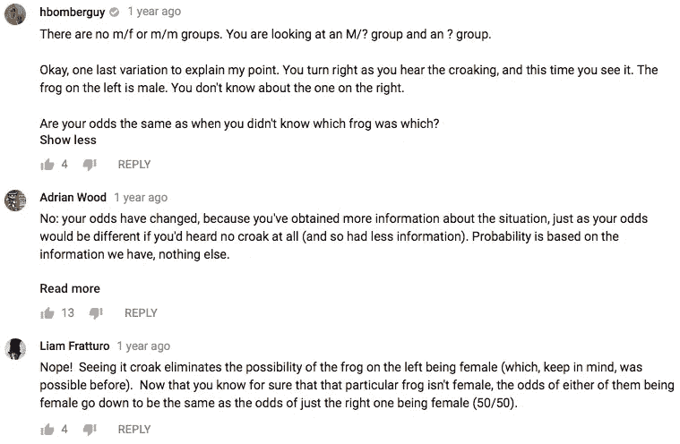

# 用 JavaScipt 解决 TED-Ed 的青蛙之谜

> 原文：<https://medium.com/hackernoon/solve-ted-eds-frog-riddle-with-javascipt-b1e5b9a80774>

Photo by Roberto Lopez ([https://unsplash.com/photos/vxKyz3HLw2g](https://unsplash.com/photos/vxKyz3HLw2g))

[TED-Ed](https://www.youtube.com/channel/UCsooa4yRKGN_zEE8iknghZA) 是 YouTube 上一个有教育内容的频道。他们偶尔会贴出谜语，给观众解谜的机会，然后解释它们是如何工作的。一个这样的难题是“青蛙之谜”，它的解决方案已被证明有点争议！它很短，你为什么不继续看呢？

See if you can solve the riddle on your own

所以我们去毒害我们自己！我们只能通过舔一只特定种类的雌性青蛙来注射解毒剂。男性和女性看起来一样，但只有男性呱呱叫。

在**一只不会叫的青蛙**和**一对青蛙(其中一只我们听到了叫声**)之间做出选择，哪个选项给了我们最大的生存几率？

我们被告知，舔一对青蛙中的两只会给我们更多的机会。这种想法当然是反直觉的！但是我们可以用一点 JavaScript非常简单地演示它的原理。

*声明:我不是数学家。我只是个程序员。如果你发现任何错误，请在评论中告诉我。*

让我们运行一个模拟程序，随机选择青蛙的性别，看看它们的分布情况。我们将运行模拟一百万次，以确保统计上显著的结果。

在这里，我们将青蛙对表示为字符串。如你所见，如果我们随机抽取成对的青蛙，它们的分布相当均匀:

*   雌雄成对，雌性在左边，
*   雌雄成对，雌性在右边，
*   两只青蛙都是雌性的
*   两只青蛙都是雄性的一对。

在这一点上，我们并不真正关心青蛙的顺序，所以我们可以将我们的几率简化如下:

**女性-男性** : 50%

**女性-女性** : 25%

**男性-男性** : 25%

但我们从谜语中知道，我们身后的一对肯定包含一只雄性，所以我们可以抛出雌性-雌性一对的可能性。我们当然可以在头脑中这样做，但是让我们重新编写代码来为我们解开这个谜。

因此我们新的机会是:

**女性-男性** : 67%

男性-男性 : 33%

由于孤独的青蛙是雌性的几率是 50/50，很明显，如果我们同时舔一对青蛙中的两只，我们遇到雌性的几率会更大。

所以我们已经解决了这个被描述的谜题，我们的解决方案和 TED-Ed 的一致。如果你满意了，故事可以到此结束。

…但争议的一点是，谜语特别说**你** **不知道这对青蛙中哪一只呱呱叫**。这个细节重要吗？有些人好像是这么想的！

我在[肖恩的 YouTube 频道](https://www.youtube.com/channel/UCJ6o36XL0CpYb6U5dNBiXHQ)上通过这个视频遇到了青蛙谜语，它质疑 TED-Ed 的谜语*本身*是否没有错。

What indeed

虽然我确实想回答这个问题，但首先我想谈谈我在它的*评论*部分发现的一个想法:

哇，什么？现在这个想法*肯定*是反直觉的。评论者认为，通过观察两只青蛙中哪一只呱呱叫，我们现在已经改变了存活的几率。

我当然同意你计算的几率会随着你获得更多信息而改变，但是让我们用我们的直觉特别考虑一下这个案例。

现在让我们假设利亚姆是正确的，在观察到呱呱叫的特定青蛙后，我们的几率将变成 50/50。这里有两种可能性。

1.  你看到左边的青蛙呱呱叫，你的生存几率现在是 50%。
2.  你看到右边呱呱叫的青蛙，你的生存几率现在是 50%。

这里需要注意的重要一点是**事件 1 和事件 2 发生的几率是相同的——同样是 50/50——不管我们的生存几率是多少**。如果这一切都是真的，哪只青蛙呱呱叫并不重要。甚至在我们看到它呱呱坠地之前，我们就可以确定我们存活的几率是一半对一半！

然而，我们已经证明了我们的胜算在 67%左右，所以必须有所让步。让我们用更多的 JS 来弄清楚这一点。如果我们*知道*左边的青蛙呱呱叫，让我们确定一下我们的胜算是多少。

因为我们需要知道哪只青蛙呱呱叫，所以我们不再用字符串来表示它们。青蛙现在被表示为具有一个`sex`属性和一个可选的`croaked`属性的对象。我们不仅排除了两只青蛙都是雌性的配对，还排除了呱呱叫的青蛙在右边的配对。

我们可以看到，即使总是左边的青蛙呱呱叫，我们仍然有两倍数量的雌性青蛙！

如果我们布置样本空间，这也是有意义的。在[消除右侧青蛙呱呱叫的](https://hackernoon.com/tagged/eliminating)对之前，空间看起来像这样:

**Mc M****M Mc****Mc F**×2**F Mc**×2

其中 Mc 是一只呱呱叫的雄性青蛙。在排除了右边青蛙呱呱叫的配对后，它看起来像这样:

**Mc M****Mc F**×2

我们把包含雌性的配对数量减少了一半，但是我们也把只包含雄性的配对数量减少了一半。因此，我们的机会是不变的。

最后，我想谈谈肖恩的视频中提出的观点，即这个谜语从根本上是有缺陷的。这个问题，我认为，需要一个更哲学的方法，所以我将把 JS 放在一边。

这个论点是基于这样一个想法，一对雄性青蛙产生的叫声是只有一只雄性青蛙的两倍。我明白这个论点！但是它给这个问题增加了更多的假设。在一个真实的生死攸关的情况下，从你自己对生物学的假设中进行推断，试图做出你要舔哪只青蛙的决定，这可能是有意义的。

然而，如果你想解开这个谜，最好的办法可能是只依靠 TED-Ed 给你的信息。众所周知，青蛙只有成对的时候才会呱呱叫，而且一对中只有一只青蛙会扮演呱呱叫的角色。你可能会认为这比一对雄性青蛙比一只青蛙更频繁地叫的可能性要小，但你只是在猜测。

嗯，我就知道这么多了。你怎么想呢?我说服你了吗？如果没有，请随意分享一些您自己的代码来证明您的观点！

可以在推特上关注我 [@okaybenji](https://twitter.com/okaybenji)