# 用贝叶斯定理和决策树解决问题

> 原文：<https://medium.com/hackernoon/solving-a-problem-with-bayes-theorem-and-decision-tree-f65ed8cdaea9>


*在这篇文章中学习如何用贝叶斯定理和决策树解决一个下棋问题，作者是 2014 年从伦敦帝国理工学院获得工程学硕士学位的数据科学家 Dávid Natingga，专业是人工智能。*

# 下棋——独立事件

假设你得到了下面的数据表。这告诉你你的朋友是否会和你在公园外面下一盘棋，基于许多与天气相关的条件:

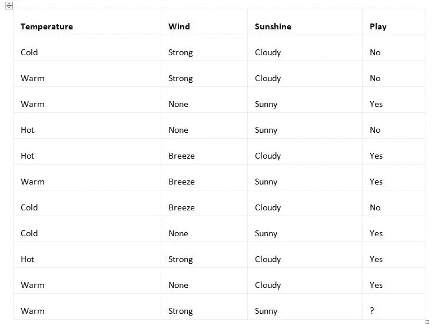

现在，利用贝叶斯定理，假设气温温暖，风力强劲，阳光明媚，你的朋友是否愿意和你在公园里下棋。

## 分析

在这种情况下，你可能要考虑把****风*** ， ***日照*** 作为独立的随机变量。当采用时，扩展贝叶斯定理的公式变成如下:*

*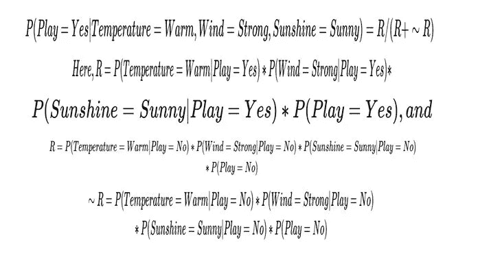*

*现在，计算表中所有已知值的列数，以确定各个概率。*

****P(Play = Yes)= 6/10 = 3/5***，既然有 10 列数据完整，其中*6 列的值 ***Yes*** 为属性 ***Play*** 。**

*****P(Temperature = Warm | Play = Yes)= 3/6 = 1/2***，因为有 ***6*** 列以值 ***Yes*** 为属性 ***Play*** 而其中， ***3*** 有值 ***Warm*** 为类似地，您将得到以下内容:**

**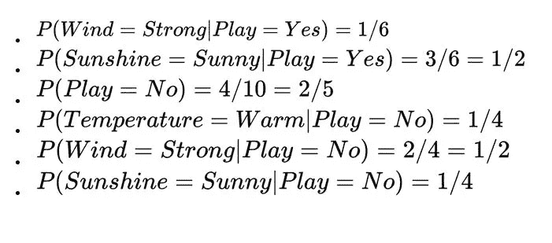**

**因此:**

**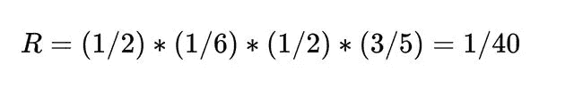**

**和**

**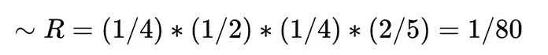**

**因此，您将获得以下内容:**

**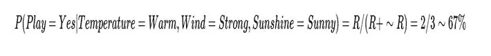**

**这意味着你的朋友很可能在规定的天气条件下，很乐意和你在公园里下棋，概率约为 ***67%*** 。由于这是大多数，您可以将数据向量( ***温度=温暖，风=强劲，阳光=晴朗*** )归类为 ***播放=是*** 类。**

# **下棋——依赖于事件**

**现在，假设你想知道你的朋友是否愿意和你在英国剑桥的一个公园里下棋。但是，这一次，您将获得不同的输入数据:**

**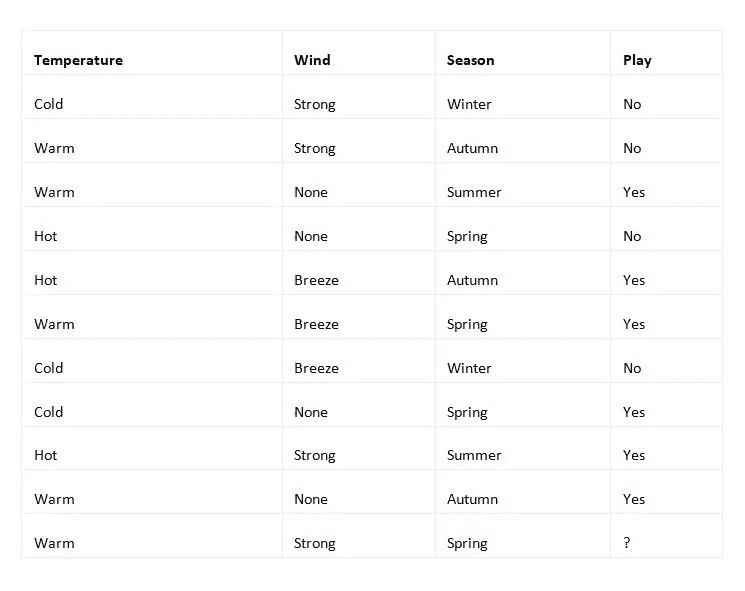**

**现在你可能想知道你的朋友是否愿意在英国剑桥的公园玩耍的答案将如何随着这些不同的数据而改变，这些数据涉及**温度**温暖**，**风**强劲**，以及**季节**春天**春天**。******

## **分析**

**你可能很想用贝叶斯概率来计算你的朋友和你在公园下棋的概率。然而，你应该小心，并询问事件的概率是否是相互独立的。**

**在前面的例子中，使用了贝叶斯概率，给出了概率变量**温度**、**风**和**阳光**。这些都是相当独立的。常识告诉你，特定的**温度**和**日照**与特定的**风速**没有很强的相关性。确实，晴朗的天气会导致气温升高，但是即使气温很低，晴朗的天气也很常见。因此，你甚至认为**日照**和**温度**是合理独立的随机变量，并应用了贝叶斯定理。**

**然而，在这个例子中，**温度**和**季节**是密切相关的，尤其是在像英国这样的地方，你所说的公园的位置。与靠近赤道的国家不同，英国全年的气温变化很大。冬天寒冷，夏天炎热。春天和秋天的温度介于两者之间。**

**因此，你不能在这里应用贝叶斯定理，因为随机变量是相关的。但是，您仍然可以使用贝叶斯定理对部分数据执行一些分析。通过剔除足够多的因变量，剩下的变量可能是独立的。由于**温度**是比**季节**更具体的变量，并且这两个变量是相关的，所以只保留**温度**变量。剩下的两个变量，**温度**和**风**，是独立的。**

**因此，您将获得以下数据:**

**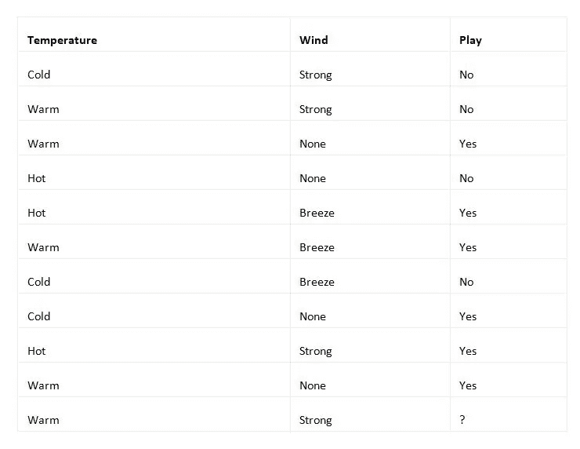**

**您可以保留重复的行，因为它们为您提供了特定数据行出现的更多证据。**

## **输入:**

**保存该表，您将获得以下 CSV 文件:**

```
**# source_code/2/chess_reduced.csvTemperature,Wind,PlayCold,Strong,NoWarm,Strong,NoWarm,None,YesHot,None,NoHot,Breeze,YesWarm,Breeze,YesCold,Breeze,NoCold,None,YesHot,Strong,YesWarm,None,YesWarm,Strong,?**
```

## **输出:**

**将保存的 CSV 文件输入到`naive_bayes.py`程序中，会得到如下结果:**

```
****python naive_bayes.py chess_reduced.csv**[['Warm', 'Strong', {'Yes': 0.49999999999999994, 'No': 0.5}]]**
```

**第一类，`Yes`，即将为真，概率 50%。数值差异是由于对浮点数值数据类型使用 Python 的非精确算法而产生的。第二类，`No`，有相同的概率，即 50%为真。因此，你不能用你所拥有的关于病媒种类的数据做出合理的结论(`Warm`、`Strong`)。然而，您可能已经注意到这个向量已经出现在结果类`No`的表中。因此，您可能会猜测这个向量应该恰好存在于一个类中，`No`。但是，要有更大的统计可信度，你需要更多的数据或更多的自变量。**

# **下棋——决策树分析**

**现在，弄清楚你的朋友是否愿意和你在公园里下棋。但是这一次，使用决策树来寻找答案:**

**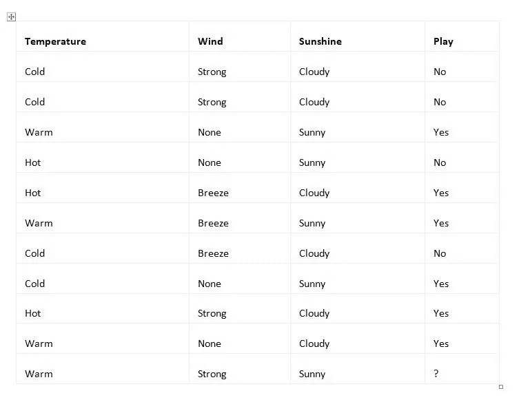**

## **分析**

**你有初始设置， ***S*** 的数据样本，如下:**

```
**S={(Cold,Strong,Cloudy,No),(Warm,Strong,Cloudy,No),(Warm,None,Sunny,Yes), (Hot,None,Sunny,No),(Hot,Breeze,Cloudy,Yes),(Warm,Breeze,Sunny,Yes),(Cold,Breeze,Cloudy,No),(Cold,None,Sunny,Yes),(Hot,Strong,Cloudy,Yes),(Warm,None,Cloudy,Yes)}**
```

**首先，确定三个未分类属性的信息增益:`temperature`、`wind`和`sunshine`。`temperature`的可能值为`Cold`、`Warm`和`Hot`。因此，您将把集合 ***S*** 划分为三个集合:**

```
**Scold={(Cold,Strong,Cloudy,No),(Cold,Breeze,Cloudy,No),(Cold,None,Sunny,Yes)}Swarm={(Warm,Strong,Cloudy,No),(Warm,None,Sunny,Yes),(Warm,Breeze,Sunny,Yes),(Warm,None,Cloudy,Yes)}Shot={(Hot,None,Sunny,No),(Hot,Breeze,Cloudy,Yes),(Hot,Strong,Cloudy,Yes)}**
```

**首先计算集合的信息熵:**

**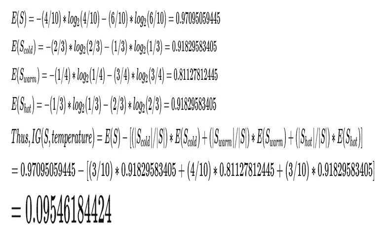**

**`wind`属性的可能值为`None`、`Breeze`和`Strong`。因此，您将把集合 ***S*** 分成三个分区:**

**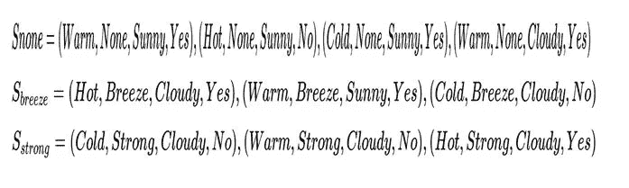**

**集合的信息熵如下:**

**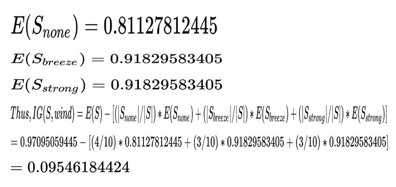**

**最后，第三个属性`Sunshine`有两个可能的值`Cloudy`和`Sunny`。因此，它将集合 ***S*** 分成两个集合:**

**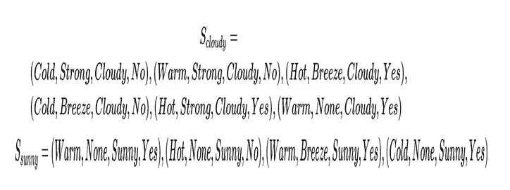**

**集合的熵如下:**

**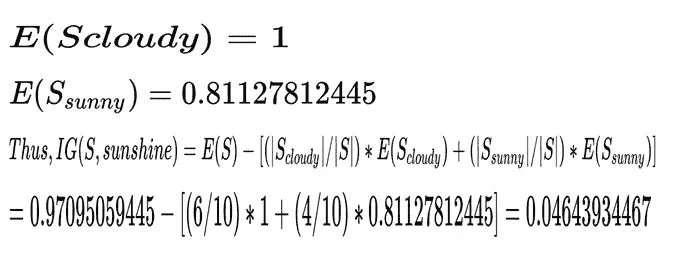**

*****IG(S，风)******IG(S，温度)*** 大于 ***IG(S，阳光)*** 。两者是平等的；因此，你可以选择任何属性来形成这三个分支；比如第一个，`Temperature`。在这种情况下，三个分支中的每一个都会把数据样本 ***骂******虫群******射*** 。在这些分支上，您可以进一步应用该算法来形成决策树的其余部分。相反，使用程序来完成它:**

**输入:**

```
****source_code/3/chess.csv**Temperature,Wind,Sunshine,PlayCold,Strong,Cloudy,NoWarm,Strong,Cloudy,NoWarm,None,Sunny,YesHot,None,Sunny,NoHot,Breeze,Cloudy,YesWarm,Breeze,Sunny,YesCold,Breeze,Cloudy,NoCold,None,Sunny,YesHot,Strong,Cloudy,YesWarm,None,Cloudy,Yes**
```

**输出:**

**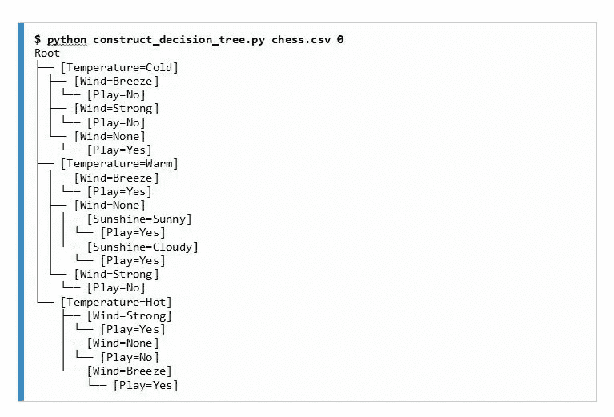**

## **分类**

**现在已经构造好了决策树，用它来分类一个数据样本 ***(温暖，坚强，阳光，？)*** 进入***{否，是}*** 中的两类之一。**

**从根开始。在该实例中,`temperature`属性有什么值？`Warm`，所以转到中间分支。在该实例中，`wind` 属性的值是什么？`Strong`，所以实例将属于类`No`，因为您已经到达了叶节点。**

**所以，根据决策树分类算法，你的朋友不会想和你在公园里下棋。请注意，朴素贝叶斯算法另有说明。要选择最好的方法，需要了解这个问题。**

***如果你觉得这篇文章有趣，可以在一周内探索* [*数据科学算法——第二版*](https://www.amazon.com/Data-Science-Algorithms-Week-algorithms/dp/1789806070) *用 7 天时间打造强大的机器学习算法基础。* [*数据科学算法一周—第二版*](https://www.packtpub.com/big-data-and-business-intelligence/data-science-algorithms-week-second-edition) *将帮助你了解如何选择机器学习算法进行聚类、分类和回归，并知道哪种算法最适合你的问题。***