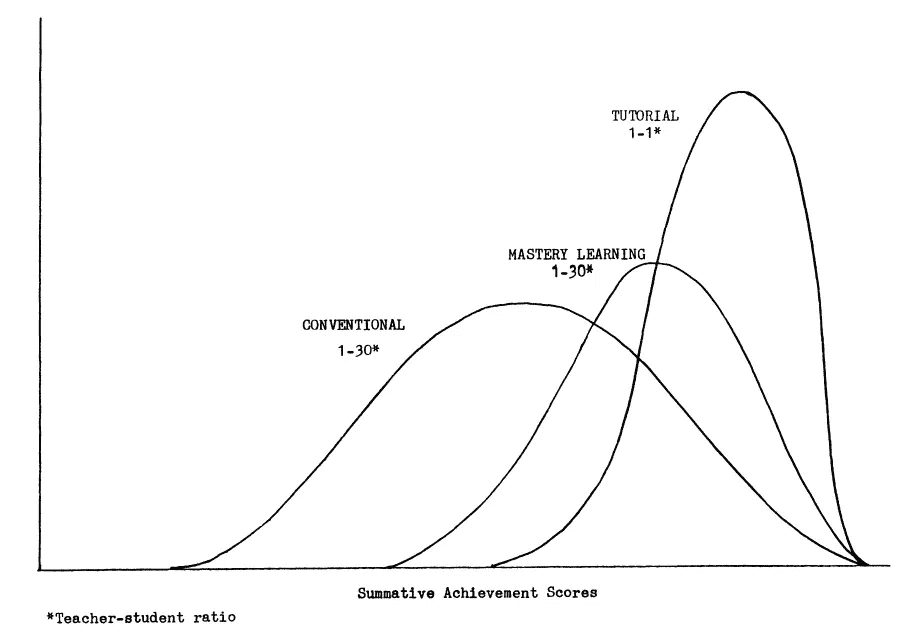
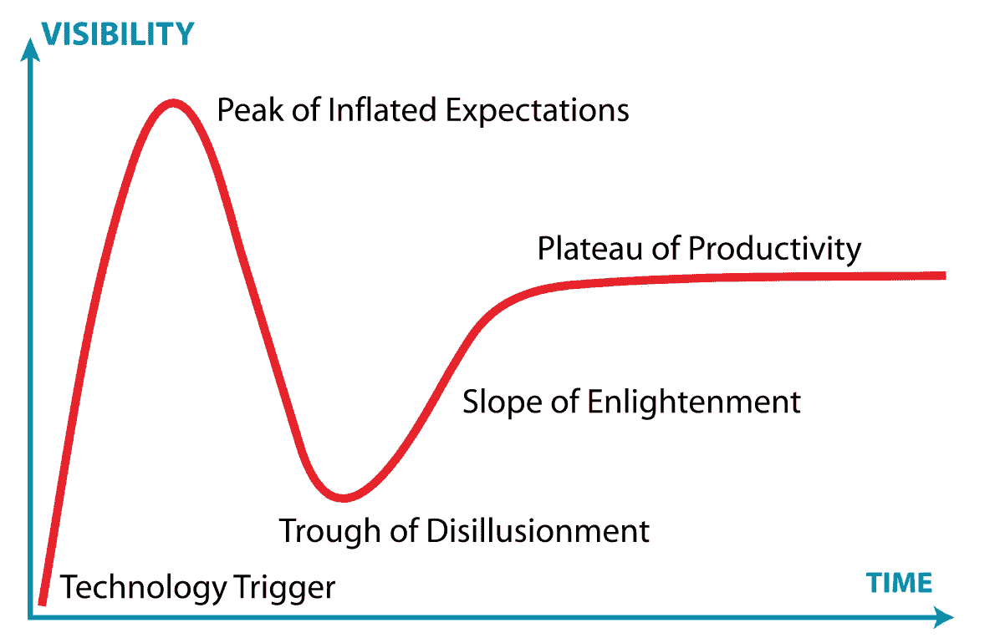

# 解决布鲁姆的 2 适马问题

> 原文：<https://medium.com/hackernoon/solving-blooms-2-sigma-problem-a2f80e1391cf>

*本帖原载于 2018 年 3 月 5 日* [*Humbot 的博客*](http://blog.humbot.io/solving-blooms-2-sigma-problem/) *。*

布鲁姆的 2 适马问题是一个 30 多年来一直没有解决的教育问题，被认为是教育技术的圣杯。我们相信，我们已经走上了用 [Humbot](https://humbot.io) 为这个问题提供解决方案的正轨。什么是布鲁姆的 2 适马问题，为什么 Humbot 能解决它？

*Benjamin Bloom. By Yeruhamdavid (Own work) [*[*CC BY-SA 4.0*](https://creativecommons.org/licenses/by-sa/4.0)*],* [*via Wikimedia Commons*](https://commons.wikimedia.org/wiki/File%3ABenjamin_Bloom_photo.jpg)

# 2 适马

教育心理学家本杰明·布鲁姆(Benjamin Bloom)发现，平均而言，使用掌握学习方法进行一对一教学的学生比在传统课堂环境下进行教学的学生表现好 98%以上。这项研究[1]最初发表于 1984 年，被称为 *2 适马*，因为一对一辅导的学生比传统教学的学生做了两个标准差(因此 98%)更好。在统计学中，希腊字母适马(σ)用于表示标准差。

Achievement distribution of students. Benjamin Bloom, 1984 [1]

这项研究的结果并不令人震惊；教师与学生的比例越好，学生学得就越好，这是很直观的道理(其他条件不变)。

# 为什么会有问题？

到目前为止，一切顺利。但为什么会被称为[“布鲁姆的 2 适马**问题**](https://en.wikipedia.org/wiki/Bloom%27s_2_Sigma_Problem)？布鲁姆和他的研究人员明白，为每个学生提供一名私人教师太昂贵了。于是，他们将其定义为一个问题，并开始寻找问题的解决方案:
**有没有几乎和一对一教学一样有效的一对多教学方式？**

本杰明·布鲁姆在 30 多年前的 1984 年提出了这个问题！从那以后，这个问题仍然没有解决的办法。事实上，布鲁姆的 2 适马问题是如此重要，以至于它经常被称为教育技术的圣杯。

# 这期间发生了什么？

形势并不像看上去那么可怕。技术有助于提高一对多教学环境的效率和效果。教师可以使用多种基于技术的工具来确保课堂时间尽可能有效果。例如，他们可以使用 [Go Pollock](https://www.gopollock.com/) 立即掌握每个学生的进度和对课程材料的理解。或者教师可以使用诸如 [Peergrade](https://www.peergrade.io/) 这样的技术来使同伴反馈更简单、更有影响力。*

此外， [Khan Academy](https://www.khanacademy.org/) 等网站为教师和学生提供免费的高质量资源，使基于掌握的学习比以往任何时候都更容易获得。

尽管取得了这些惊人的进步，但技术仍然没有达到一对一辅导的水平。关于人工智能将如何实现真正的个性化学习，有很多传言，但不幸的是，目前为止，这只是传言。

# Humbot 如何解决 Bloom 的 2 适马问题？

我相信，最终，软件将能够提供真正的一对一教学体验。会很棒的。但是很难预测什么时候会发生。我最喜欢的一句名言很好地概括了这种情况。比尔·盖茨说过:

> *我们总是高估未来两年将发生的变化，低估未来十年将发生的变化。不要让自己被蒙骗而无所作为。*

媒体炒作人工智能的短期潜力，现在人们感到失望，因为，当然，人工智能的真正进展要慢得多。一种技术的典型路径[炒作周期](https://en.wikipedia.org/wiki/Hype_cycle)

*Gartner Hype Cycle.* [*Jeremykemp*](https://en.wikipedia.org/wiki/User:Jeremykemp) *at* [*English Wikipedia*](https://en.wikipedia.org/wiki/) *[*[*GFDL*](http://www.gnu.org/copyleft/fdl.html) *or* [*CC BY-SA 3.0*](https://creativecommons.org/licenses/by-sa/3.0)*],* [*via Wikimedia Commons*](https://commons.wikimedia.org/wiki/File%3AGartner_Hype_Cycle.svg)

关键是要明白今天能做什么。Humbot 的方法是用软件来增强人类导师的能力，使他们在教学中的效率和效果提高 100 倍。他们现在可以用同样的效率来教授一百个人，而不是一对一。你可以把我们正在开发的软件想象成你手机自动建议功能的一个奇特版本。

实现我们的使命也意味着我们将把一对一教学的成本降低 100 倍。我们在下一个大赌注。没有人确切知道我们能让教学变得多有效，以及人工智能研究将朝哪个方向发展。

然而，这个赌注值得一赌。如果我们是对的，我们将为数亿中低收入家庭的孩子提供高质量的教育。并将为布鲁姆三十多年前提出的问题提供一个解决方案。

# 参考

[1]: [“第二个适马问题:寻找像一对一辅导一样有效的小组教学方法”](http://web.mit.edu/5.95/readings/bloom-two-sigma.pdf) (PDF)，教育研究员，本杰明·布鲁姆

*声明:我知道两者的创始人，Go Pollock 和 Peergrade。我就越有信心说，他们正在开发了不起的技术，你应该去看看。