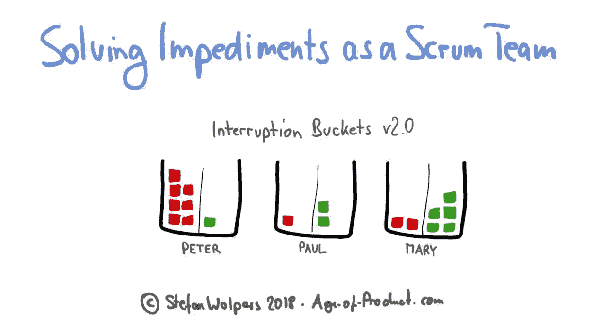
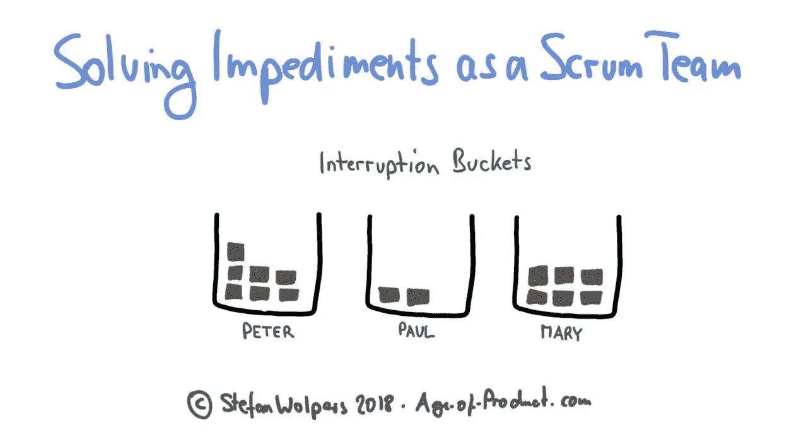
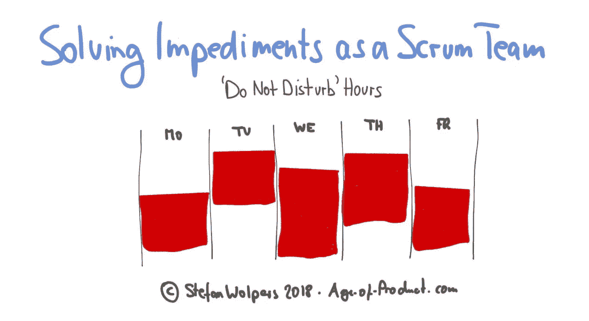

# 作为一个团队解决障碍

> 原文：<https://medium.com/hackernoon/solving-impediments-26fce6840710>

> TL；DR:回顾会的主要信息很清楚:利益相关者和高级管理层打断了太多的工作。这些干扰阻碍了团队的工作流程。因此，实现 sprint 目标在过去曾数次面临风险。而且，球队最近两次错失冲刺目标。作为一个团队解决障碍已经成为一种需要。

通过运行实验和迭代解决方案，了解更多关于如何作为一个团队解决障碍的信息。

# 障碍的类型

根据 [Scrum 指南](https://www.scrumguides.org/scrum-guide.html#team-sm)，scrum master 应该是处理这种障碍的合适团队成员:

> “Scrum 大师帮助那些 Scrum 团队之外的人理解他们与 Scrum 团队的互动哪些是有帮助的，哪些是没有帮助的。Scrum Master 帮助每个人改变这些交互，以最大化 Scrum 团队创造的价值。”

然而，利益相关者——尤其是高层管理人员——对 Scrum 团队的生产力至关重要的基本敏捷概念一无所知的原因有很多:

*   他们从一开始就没有接触过敏捷和精益实践。(这无疑是一个菜鸟的错误；成为敏捷需要组织中的每个人至少接受一个关于“敏捷”如何工作的基本介绍。)
*   即使他们接受了这样一个敏捷实践的基础介绍，他们也从未被介绍过流程理论和生产力。他们不知道被打断的后果。很可能，组织中没有一个 scrum 大师或敏捷教练觉得自己有足够的能力来教授心流的概念。(这也可能部分归因于在这个问题上标准教科书的声誉，Reinertsen 的“[产品开发流程的原则](https://www.amazon.de/Principles-Product-Development-Flow-Generation/dp/1935401009)”，这被认为是“难以”阅读。)
*   一些高级经理也有一种态度，认为“敏捷规则”并不适用于他们，不管 scrum 大师多么频繁地指出他们的错误行为。按照他们的标准，软弱的领导总是会找到合理的理由来解释为什么他们的信息需求需要以一种特权的方式来处理。(问题:如果罪魁祸首是首席产品经理、首席技术官或首席执行官，您会将问题上报给谁？)

利益相关者和管理者打断团队的事实并不是[指责 scrum 大师](https://age-of-product.com/scrum-mom/)的理由，而是团队解决问题的绝佳机会。

# 敏捷过渡——来自战壕的手册

最新的，245 页的版本**[敏捷过渡——一个实践手册，带清单](https://age-of-product.com/download-agile-transition-hands-guide-trenches/)**在这里**可以找到，而且是**免费的。********

********

# ****作为一个团队解决诸如中断问题等障碍****

****在这种情况下，团队决定从两个层面解决障碍:****

1.  ****scrum master 联系了涉众和管理层，在晚上方便的时候提供了一个简短的培训课程，教育他们敏捷团队的生产力问题。****
2.  ****产品负责人在团队空间的一面墙上制作了一张中断桶海报。(从 Jimmy Janlén 的书“[敏捷蔻驰的工具箱——可视化示例，伟大的团队如何可视化他们的工作](https://www.amazon.de/Toolbox-Agile-Coach-Visualization-visualize/dp/9188063011/ref=sr_1_1)”中了解更多关于中断桶的信息。))****

********

****在接下来的回顾中，实验进行了两周，团队分析了情况:****

*   ****利益相关者和高级管理层对团队生产力研讨会的反应低于预期。这一提议尤其没有惠及最无知的罪犯。****
*   ****然而，中断桶设法在团队区域中引发讨论。事实证明，在中断开始时添加一个标签并同时指出中断流程的问题是非常有用的。一些利益相关者和管理者在得知这些问题后感到惊讶。在 sprint 结束时，甚至出现了类似“我会给你发一封电子邮件，我不想在我的专栏里再出现一个帖子。”另一方面，最臭名昭著的作恶者也不在乎形象化。****

****因此，团队决定重复问题解决方法:****

1.  ****scrum master 现在正在寻求与那些没有参加研讨会的人进行一对一的交流，并在中断桶板上堆积了几个帖子。****
2.  ****中断桶接受了改造，现在可以区分有用和无用的中断。(在所有的干扰中，也有一些有用的干扰，只是在沟通方面被误导了。)****

********

****该团队决定引入“请勿打扰时间”,并设想这一时间表。****

********

****一个 sprint 之后，障碍实际上可以被限制在一个人身上，而其他人则乐于指导他们如何更好地与 Scrum 团队互动。****

# ****结论——作为一个团队解决障碍****

****通常，协作被证明是成长一个成功的 Scrum 团队的基础。作为一个团队，通过运行实验和迭代解决方案来解决障碍，在这种情况下，团队的生产力及其在利益相关者和高级管理层中的地位都得到了提高。(除了一个，不过那是后话了。)****

****当作为一个团队协作解决障碍时，你学到了什么？请在评论中与我们分享。****

## ****如果你喜欢这篇文章，帮我一个忙👏👏 👏多次—您的支持对我来说意味着一切！****

*******如果你更喜欢邮件通知，请*** [***注册我的每周简讯***](https://age-of-product.com/subscribe/?ref=Food4ThoughtMedium) ***，加入 19635 位同行。*******

# ****📺加入 Youtube 上的 825 多名敏捷同行****

****现已在 Youtube 产品年龄频道上发布:****

*   ****[敏捷成熟度和敏捷评估:敏捷是时尚还是趋势？](https://www.youtube.com/watch?v=XtESMQ2wcm8)****
*   ****[敏捷失败模式 2.0](https://www.youtube.com/watch?v=-RXQLVhIuJg&t=6s)****
*   ****[产品所有者反模式](https://www.youtube.com/watch?v=VnopIzbRJ8k&t=12s)****

# ****✋不要错过:加入 4075 人以上的“动手敏捷”Slack 社区****

****我邀请你加入[“手把手的敏捷”Slack 社区](https://goo.gl/forms/LObbRtSF9vvxN3CL2)，享受来自世界各地的敏捷实践者的快速增长、充满活力的社区带来的好处。****

********

****如果你现在想加入，你现在所要做的就是通过这个谷歌表格提供你的证书，我会帮你注册。对了，**免费的。******

# ****相关内容—作为一个团队解决障碍****

****调查:你如何解决团队无法控制的障碍？(匿名。)****

****免费下载“Scrum 反模式指南”****

****[作为一个团队解决障碍](https://age-of-product.com/solving-impediments/)首次在 Age-of-Product.com 上发表。****