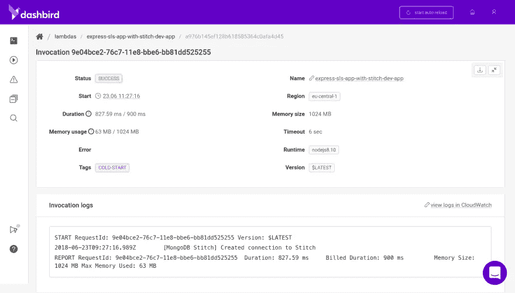
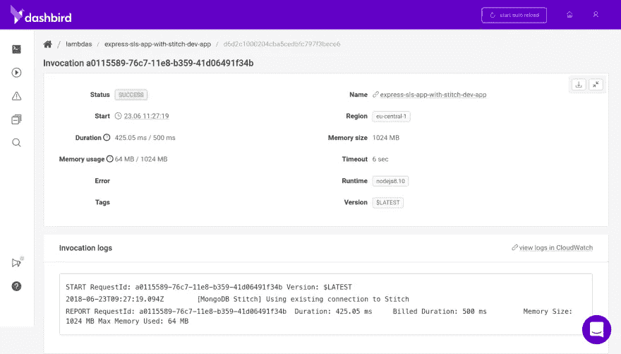
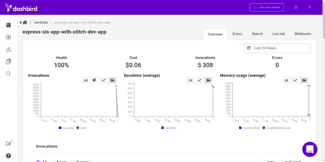

# 使用 Serverless 和 MongoDB 解决不可见的伸缩问题

> 原文：<https://medium.com/hackernoon/solving-invisible-scaling-issues-with-serverless-and-mongodb-1a065b5a6465>

自从软件工程成为一种职业以来，我们一直努力为全球的用户服务。随之而来的是缩放问题以及如何解决它。很多时候，这些将我们的软件扩展到不可想象的程度的想法是不成熟和不必要的。

随着无服务器架构和后端即服务提供商的兴起，这已经完全变成了另一回事。现在，我们面临的不是如何纵向扩展和横向扩展的问题，而是如何在不产生沉重负载的情况下扩展我们的数据库连接。

随着我们对底层基础设施了解的减少，除了编写[健壮、高效的代码](https://hackernoon.com/fantastic-serverless-security-risks-and-where-to-find-them-737d2206545a)和使用[合适的工具](https://dashbird.io/)来缓解这个问题，我们没有太多可以做的。

或者是？🤔

# 数据库如何与无服务器协同工作？

使用传统服务器，您的应用程序将在启动时连接到数据库。很符合逻辑，对吧？它做的第一件事是通过一个连接字符串连接到数据库，直到完成，应用程序的其余部分将初始化。

[无服务器](https://www.martinfowler.com/articles/serverless.html)对此的处理略有不同。只有当你触发一个函数时，代码才会真正运行。这意味着您必须在同一个函数调用期间初始化数据库连接并与数据库交互。

每次运行一个函数时，都要经历这个过程，这将是非常低效和耗时的。这就是为什么无服务器开发人员利用一种称为连接池的技术，只在第一次函数调用时创建数据库连接，并在每次后续调用中重用它。现在你在想这怎么可能？

简而言之，lambda 函数本质上是一个微小的容器。它被创建并在很长一段时间内保持*温暖*，即使它不是一直在运行。只有当它处于非活动状态超过 15 分钟后，才会被终止。

这为我们提供了 15 到 20 分钟的时间框架，在此期间，我们的数据库连接处于活动状态，可以随时使用，而不会遭受任何性能损失。

# 使用 Lambda 和 MongoDB Atlas

这里有一个简单的代码片段供您查看。

一旦你更好地看了上面的代码，你会发现它是有意义的。在顶部，我们需要`mongoose`并初始化一个名为`connection`的对象。没什么更多的了。我们将使用 connection 对象作为缓存来存储数据库连接是否存在。

第一次需要并调用`db.js`文件时，它会将 mongoose 连接到数据库连接字符串。每个连续的呼叫都将重新使用现有的连接。

这是它在代表我们的 lambda 函数的`handler`中的样子。

这个简单的模式将使您的 lambda 函数缓存数据库连接，并显著提高它们的速度。很酷吧？😊

所有这一切都很神奇，但是如果我们达到了数据库所能处理的连接数上限，该怎么办呢？嗯，好问题！这里有一个可行的答案。

# 连接限制呢？

如果你担心连接限制，那么你可以考虑使用后端即服务来解决这个问题。理想情况下，它会创建一个您的函数可以使用的连接池，而不必担心达到上限。实现这一点意味着提供者会给你一个 REST API 来处理实际的数据库交互，而你只使用这些 API。

你们这些铁杆读者会考虑自己创建一个 API 来容纳连接池或者使用 GraphQL 之类的东西。这两种解决方案都非常适合最适合您的用例。但是，我将着重于使用现成的工具来快速启动和运行。

# 使用 Lambda 和 MongoDB 缝合

如果你像我一样喜欢 MongoDB，你可能想看看他们的后端即服务解决方案，名为 [Stitch](https://www.mongodb.com/cloud/stitch) 。它为您提供了一个简单的 API 来与 MongoDB 驱动程序交互。你只需要创建一个 Stitch 应用程序，将它连接到你已经运行的 Atlas 集群和你的 set。在 Stitch 应用程序中，确保启用匿名登录并创建您的数据库名称和集合。

安装 stitch npm 模块，并在代码中引用您的 stitch 应用程序 id，然后开始调用 API。

如你所见，模式非常相似。我们创建一个缝合客户端连接，并为每个后续请求重用它。

lambda 函数本身看起来几乎和上面的例子一样。

似乎很相似。我会习惯的。然而，Stitch 有一些现成的很酷的特性，比如为您的客户端连接提供身份验证和授权。这使得保护您的路线变得非常容易。

# 怎么知道有效？

为了确保我知道在每个给定时间哪个连接正在被使用，我使用 [Dashbird 的调用视图](https://dashbird.io/features/aws-lambda-serverless-monitoring/)来检查我的 [Lambda](https://aws.amazon.com/lambda/) 日志。

在这里，您可以看到它在第一次调用时创建了一个新的连接，同时在后续调用中重用它。

这项服务有一个免费层,可以试用 14 天来获得无限的功能，所以如果你想要的话，你可以[去看看。](https://dashbird.io/register/)[如果你想要延长试用期，请告诉我](mailto:adnan@dashbird.io)，或者只是[加入我的简讯](https://upscri.be/b6f3d5/)。😊

# 包扎

在理想的无服务器世界中，我们不需要担心数据库连接的上限。然而，要达到这个规模问题，访问您的 API 所需的用户数量是巨大的。上面的例子展示了如何通过使用后端即服务提供商来缓解这个问题。即使 [Stitch](https://www.mongodb.com/cloud/stitch) 还没有成熟，但它是由 [MongoDB](https://www.mongodb.com/cloud) 制作的，这是一个令人惊叹的数据库。和 [AWS Lambda](https://aws.amazon.com/lambda/) 配合使用，速度快得惊人。

要查看使用上述两种连接模式的几个项目，请跳到这里:

*   [用 MongoDB 构建无服务器 REST API](https://github.com/adnanrahic/building-a-serverless-rest-api-with-nodejs)
*   [用 Stitch 构建无服务器 REST API](https://github.com/adnanrahic/building-a-serverless-rest-api-with-nodejs-and-mongodb-stitch)

如果你想阅读我以前的一些无服务器思考，请前往[我的简介](https://dev.to/adnanrahic)或[加入我的时事通讯！](https://upscri.be/b6f3d5/)

或者，看看我写的其他几篇关于无服务器的文章:

*   [如何使用无服务器将 Node.js 应用程序部署到 AWS Lambda](https://dev.to/adnanrahic/how-to-deploy-a-nodejs-application-to-aws-lambda-using-serverless-2nc7)
*   [AWS Lambda 和 Node.js 入门](https://hackernoon.com/getting-started-with-aws-lambda-and-node-js-4ce3259c6dfd)
*   [用 JSON web 令牌保护无服务器 API 的速成班](https://medium.freecodecamp.org/a-crash-course-on-securing-serverless-apis-with-json-web-tokens-ff657ab2f5a5)
*   [将 Node.js REST API 迁移到无服务器](https://hackernoon.com/migrating-your-node-js-rest-api-to-serverless-d2a170e0856c)
*   [用 Node.js 和 MongoDB 构建无服务器 REST API](https://hackernoon.com/building-a-serverless-rest-api-with-node-js-and-mongodb-2e0ed0638f47)
*   [node . js 无服务器速成班](https://hackernoon.com/a-crash-course-on-serverless-with-node-js-632b37d58b44)

希望你们喜欢读这篇文章，就像我喜欢写这篇文章一样。击中微小的心脏，让其他人在媒体上看到。下次见，保持好奇，玩得开心。

*最初发布于*[*dev . to*](https://dev.to/adnanrahic/solving-invisible-scaling-issues-with-serverless-and-mongodb-4m55)*。*