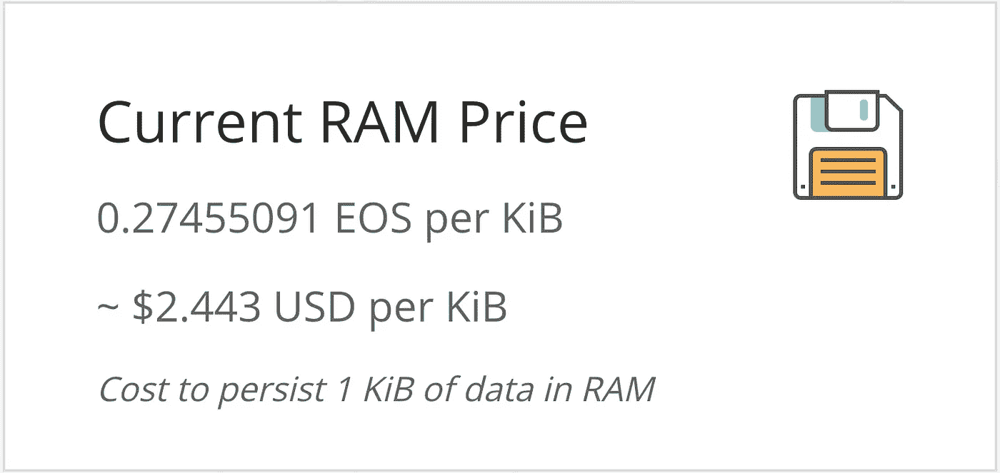
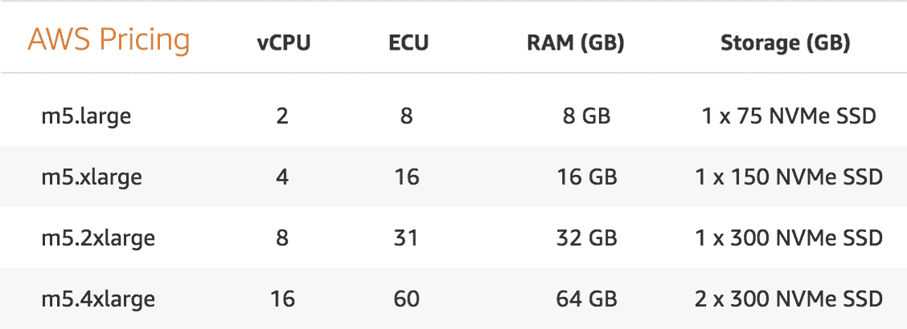

# 解决 RAM 投机和 EOS 中的产权问题

> 原文：<https://medium.com/hackernoon/solving-ram-speculation-property-rights-in-eos-631ca10c1970>

Evolution’s Development Plan for Resource Management

在 Evolution，我们有幸与 EOS 社区合作，就如何分散投票和确保公平批量生产提出独特的方法。然而，正如 Dan Larimer 所指出的，由于计算资源的限制及其未来对所有权的阻碍，我们已经开始开发一种可扩展的 RAM 和财产权解决方案。RAM 在 EOS 中是一种稀缺资源，其局限性促使 Dan 在 EOS 章程中实施了 [3 年资产权利限制](https://steemit.com/eos/@tanishqyeverma/why-article-xv-property-rights-is-a-great-addition-into-eos-constitution)。帐户中大量 RAM、CPU 和带宽的长期技术限制不应导致对用户权利的限制。即使区块生产商升级了 RAM，也有可能出现囤积账户需要被拆分和拍卖以释放 RAM 的情况。由于 Bancor 的自动定价算法，囤积策略进一步加剧，该算法允许囤积者以低成本存在的稀缺市场中的价格无限增长。

资源所有权的技术和经济限制应该向核心开发商发出信号，即 RAM 市场动态与基本的长期所有权相悖，需要彻底改革。[正如其他开发人员指出的](https://github.com/EOSIO/eos/issues/4173)在允许 EOS 链启动之前，确保长期资产权利的技术可持续性是核心开发团队的责任。Evolution 提出了系统范围的解决方案，以消除 EOS 令牌持有者对永久资产权利的疑虑，完全消除投资者对 RAM 市场的投机，并全面重建 EOS 资源管理。

# 围绕资源管理的核心问题

在 EOS 生态系统中，令牌持有者的资产与需要 4KB RAM 的用户帐户相关联，以便有机会提交操作并在其帐户中本地存储数据。作为利用 EOS 平台的有限但必需的资源，我们已经看到市场动态控制了 RAM 价格，因为它们在 8 天内从 0.14 美元上涨到 2.44 美元。这给 DApp 开发商带来了巨大的负担，他们希望为项目可能需要的未来资源保留权利。现在，开发人员在他们的 DApp 上装载的每个用户的 RAM 成本约为 10 美元。

Between June 22nd and July 2nd the RAM prices went up 1,742% from $0.14 to $2.44 USD per KB.

投资者对 RAM 的需求正在迅速形成，在不存在任何超过 300 个用户的 DApps 的情况下，利用率已经达到 70%。RAM 成本的飙升似乎纯粹是基于投资者对利润的预期购买大量股份，而不是其原始用例。更糟糕的是，像 CPU 和带宽一样，从其他所有者那里租借 RAM 是不可能的。Evolution 有一个四层方法，它将提供一个替代架构来解决上述问题，同时消除投资者的投机和囤积策略，人为地推动 RAM 价格上涨。

# EOS 资源约束的解决方案

Evolution 针对 RAM 推测的四层解决方案旨在为开发人员提供一种通用结构，这种结构是从云或共享托管服务购买实例时发现的。这简化了资源并将资源捆绑到各种包中，防止特定资源被投资者投机直接滥用。通过以下解决方案，Evolution 的目标是在主链架构上实现 6 亿活跃用户账户:

## **1。去除 RAM 投机& Bancor 流动性**

在每个市场中，买卖双方都存在价差。EOS 转而使用 Bancor 的定价协议，该协议旨在随着市场内资产储备的耗尽，通过以更高的价格设定价格来保证流动性。大多数数字资产在交易所之间出售，这使得价格能够找到一个平衡点，因为买家会以最低的要价进入交易所。然而，在 RAM 中只存在一个由 Bancor 的自动定价算法操作的做市商。当围绕一项数字资产存在多个交易所以提高价格平衡时，Bancor 的方法最有效，但在 RAM 这样的稀缺孤岛市场中，这为操纵提供了机会。

为了解决这个问题，Evolution 正在开发一种分组资源模型，类似于云托管服务的模型，将 RAM 与 CPU 和带宽绑定在一起。由于与 RAM 相比，CPU 和带宽可以无限扩展，这些捆绑包将切断投资者专门针对 RAM 交易的需求。每个基本包将提供 2.5MB 的 RAM，以及各种 CPU 和带宽。对于额外的资源，开发人员需要投入额外的 EVO 令牌并选择升级的资源包。这种方法阻止了直接的 RAM 交易。

Amazon AWS grouped resources

## **2。打桩 30 天&资源税**

拆单 EOS 是一个 3 天的过程，允许交易者快速出售 RAM 并获得流动性。Evolution 提议 RAM 有 30 天的锁定期，以防止短线交易者人为推高价格。

此外，我们建议从最初购买 RAM 之日起每 30 天征收一笔小额税。该税将按月征收，以激励释放被囤积的 RAM，并优先考虑真正的开发。所有税收产生的代币都将被烧毁。

## **3。重组 EOS 主链职责**

将主链限制为帐户名称、投票和治理实现将每个用户帐户限制为最小 KB 使用量，并将非关键使用量卸载到 DApp 端链上的 DApps 插槽。开发人员购买计算资源的流程现在将落入一个侧链，该侧链允许开发人员锁定令牌以访问捆绑了资源的开放插槽。初始侧链上的开发插槽将由一个共享实例组成，该实例包含 10，000–20，000 个 DApps，具体取决于它们的开发需求和各自的 EVO 令牌份额。开发者将能够通过社区开发的[投票和赌注门户](https://youtu.be/dKDcN2dengE)在主链上启动他们的环境。

主要的治理和开发链都是由同一套区块生产者驱动的，以尊重选民权利和分散化。通过在主链之外处理所有 DApp 和相关计算资源，现在由一个侧链来管理附加到帐户的数据，该侧链存储用户各自的 DApp 使用历史和数据，而不是直接存储在主链上。

## **4。限位主链闸板**

我们看到了通过限制非活动帐户上的活动 RAM 来减少 RAM 使用的潜力。通过限制活跃用户帐户的 RAM 使用，有机会将主链上的总容量大幅增加到 6 亿个活跃帐户和大约 3 亿个非活跃帐户。我们还在考虑将存储请求更新到 SSD 还是 RAM，但要考虑延迟限制。

# 结束投资者的人为价格需求

RAM 最终会影响基于当前管理模型的所有用户帐户创建。Evolution 正在准备将这些更改实施到 Evolution 的区块链中，同时也在制定一个提案来帮助将这些建议实施到 EOS 基础架构中。分享解决所有权限制的多种方法只会有助于整个生态系统。

 [## 进化推特

### 进化的最新推文

Twitter.com](https://twitter.com/eoschain) 

期待您的反馈。请通过[电报](http://t.me/evolutionos)加入我们，了解最新的空投公告。