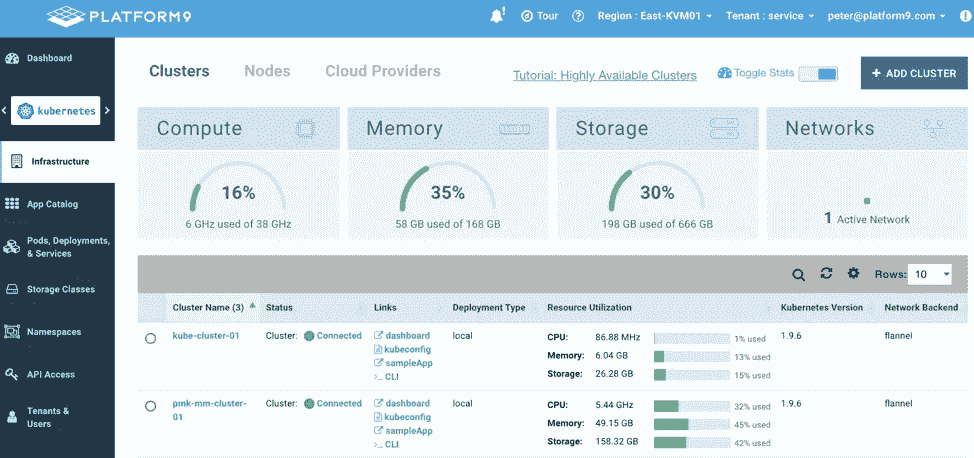
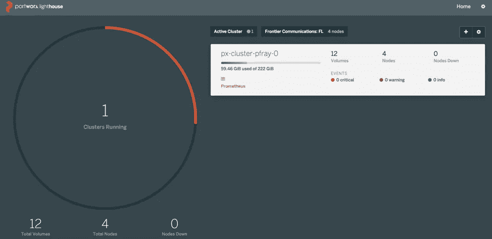

# 解决 Kubernetes 和存储挑战

> 原文：<https://medium.com/hackernoon/solving-the-kubernetes-and-storage-challenge-39621a7e2afa>


# 企业对 Kubernetes 的迷恋

似乎每个人都迷恋 Kubernetes。每个组织都有一个与 Kubernetes 合作或计划合作的项目。当采用 Kubernetes 时，组织很快意识到需要做出许多决定，而且 Kubernetes 不是一件简单的事情。一些常见问题是:

1.  我将如何部署 Kubernetes？
2.  我将在哪里部署 Kubernetes？
3.  我想使用公共云版本的 Kubernetes 吗？他们可靠吗？
4.  我们的组织应该使用什么样的网络模型？印花布，编织，法兰绒，其他？
5.  Kubernetes 是如何管理和部署存储的？
6.  一旦我们部署了 Kubernetes，第二天的行动呢？

在这篇博客中，我们将关注 Kubernetes 上线后的第一个挑战:存储。

当我们在大型企业客户的容器部署方面与他们合作时，一些事实开始浮现。虽然每个客户都希望将 Kubernetes 作为容器编排的标准，但企业应用程序和更新的云原生应用程序需要数据中心提供的所有企业插件。

《财富》5000 强企业希望以两种方式利用 Kubernetes，第一种方式是托管绿地应用程序，但也用于重新架构和现代化遗留应用程序，以便它们基于 Kubernetes。Kubernetes 提供了健壮的特性和 API，这些特性和 API 提供了高可用性、可伸缩性、对运行可移植容器的支持，以及对诸如滚动升级、canary 部署等部署问题的支持。

存储对于现实世界中基于 pod 的基础架构至关重要。容器文件本质上是短暂的，这意味着在终止或崩溃时，所有用户数据都会丢失。此外，组织成 pod 的容器读取共享文件和数据资产。卷抽象说明了这两种情况。

因此，Kubernetes 的一个关键考虑因素是企业存储支持。在容器中运行的应用程序需要执行一系列数据管理任务和 CRUD 功能。因此，Kubernetes 需要支持各种各样的持久存储范例。存储必须是在关系数据库、消息队列、NoSQL 数据库等中运行遗留应用程序的一等公民。

CNCF 的 Kubernetes 项目帮助培育了 CSI(容器存储接口),使一系列第三方存储供应商(SP)能够为其产品开发符合 CSI API 的标准插件。一旦创建，它应该可以无缝集成到许多容器编排(CO)系统中，比如 Kubernetes、Mesos 等实现 CSI 的系统。

# 进入平台 9 管理 Kubernetes (PMK)

Platform9 提供业内唯一的 Kubernetes 托管服务。Platform9 Managed Kubernetes (PMK)简化并解决了上述跨任何基础设施或云部署和管理 Kubernetes 集群的挑战。PMK 允许简单地部署 Kubernetes 集群、扩展这些集群、监控、升级，并提供一流的服务来解决这些部署问题。如果您的组织刚刚使用第一个 K8s 集群涉足 Kubernetes 生态系统，或者已经部署了数百个 Kubernetes 集群，Platform9 可以管理这些环境。

# 在平台 9 上部署 Kubernetes

我已经在 9 号平台上部署了很多次 Kubernetes。我想创建一个新的环境来测试存储和平台 9 管理的应用程序。我在我们的数据中心设置了 7 台物理服务器。安装了 Ubuntu 16.04，准备安装 Kubernetes 集群。

1.  我下载了 Platform9 代理并安装在每台服务器上
2.  为平台 9 管理的 Kubernetes 注册代理
3.  遵循 Platform9 安装向导并创建了一个 Kubernetes 集群。



## 简单！kubernetes 10 分钟后开始运行。

一旦部署了 Kubernetes，开发团队开始使用新的环境，首先要面对的挑战之一就是:“我如何解决持久存储？”这是组织面临的第一个也是最常见的挑战。虽然开发团队可能希望编写 12 因素无状态应用程序，但当有状态服务(如数据库、队列、键值存储、大数据和机器学习)在 Kubernetes 上运行时，将需要管理有状态数据集。关于存储的问题将会出现，这只是一个时间问题，为了让组织在 Kubernetes 之旅中取得成功，需要解决这个问题。

Kubernetes 中的存储很复杂，从 Kubernetes 文档中可以看出，存储有很多种类型，不同的云提供商有不同的存储类型:

1.  卷
2.  持久卷
3.  卷快照
4.  存储类别
5.  卷快照类
6.  动态卷供应

PMK 为部署 K8s 时需要做出的所有上述决策提供了完全的灵活性。然而，当与 [Portworx](https://portworx.com/) 结合使用时，存储决策就大大简化了。

# 输入 Portworx——它就能工作！


在花了似乎几个小时的时间使用谷歌机器和阅读 Kubernetes 关于存储的文档后，我遇到了 Portworx，它为 [Kubernetes 存储](https://portworx.com/use-case/kubernetes-storage/)提供了一个解决方案。我后来甚至发现 Portworx 是一个平台合作伙伴。已经部署了 Kubernetes，并且很高兴在我新创建的 Kubernetes 集群上部署一些应用程序，我需要一个简单、快速的解决方案来为我的容器提供存储。

来自 Portworx 网站:

“Portworx 是一家云原生存储公司，企业依靠它来降低跨多个云和本地环境快速部署容器化应用程序的成本和复杂性。

通过 Portworx，您可以使用任何容器调度程序管理任何基础设施上的任何数据库或有状态服务。您可以为所有有状态服务获得一个单一的数据管理层，无论它们在哪里运行。Portworx 在多云环境中茁壮成长。"

在我的环境中，我有 7 台服务器，我使用 Platform9 部署了一个 Kubernetes 集群，其中有 3 个主节点和 4 个工作节点。点击了几下鼠标后，我浏览了 Portworx 文档，找到了“在 Kubernetes 上安装——所有其他发行版”页面。我单击了“生成规范”链接。

我被提示:

1.  Etcd 详情。我选择了 Portworx hosted——因为这比我自己安装更容易，而且我不想使用我的 Kubernetes etcd。
2.  选择使用“本地”存储和使用未装载的卷。这对我来说是一个很好的选择，因为我的工作节点上已经有 4 个 50gb 的未安装卷。
3.  我选择了网络的默认值
4.  最后，在“高级设置”下，我选择启用 UI 和 Stork，Stork 是 Portworx 创建的 Kubernetes 调度程序扩展，用于实现 pod 和存储的超融合以及跨云迁移。

好的。这似乎太容易了，不可能是真的。这正是我一直在寻找的。我下载并执行了一个 spec.yaml:

```
Kubectl apply -f spec.yaml
```

这再简单不过了。在等待所有 docker 层下载一段时间后，我有了一个完整的运行 Portworx 的环境。



# 结论

最重要的是，在大约 30 分钟的时间里，我安装了一个完整的 Kubernetes 集群，并拥有了一个功能齐全的存储解决方案。我认为对这两种工具协同工作的最佳描述应该是“运动中的简单性”。

在安装好所有东西之后，我想测试一下这个解决方案，以确保动态 PVC 确实可以工作，并且可以被我的 Kubernetes 集群使用。所以我决定安装一些需要使用持久存储的应用程序。

我安装了:

1.  minio——为您的本地数据中心提供开源 AWS S3 环境
2.  Jenkins-x —开源 CI/CD 管道环境
3.  普罗米修斯——开源 Kubernetes 监控
4.  grafana——我用作 Prometheus 前端的开源绘图引擎
5.  [EFK 堆栈](https://platform9.com/blog/kubernetes-logging-and-monitoring-the-elasticsearch-fluentd-and-kibana-efk-stack-part-1-fluentd-architecture-and-configuration/) — Kubernetes 测井和监测:Elasticsearch、Fluentd 和 Kibana (EFK)

半天之后，我有了一个高度可用的 Kubernetes 集群，它运行在平台 9 管理的 Kubernetes 上，平台 9 管理的应用程序和 Portworx 功能齐全。我从未担心过我的存储环境。