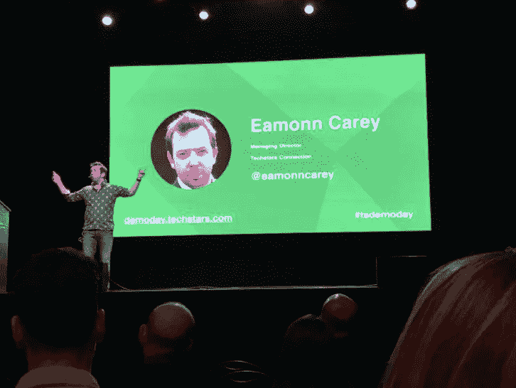

# 部分 2018 投资论文

> 原文：<https://medium.com/hackernoon/some-2018-investment-theses-dab606bfc57b>

我目前正在为下一个 Techstars 伦敦项目(TL；dr — [apply](http://apply.techstars.com) now)，我们已经在世界各地遇到了一些不可思议的公司。我想分享一些我特别感兴趣的领域的想法。这绝不是一份详尽的清单，如果你看看我们现有的[产品组合](https://www.techstars.com/programs/london-program/)，你会看到从硬件到软件、B2B 到 B2C、果汁到基因组学的所有产品，这将永远如此，但我认为在一些领域，拥有优秀产品和正确支持的正确团队有巨大的机会。

**食品科技**。到 2050 年，我们将需要养活超过 90 亿人。我们怎样才能做到这一点而不使地球不堪重负呢？我渴望见到那些利用技术创造新的食品品牌、产品、体验等的公司。不可能的汉堡是我尝过的最好的汉堡之一，我迫不及待地想尝试无鳍食物和许多其他食物。我喜欢 Apeel 生产质量和保质期的优雅方式。我喜欢来自小农场的团队在蘑菇和垂直农业方面所做的工作。我已经投资了这个领域的几家公司——[eat cultured](https://eatcultured.com/)，世界上第一款由人工智能酿造的啤酒[和](http://www.wired.co.uk/article/beer-brewed-by-ai-intelligentx) [Gastrograph](https://www.gastrograph.com/) ，他们正在使用人工智能来理解和模拟人类的感官知觉，为世界上一些最大的品牌服务。我们吃的食物、我们种植食物的方式、我们与食材、品牌、菜肴、餐厅等互动的方式都在发生变化，我很想听到或被介绍给那些以令人兴奋的新方式思考食品生产、消费等问题的人。

面向老年人口的技术。人们越来越长寿，越来越少生孩子。结果，在世界上的几个 T2 国家，我们有一个老龄化的人口基数。我觉得有趣的是，对于 50 多岁、60 多岁、70 多岁、80 多岁甚至更老的人来说，科技领域几乎没有什么明显的创新。在许多情况下，确实存在的技术把人们幼稚化，对他们居高临下，或者坦率地说，只是丑陋、没有功能和令人尴尬。这是一个拥有手段、悟性、欲望和(至关重要的)使用、支付能力的人群，最重要的是，他们能从各种各样的产品中获益。围绕健康和幸福、营养、缓解孤独、娱乐、教育、参与等等，有巨大的[机会](https://www.fastcompany.com/3068543/our-aging-population-can-be-an-economic-powerhouse-if-we-let-it)。我坚信这是一个在未来几年将会有巨大增长的领域。合适的产品不仅有潜力改变和改善生活，还能建立一个真正的、可持续的、可扩展的、有益的企业。

**抽象图层。我一直认为消息应用程序是我们生活中有效的命令行。无论是 Alexa，Messenger，微信还是其他当前或未来的应用程序/技术/设备，都是如此！我对公司如何几乎成为现实生活中的抽象层很感兴趣。看看 Plansnap [演示日推介](https://www.youtube.com/watch?v=THhop_gw8lc)(注意这在手机、短信和 Alexa 上的表现)来了解我的意思。我喜欢不需要你下载应用程序的产品——而是存在于你所在的任何地方，不管你当时使用的是什么平台。随着时间的推移，我希望在健康、健身、教育和几乎任何你想得到的领域看到特定于垂直行业的产品。围绕用户界面、UX、用户获取、保留等方面存在巨大挑战——但如果很容易，每个人都会去做…**

**逃避现实的时代。**这个世界有时是个残酷的地方。无论是我们的多巴胺[成瘾](https://www.inc.com/john-boitnott/is-your-need-for-another-dopamine-hit-wrecking-your-business-your-life.html)还是仅仅是新闻，我们创造了一个充满忧郁机会的世界。我想投资那些让人们微笑的公司。我投资了的[派对，因为我喜欢让有趣的人聚在一起吃东西、喝饮料和聊天。我喜欢那些能让人们微笑、大笑，或者在现实或虚拟世界中给他们带来惊人体验的产品。成为《农场恶棍》](http://partywith.co)和[《Kiip》](https://www.kiip.me/)的一员的最大好处之一就是收到粉丝的来信，他们被我们用一部简单的漫画或一份让他们感到惊奇的奖励所鼓舞。这有太多潜在的应用，几乎不可能列出来——但给一些背景——我喜欢 [Octi](http://www.octi.tv) 、[胡萝卜](http://www.meetcarrot.com/)、[史诗般的胜利](http://www.rexbox.co.uk/epicwin/)(这怎么可能不更大呢？？)[、愚蠢的黑客马拉松](http://www.stupidhackathon.com/)、有个性的应用、[小细节](http://littlebigdetails.com/)等等。几年前，我写了一篇关于这个问题的文章给《T21 》,我仍然坚信我们的生活需要更多的乐趣和恶作剧。

**AI 和机器学习。**如今，这可能感觉像是一个卫生因素，但我正在寻找使用人工智能、人工智能和计算机视觉来解决个人和企业实际问题的公司。在过去的四年里，我很幸运地成为了 [Lingvist](http://lingvist.com) 的董事会成员，看着他们开发自己的知识图谱[技术](https://lingvist.com/blog/science/2018/02/16/is-there-a-map-for-learning-a-language/)展示了人工智能和人工智能在正确的产品、算法和团队的帮助下是多么迷人、有粘性和完全有用。看到不可思议的计算机视觉公司在从医疗保健到时尚的各个领域工作，从 B2B 到 B2C，真是令人着迷。伦敦和欧洲更广泛地拥有这个行业中一些最优秀的人才(也有深刻的人才)和公司，我希望继续支持在广泛的领域、广泛的产品类型和所有阶段使用人工智能、人工智能和计算机视觉的团队。

**区块链和代币经济**——我是区块链和代币经济技术的信徒。不可否认，有大量冒着热气的狗屎伪装成项目/公司，但也有真正改变世界的技术，令人难以置信的才华和热情的人，以及一些非常非常聪明的想法开始出现——从协议层到。平台和权利的方式通过[密码收藏品](https://thecontrol.co/digital-collectibles-a-new-category-of-tokens-emerging-fb991c1dff6a)(和小猫)和更多除此之外。我很想见到一些公司以有趣的方式使用代币来吸引、留住和奖励他们的用户。我特别渴望与那些有想法的人交谈，如何使他们的代币、门票和更容易被大众消费者获得和使用。

其他的。以上绝非详尽无遗的清单。我认为，当谈到对 Twitter、脸书和其他人的强烈反对时，我们正处于开端的末尾。让我感到有巨大的[机会](https://twitter.com/eamonncarey/status/949991851804815361)给平台，让更小的人群围绕共同的兴趣进行互动。我很好奇信息、语音和其他东西会如何影响我们与他人的联系。我对营销和广告的未来感兴趣——在一个广告封锁的世界里，大品牌如何做有趣和吸引人的事情？我遇到了一些在硬件、教育、开发工具等领域工作的令人难以置信的公司，我希望我们能够在这些领域以及我还没有提到的其他领域进行合作和投资。对于一些额外的背景，这里有几篇我写的关于[音频内容](/@eamonncarey/wechat-whatsapp-and-the-walkie-talkie-content-opportunity-e7ab661af43f)、[手势界面](/@eamonncarey/thumbs-up-58c801247a88)和[广告拦截](/@eamonncarey/ad-blockers-are-the-condoms-of-the-internet-8ea9ed11443a)的机会的文章。

从根本上说，我从解决人类基本动机的角度来思考问题。产品让人们更快乐还是更健康？他们是否以一种有意义的方式节省了时间或精力？他们是在帮助人们和企业赚更多的钱，减少浪费和浪费的时间，提高参与度还是解决他们的一些根本问题？它们对使用它们的人或企业有实质性的影响吗？我喜欢思考一个产品在短期、中期和长期有哪些切实的好处——以及一家[公司](https://hackernoon.com/tagged/company)如何围绕这些好处来构思故事，以帮助获得用户、销售、营销、保留、招聘以及所有其他有助于他们成功的过程。

如果你正在开发符合上述任何一条的产品，我真的真的很想听听你的意见。即使你不是，我仍然非常渴望了解你的业务。我投资的一些最好的公司都是晴天霹雳。老实说，我最喜欢的莫过于有机会见到那些致力于为他们的用户、客户甚至全世界带来真正改变的产品的聪明人。

我很高兴投资于一个了不起的团队，他们写下想法的餐巾纸背面的墨水还在变干，就像我投资于一家拥有数百万资金和 10 多名员工的公司一样。如果你有问题，你可以在[的 Twitter](http://twitter.com/eamonncarey) 上给我发短信，在[的 LinkedIn](https://www.linkedin.com/in/ecarey/) 上找到我，或者发邮件给我(这应该很容易弄清楚)。

或者直接开始吧！申请现已开放。

希望几个月后你能在伦敦和我站在同样的舞台上！