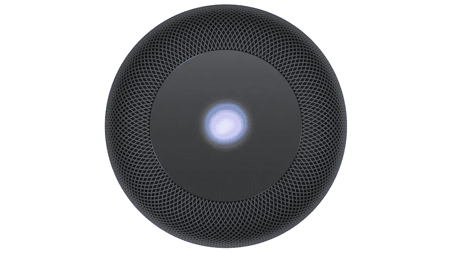

# 关于 HomePod 的一些回答

> 原文：<https://medium.com/hackernoon/some-answers-about-the-homepod-c96c7ce93589>

## 来自 HomePod 的早期评论给了我们一些关于这款产品未知之处的答案，但仍然保留了一些问题，并使隐私成为该设备的一个大问题。

上周，我写了几篇帖子，围绕苹果 HomePod 的公开问题，以及答案可能如何影响其成功。一个集中在音乐功能上，而另一个集中在智能音箱上如何打电话和发信息上。

现在，记者们已经发布了几篇评论，可以在短时间内测试该产品(在他们的帖子中，他们通常谈论大约一个小时)。他们解释了我的一些问题，但也强化了新的问题。

# 关于音乐的问题

所有早期评论[都强调 HomePod 的音质简直难以置信](https://www.reddit.com/r/audiophile/comments/7t51a2/nda_is_up_what_can_i_tell_you_guys_about_the/)。这也被用作设备中其他限制的借口。争论的焦点是苹果公司并不是真的想用这个产品与亚马逊竞争，而是他们在追求一个不同的市场。我倾向于不同意那个观点，就像有些人不同意那样。

即使我们认为 HomePod 只是发烧友的音乐设备，而不是家庭操作系统的，[为什么他们不支持其他音乐服务，比如 Spotify](https://mashable.com/2018/01/24/why-apple-homepod-might-fail/#hG4VgIMnGsq4) ？

是的，已经证实 Spotify 可以通过 AirPlay 使用，我猜 HomePod 只能通过 AirPlay 支持 FLAC 格式，[根据他们的技术规范](https://www.apple.com/homepod/specs/)，但他们不会提供这种主要体验。事实上，甚至 iTunes Match 支持目前也不清楚，一些报道称有可能，一些报道称没有。

苹果通常会在其产品中给出自己的生态系统偏好，但他们也意识到，他们不能指望所有用户都完全以苹果为中心。这意味着最终他们提供了一种在设备中支持第三方服务的方式，就像现在 Spotify 与 iPhone 上的 Siri 集成一样。

我预计 Spotify(以及一般的第三方音乐)在 HomePod 的支持未来会有所改善，但目前这是一个很大的限制。

# 电话中的问题

围绕通信，我最初的一些猜测围绕通话得到了证实，特别是通话行为得到了 TechCrunch 的[证实:](https://techcrunch.com/2018/01/26/up-close-with-apples-homepod/?ncid=rss&utm_source=tctwreshare&utm_medium=feed&utm_campaign=Feed%3A+Techcrunch+%28TechCrunch%29&sr_share=twitter)

> 板载也有呼叫功能。它实际上需要在 iPhone 上启动，然后交给 HomePod。这意味着手机需要存在。

但是我仍然有一个问题，我没有在任何早期的预览中看到答案。**这能在本地 Wifi 下与任何 iPhone 兼容吗？**

这是一个相关的问题，因为我们得到的另一个答案是，HomePod 将只支持一个 iCloud 帐户。[来自 MacWorld](https://www.macworld.com/article/3251175/home-tech/homepod-facts.html) :

> 当您设置 HomePod 时，像任何其他 Apple 设备一样，会要求您输入 iCloud 地址。明智地选择，因为这是 HomePod 将挂钩的主要帐户。[…].由于 HomePod 是一个家用设备，关于谁被认为是 HomePod 的“首脑”可能会有一些激烈的讨论。

因此，这可能也会影响通话的免提行为，只有与同一个 iCloud 帐户关联的 iPhone 才允许通话。这似乎是可能的，因为在许多帖子中，这种行为被称为“切换”，这是苹果公司使用的名称(以及“连续性”)，用于设备之间的交互(如 iPhone 到 Mac，或 Apple Watch 到 iPhone)。但这只能在同一用户拥有的设备之间工作，因此依赖于使用同一 iCloud 帐户的两个设备。

如果是这种情况，对于家用设备来说，这种限制是很严重的，因为有时你无法控制谁会接到电话。假设 HomePod 正在使用我的 iCloud 帐户，但一些朋友打电话给我的妻子安排聚会。她将不能从她的电话通过 HomePod 拨打电话，但是 HomePod 也是她的设备。

# 关于呼出电话的问题

另一个确定的限制是不能从 HomePod 发起呼叫。这可能看起来是个小问题，因为用电话发起呼叫应该很简单，但我实际上认为这是错过了一个让设备成为老年人不可或缺的机会。

如果家里发生紧急情况或事故，电话可能在够不着的地方，或者别人拿不到。但是如果他们能够说‘嘿 Siri，打电话给我儿子’或者‘嘿 Siri，打电话给紧急服务部门’，这个设备的价值可能是巨大的。

与[的 Google Home](https://twitter.com/Google/status/864897892758294529) 和[的 Echo line](https://www.theverge.com/2017/9/27/16374896/amazon-alexa-calling-messaging-uk-germany) 的呼叫功能相比，苹果的呼叫方法有一个优势，即通过使用真正的电话，它可以用来呼叫紧急服务，而其他产品无法做到这一点。为了能够用亚马逊扬声器做到这一点，你必须额外投资购买[Echo Connect，它允许将你的 Echo 插入你的座机电话，这样你就可以用你现有的号码](https://www.engadget.com/2017/09/27/amazon-echo-connect/)拨打和接听任何常规电话。由于该解决方案也使用真正的电话，因此通过 Echo Connect 呼叫紧急服务也是可能的。

# 关于信息的问题

另一个答案，这次来自 Mashable ，是关于 HomePod 对消息的支持:

> 您可以配合 HomePod 使用某些 Apple 服务，主要是“信息”、“日历”和“提醒事项”。然而，如果你的 iPhone 离开了当地的 Wi-Fi 网络(比如说，如果你去上班了)，这些个性化功能会自动关闭，当你回来时会重新激活。

当手机在覆盖范围内时，它不会回答其他通知是否可用，因为这将允许——例如——回复 WhatsApp 收到的信息(就像你可以使用 Apple Watch 一样)，甚至直接通过 SiriKit 发送 WhatsApp 信息。这是一个问题，我希望在 HomePod 最终面世时能够回答。

但无论如何，这证实了我刚才谈到的关于通话的同一个问题:**这是一个家用设备**(它在名字中，*对吗？*)，因此限制个人的特性似乎有问题，原因有二:

1.  因为**它把它的价值限制在家庭的其余成员，**这些成员将不能使用它的部分设计价值。这也可能导致在决定谁在不同的服务中需要更多什么时的冲突:也许我需要消息，但从不使用提醒，但我的妻子经常使用它，并可能从中受益；但是一个 iCloud 账户意味着两者可以一起使用。(顺便说一句，从社会学的角度来看，苹果的设计思维看起来像是延续了家庭中“一家之主”的传统方式，这不符合当前社会的期望，可能也没有传达他们的客户群的现实)
2.  因为**不管怎么说，这是一个严重的隐私问题**，因为一旦主 iPhone 在家(和它的主人在一起或被留下)，它就把主人的关键信息(他们的消息、他们的提醒、他们的日历条目)提供给说话者能接触到的任何人。任何人都可以询问我最新消息的内容，可以以我的名义发送消息或查看我的提醒。

这第二点既得到了 TechCrunch 的[证实:](https://techcrunch.com/2018/01/26/up-close-with-apples-homepod/?ncid=rss&utm_source=tctwreshare&utm_medium=feed&utm_campaign=Feed%3A+Techcrunch+%28TechCrunch%29&sr_share=twitter)

> 目前，HomePod 还不能根据声音来区分用户，所以事情还不能个性化到那种程度。该公司提出的解决方法是，只有当设备检测到用于设置该功能的移动设备存在时，才启用该功能。

[和可混搭](https://mashable.com/2018/01/25/apple-homepod-hands-on/?utm_cid=mash-com-Tw-main-link#Zr35zsoNCSqs)

> 然而，个性化*没有*做的一件事是开启 HomePod 辨别个人声音的任何方式。与 iPhone 不同的是，你可以将 Siri 设置为只对你的声音做出响应，而 HomePod 可以对听力范围内的任何人做出响应(我向苹果代表询问假设的 Siri 命令，并听到公寓里的各种 HomePods 对我的询问做出回应，从而发现了这一点)。

苹果公司在为 iPhone 提供安全性方面花了很大力气，以确保消费者的隐私。您可以阻止信息通知在锁定屏幕中显示信息内容，并使用 PIN、指纹或面部来保护对所有应用程序的访问。

这意味着你可以把手机留在家里，而不用担心隐私问题。但是家里有了 HomePod，情况就不一样了。

我不认为这是一个很好的论点，认为在你的房子里你可能不会特别暴露隐私，因为我认为这是一个个人权利，每个人都可以选择他们愿意在多大程度上与家人分享。我可以把我 iPhone 的 PIN 码给我妻子，这样她就可以在需要的时候获取信息，但这是我的选择，不是苹果的。

苹果已经在 iPhone 中支持语音打印，因此“嘿 Siri”功能只能由手机的主人触发。这也应该是 HomePod 的一项功能，因此某些操作只能由 iCloud 帐户所有者执行。

让我们希望在未来的版本中解决这个问题，也应该支持多个 iCloud 配置文件。