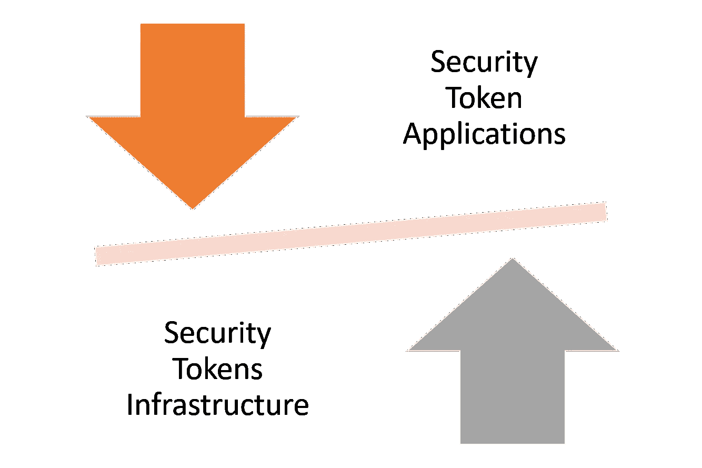

# 下一代安全令牌平台需要考虑的一些很酷的协议

> 原文：<https://medium.com/hackernoon/some-cool-protocols-to-consider-for-the-next-generation-of-security-token-platforms-98697f0c55e6>

为了使加密证券成为相关的资产类别，为安全令牌建立正确的基础设施是下一个关键挑战。超越当今平台中的基本令牌化功能，并启用可以模拟安全产品动态的基础架构构建块，这是安全令牌空间长期生存的当务之急。然而，为安全令牌创建下一个运行时构建块的过程受到基础设施和应用程序之间的摩擦的控制。如果没有合适的基础设施，将能够催化空间发展的资产类别标记出来几乎是不可能的。同时，如果没有接触过复杂的项目，就很难知道安全令牌中真正需要的基础设施构建块是什么。正确的答案是确定要构建多少基础设施来实现伟大的安全令牌项目，这一点非常重要。

确定下一波安全令牌平台的正确基础架构块当然很困难，但有一些明确的领域可以作为起点。即使在加密证券行业的初期阶段，我们已经看到一些项目声称拥有当前一代平台所缺少的功能。从市场的角度来看，一个有趣的争论领域是确定这些功能是将作为独立的协议发展，还是将被整合到通用安全令牌平台中。

# 鸿沟前的困境:平台与协议

在区块链领域，我们看到了第二层协议的激增，这些协议专注于实现分散式应用的单一功能。你当然可以证明，衍生品或流动性等安全令牌领域非常复杂，值得制定自己的协议。然而，短期内情况可能并非如此。

在他的畅销书《跨越鸿沟》中， [Geoffrey A. Moore](https://en.wikipedia.org/wiki/Geoffrey_Moore) 解释了控制技术市场发展的不同动力。摩尔将任何技术市场分为前鸿沟或早期市场和后鸿沟或主流市场，前者以新技术为实验对象，后者在更广泛的市场中采用该技术。

我们可以从 Moore 的论文中推断出的一个教训是，在前鸿沟市场中，提供端到端体验的解决方案往往比特定功能的解决方案更成功。将这一分析带到安全令牌领域，我们应该预计当前阶段的市场将由包含加密安全协议简化版本的端到端令牌化平台引领。随着市场的发展，其中一些协议将变得足够相关，可能会发展成为可以集成到不同平台的独立产品。

考虑到这一点，下一个合乎逻辑的步骤是确定下一波安全令牌平台应该包含哪些协议。鉴于大多数加密安全平台都存在于以太坊运行时中，它们可以从过去几年中我们在基于以太坊的协议中看到的巨大创新中受益。下面，我列出了一些领域和协议，我认为这些领域和协议可以给当前一代的安全令牌平台带来一些直接的价值。我喜欢将这些博客帖子保持在可管理的长度，所以我只提供协议的简要描述。我有一系列的帖子来深入探讨这些不同的领域。此外，我知道这个列表中遗漏了一些协议，但我试图将重点放在我认为可以快速纳入现有安全令牌平台组的协议上。

# 资产流动性

问题:可以说，流动性是加密证券市场最重要的挑战。虽然这一挑战的一部分将作为该领域的自然发展得到解决，但平台需要将流动性协议作为一级构建模块。

[**Bancor**](https://about.bancor.network/)**:**Bancor 提出了一种基于智能代币概念的流动性协议，智能代币是在其智能合约中持有其他代币余额的代币。使安全令牌、智能令牌兼容可以是在空间中实现第一级流动性的基本步骤。

[**双令牌瀑布**](https://tokenwaterfall.io/)**:**[Michael Oved](https://twitter.com/ovedm606)最近与人合著了我认为是安全令牌领域最重要的白皮书之一。双令牌瀑布提出了一种令牌结构，它结合了基于不同触发器激活的债务和股权令牌，以简化安全令牌传输中的流动性。

# 管理

**问题:**除了基于交易的共识机制之外，安全令牌还需要新的治理和投票机制。从简单的合规性和验证到复杂的红利分配动态，投票和治理模型都应融入下一波安全令牌平台。

[**POA 网络**](https://poa.network/) **:** 授权证明是一种基于身份的共识模型，我相信它可以在安全令牌中实现治理动态性。POA 网络使用以太坊兼容的侧链模型实现授权证明，该侧链模型可以适应不同的安全令牌平台。

# 隐私

**问题:**今天的安全令牌交易共享相同级别的隐私，基本上没有隐私。启用隐私策略模型对于解锁跨不同行业的一整组安全令牌场景至关重要。

**[**Bulletproofs**](https://crypto.stanford.edu/bulletproofs/)**:**最近被 Monero 采用，bullet proof 为保密事务提供了一个高性能的协议。Bulletproofs 解决了 zk-Snarks 之类的协议的一些限制，以实现事务的验证。一个更简单的 Bulletproofs 版本可以在安全令牌平台上实现，以在加密证券中实现不同级别的隐私。**

****[**ZK-SNARKS**](https://z.cash/technology/zksnarks/)**:**ZK-SNARKS 可以说是区块链空间中采用最多的隐私协议，已经在以太坊上实现了多次。采用 zk-SNARKs 可能是在安全令牌平台中实现隐私的一个容易实现的结果。****

# ****揭发****

****问题:信息披露是安全令牌技术最重要的缺失特征之一。允许访问与加密证券相关的数据集对于实现该领域的流动性和合规性至关重要。如果我们对一项资产一无所知，我们怎么能期望对它进行正确的定价呢？****

****[**IPFS**](https://ipfs.io/)**:**IPFS 是内容和数据存储采用最多的协议之一。将安全令牌披露集成到 IPFS 中是一项相当简单的工作。****

# ****侧链****

******问题:**安全令牌应用容易受到以太坊平台的限制。在我看来，安全令牌很可能需要一个新的运行时来扩展以太坊平台的功能。侧链是实现这一目标的中间地带。****

****[**Loom**](https://loomx.io/)**:**Loom Network 是一个最近的项目，它实现了 DChainApps，这些 DApps 可以在自己的侧链中执行，同时保持与以太坊 mainnet 的互操作性。我不确定 Loom 的使用是否可以推广到加密证券，但它在很多情况下肯定是有用的。****

# ****债务****

******问题:**债务是安全令牌的杀手场景之一，但今天的协议根本不支持这种用例。将债务协议整合到安全令牌平台中会成为一个非常有用的用例。****

****[**达摩**](https://dharma.io/) **:** 达摩是去中心化债务场景下最健壮的协议之一。虽然 Dharma 是一个非常通用的协议，但它的一个更简单、更具体的版本可以适用于安全令牌平台。****

# ****派生物****

******问题:**仅仅着眼于长期交易，开发一种新的资产类别几乎是不可能的。实现做空、对冲加密证券的机制是实现复杂的令牌化安全场景的基础****

****[**dYdX**](https://dydx.exchange/)**:**dYdX 是令牌化衍生品新兴领域的主要协议之一。dYdX 提供了一组协议，用于支持关键的加密金融原语，如保证金交易、期货、期权、做空等。将一些 dYdX 协议应用到安全令牌平台中可以实现非常有趣的场景。****

****这些是我认为可以扩展现有安全令牌平台组功能的一些关键协议。还有许多其他有趣的领域可能在下一波加密证券中扮演相关的角色，但是，和往常一样，我们需要从某个地方开始。****