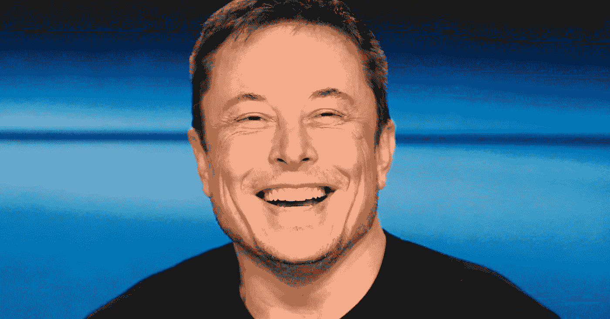

# 埃隆·马斯克的一些教训

> 原文：<https://medium.com/hackernoon/some-lessons-from-elon-musk-2660c3e349af>

# 论人工智能

## 人工智能是我们今天面临的最大风险

埃隆·马斯克(Elon Musk)曾多次谈到人工智能，以及它如何对世界构成巨大威胁。在一次全国州长会议上，埃隆·马斯克警告说，人工智能是“我们作为一个文明所面临的最大风险”。埃隆·马斯克(Elon Musk)说，由于他在科技行业的深度参与，他*[有机会]接触最前沿的人工智能，*以及*“人们应该真正关心它。”*

马斯克也[显然相信](http://“building a fleet of artificial-intelligence-enhanced robots capable of destroying mankind,”)谷歌正在“建造一支能够毁灭人类的人工智能增强机器人舰队。”在一条推文中，埃隆·马斯克声称人工智能“比核武器更具潜在危险”。

## 人工智能应该被规范

在同一次会议上，马斯克表示，他认为人工智能是少数几个需要监管的领域之一:

> “人工智能是一个罕见的案例，我们需要主动监管，而不是被动应对。因为当我们对人工智能监管做出反应时，已经太晚了。”

## 人工智能可以用于战争

埃隆·马斯克还担心人工智能可以用于战争场景，能够制造大量假新闻(即在宣传计划中推动某种意识形态)，伪造新闻稿，以及操纵一般信息。马斯克认为“笔比剑更有力量。”

在某些方面，我们已经看到这种情况正在发生。例如，我们在臭名昭著的“deepfakes”中看到了这一点。Deepfakes 是被操纵的视频，它使一个人看起来好像在做/说一些他们在现实中实际上没有做/说的事情。这种事情的一个例子可以在[这里](https://www.buzzfeednews.com/article/davidmack/obama-fake-news-jordan-peele-psa-video-buzzfeed#.el7Eqkeo7A)找到，在这个视频中，美国前总统巴拉克·奥巴马似乎说了一些他实际上没有说的话。

# 论模拟理论

## 我们不生活在模拟环境中的可能性非常小

埃隆·马斯克曾说过:“我们有十亿分之一的机会生活在现实中。”

> “如果你假设*任何进步的速度*那么游戏将变得与现实无法区分……即使进步的速度比现在下降一千倍，让我们想象一下 10，000 年后的未来，这在进化的尺度上算不了什么”

## 不要在热浴盆里谈论模拟理论

埃隆·马斯克[说](https://www.youtube.com/watch?v=xBKRuI2zHp0)他考虑过我们在模拟*中的想法，“即使是在热水浴缸中。以至于不得不禁止在热水浴缸里进行这样的对话。这不是最性感的对话。”*

# 殖民火星

## 火星不是一个死亡的好地方

埃隆·马斯克曾经说过，他想死在火星上，只是不想撞地球。当[要求](https://www.youtube.com/watch?v=5-gRswFMZio)澄清他的观点时，他说*“如果你要选择一个死亡的地方，那么火星可能，你知道，是个不错的选择。这不是火星人的死亡愿望。但生在地球，死在火星。(那)很好。”*

# 关于生孩子

## 你应该有一些

埃隆·马斯克[说](https://www.vanityfair.com/news/tech/2013/03/elon-musk-die-mars)，*“孩子们很棒。你们都应该有孩子！实际上我没怎么看过我的。我发现我可以和他们在一起，并且还能收发电子邮件。我可以和他们在一起，同时还能工作。”*

话虽如此，身为三家不同公司的高管和五个孩子的父亲并不容易。他说他想“轻松一下”，他的新年决心是玩得更开心。

# 在社交媒体上

## 过度使用社交媒体会导致悲伤

在乔·罗根对埃隆·马斯克的采访中，马斯克说:

> “人们看起来比实际生活要好得多……人们会上传自己真正快乐时的照片，他们会修改这些照片，让它们看起来更好看。即使他们没有修改照片，他们至少选择了最佳照明和最佳角度的照片。
> 
> 所以基本上人们看起来比他们实际上更好看，而且他们看起来比实际上更快乐。所以，如果你看看 Instagram 上的每个人，你可能会想‘伙计，这里有这么多快乐、美丽的人，而我没有那么好看，我也不快乐，所以我一定很差劲’。那会让人难过的”

## 人们在社交媒体上看起来比实际上更快乐

在采访中，埃隆·马斯克继续说道:*“那些你认为超级幸福的人，其实并没有那么幸福。他们中的一些人真的很沮丧，他们非常难过。一些看上去最快乐的人实际上是一些现实中最悲伤的人。”*

## 花更多的时间和朋友在一起，而不是使用社交媒体

*“这听起来可能很老套，”*埃隆[说](https://www.youtube.com/watch?v=8fkTdr3snLQ)，*“但是爱就是答案……在这个世界上拥有更多的爱不会有什么坏处……我们应该这么做。真的……多花点时间和朋友在一起，少花点时间在社交媒体上*

# 产生积极的影响

## 制造人们喜欢的东西

Elon Musk 继续说道，*“我们试图用特斯拉制造人们喜欢的东西……你能买到多少你真正喜欢的、能给你带来快乐的东西呢？如此难得，如此难得。我希望有更多的东西。这就是我们[在特斯拉]正在努力做的事情。做一些有人喜欢的东西。*太难了

## 埃隆的长期目标

在与乔·罗根的[相同的采访](https://www.youtube.com/watch?v=8fkTdr3snLQ)中，埃隆·马斯克谈到他的人生终极目标(即目的)是什么:

> “我的目标是尝试做有用的事情，尝试最大化未来变好的可能性，让未来变得令人兴奋。你期待的东西。”

## 关于有目的

埃隆·马斯克后来在采访中说，“需要有让你期待早上醒来的事情。你在早晨醒来，你期待着新的一天，期待着未来。”

# 如何思考

## 根据基本原则推理，而不是类比

Elon Musk [说过](https://www.youtube.com/watch?v=NV3sBlRgzTI)不要用类比来思考事情(例如，我们正在制造一种与 Y 相似的产品 X)。用类比来思考问题只会导致解决方案的轻微迭代。那么为什么经常使用类比呢？根据马斯克的说法，从类比中思考要比从基本原则中思考容易得多。什么是第一原理思维？

> “它真正的意思是，你把事情归结为最基本的真理，然后说，好吧，我们能肯定什么是真的？还是我们确信有可能是真的？然后从那里推理。”

# 论冒险

## 年轻的时候要冒险

在南加州大学的毕业典礼上，埃隆·马斯克谈到为什么年轻时冒险如此重要:

> “现在是冒险的时候了。你没有孩子，但随着年龄的增长，你的义务也在增加。一旦你有了家庭，你不仅开始为自己冒险，也为你的家庭冒险。做一些可能行不通的事情会变得更加困难。所以现在是时候这么做了，在你有那些义务之前。所以我鼓励你现在就去冒险。做一些大胆的事情。你不会后悔的。”

## 即使有风险，也要做有意义的事情

埃隆·马斯克[说过](https://arstechnica.com/cars/2016/01/elon-musk-tells-bbc-he-thought-tesla-spacex-had-a-10-chance-at-success/)他的目标一直是*“尽我所能确保未来是美好的……一开始我认为特斯拉和 SpaceX 可能有 10%的成功机会”*

尽管 SpaceX 和特斯拉看起来实际上成功的机会很小，但他们现在已经处于创造用户喜欢的产品的位置(特别是特斯拉)。如果某件事很重要，你不应该花时间计算成功的可能性。

# 关于经营公司

## 不要把注意力放在钱上

在接受 INC 杂志采访时，埃隆·马斯克说道:

> “当我和我的兄弟以及另一个人格雷格·库里一起创办第一家互联网公司 Zip2 时，我并不是真的抱着致富的想法。我并不反对变得富有，只是从我想成为互联网一份子的角度出发。我想如果我们能赚到足够的钱勉强度日，那就没问题了。当我们开始的时候，我们实际上只有一台电脑，所以它在白天是我们的网络服务器，而我会在晚上编码。我们刚刚在帕洛阿尔托有了一个小办公室，那时租金还不算贵，嗯，每月大概 350 美元。这比公寓便宜，所以我们就睡在办公室，然后在 Page Mill & El Camino 的基督教青年会洗澡。所以我们会走过去冲个澡。”

## 开公司真的很难

马斯克曾[说过](https://www.inc.com/christine-lagorio/elon-musk-company-failure-brain-health-fact-check.html)经营*“创办一家公司就像吃玻璃，凝视深渊。你必须做很多你不喜欢的事情。”*

他还认为，我们的大脑没有能力处理公司的死亡，这就像一个人的死亡对我们的大脑一样:

> 你必须付出难以置信的努力和巨大的压力——这比大多数人意识到的要痛苦得多。大多数公司都会倒闭。在你大脑的某个层面上，你的大脑——我们没有像公司一样进化；我们进化是为了应对真正的死亡。尽管一个公司的死亡不是真实的，也不像某人身体上的死亡，你的大脑在边缘系统层面上并不完全理解这一点。所以压力真的很大。你可能不想经历一次以上。