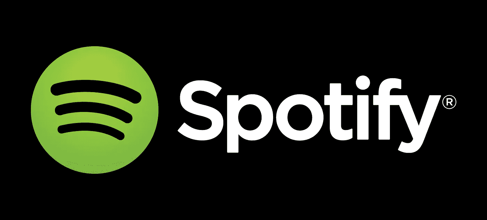

# 关于 HomePod 发射前的几个问题(1):音乐

> 原文：<https://medium.com/hackernoon/some-questions-about-the-homepod-before-its-launch-1-the-music-e32f9b7a9072>

## 苹果将于 2 月 9 日发布他们的智能扬声器，但规格中并不清楚其一些功能

本周，苹果终于宣布，他们将从 2 月 9 日开始销售他们的 HomePod T1，一款新的智能音箱，与 T2 亚马逊的 Echo T3 或 T4 的 Google Home T5 竞争。这比最初预计的 2017 年底有所延迟，因为最初是在去年的 WWDC 上宣布的。

但在这几个月之后，有几件事情尚不清楚该设备将如何工作，这将使许多用户在决定花费 345 美元之前等待第一次审查以获得更多信息。

在这篇文章中，我将谈论一些不清楚的事情，比如关于播放音乐的 HomePod 的限制，在下一篇文章中，我将谈论 HomePod 的通讯服务。

# 音乐角度

苹果基本上是围绕其音乐功能为 HomePod 做宣传。在与竞争对手进行比较时，音质预计将是苹果公司希望其客户寻找的主要差异。当然，苹果也将这种体验与他们的 Apple Music 服务联系起来。当吹嘘 Apple Music 是 HomePod 的内容提供商时，他们在自己的网页上这样说:

> **您家中超过 4500 万首歌曲。**
> 
> Apple Music 可以解锁你能想到的几乎所有歌曲。[..]没有 Apple Music？免费试用三个月，可随时取消。

但是，三个月后会发生什么呢？如果你不想订阅苹果音乐，买 HomePod 有意义吗？这是一个相关的问题，因为虽然 Apple Music 是苹果生态系统的关键部分，也是将用户带到 HomePod 的一种方式，但它不是最大的音乐流媒体服务。

Apple Music 应该有超过 3000 万订户，但截至 2017 年底，Spotify 的订户数量将翻了一番，达到 7000 万。HomePod 不支持最受欢迎的音乐服务，这严重限制了它的潜在影响力，特别是当它的竞争对手亚马逊和谷歌在其智能音箱中支持它的时候。

或者 HomePod 会支持 Spotify，但他们目前还没有推广。

# HomePod 上的 Spotify

在他们的规范中有一些提示。第一个是在 HomePod 产品网页的音乐部分中提到的:

> 连接到您的 Wi-Fi 网络的朋友可以将他们的音乐直接传输到您的 HomePod

这一点在 t [技术规范第](https://www.apple.com/homepod/specs/)页得到了强化，在“无线”下提到了“访客直接访问”，并附有以下脚注:

> 点对点 AirPlay 需要装有 OS X Yosemite 或更高版本的 Mac (2012 或更高版本)，或者装有 iOS 8 或更高版本的 iOS 设备(2012 年末或更高版本)。

因此，我的猜测是，你将能够使用你的 HomePod 听 Spotify 或其他音乐流媒体服务，通过 AirPlay 将它从你的 iPhone 上传到扬声器。

苹果的“另一种”音乐流媒体服务 iTunes Match 呢？我的猜测是，它将成为二等公民，就像 Spotify 一样，你可以在手机上播放它。

但所有 Siri 集成或 HomePod 的直接播放将仅限于 Apple Music。事实上，在同一技术规格页面的“系统要求”下，您可以看到

> 完整音乐功能的 Apple Music 订阅

# 也许在将来

我认为这不是苹果的正确做法，因为:

*   保持 HomePod 对苹果音乐的“独占”将无助于苹果音乐与 Spotify 的竞争。之前没有考虑智能音箱的苹果音乐用户将在 HomePod 看到优势，但现有的 Spotify 用户将把它视为限制，而不是转换音乐服务的理由。
*   在现有产品已经支持 Spotify 的情况下，不支持 Spotify 使得 HomePod 不再是一个有吸引力的选择。

但我也认为这在未来会改变，因为最终苹果会向第三方应用开放 HomePod，这样开发者就能把他们的服务带到那里。Spotify 将不得不建立他们自己的一个 HomePod 应用程序——就像他们建立自己的 iPhone 应用程序一样——苹果音乐的集成可能仍然会更好，但至少它将不再是一个“系统要求”。

但这仍然突显了一个问题，即苹果现在推出的是一款封闭的产品，而市场上已经有了开放的选择，开发者已经在开发应用程序(或者在亚马逊 Echo 的情况下，' [**技能**](https://www.amazon.com/b?node=13727921011) **')，这些应用程序甚至在你购买后每天都在改进产品。**