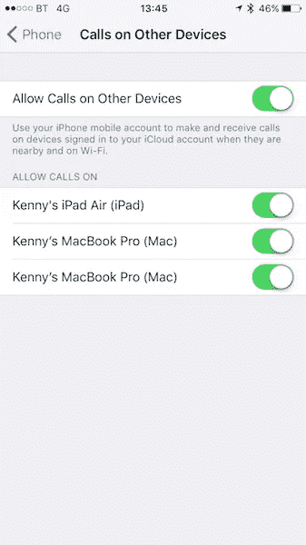

# HomePod 发射前的几个问题(二):通信

> 原文：<https://medium.com/hackernoon/some-questions-about-the-homepod-before-its-launch-2-communications-49cf955cd8c8>

## 苹果将于 2 月 9 日发布他们的智能扬声器，但规格中并不清楚其一些功能

本周，苹果公司终于宣布，从 2 月 9 日起，他们将出售他们的 HomePod(T1)，一款新的智能音箱，与 T2 亚马逊的 Echo 或 T4 的 Google Home 竞争。HomePod 最初是在去年的 WWDC 上发布的，预计在 2017 年底发布。

经过这几个月，仍有一些事情不清楚该设备将如何工作。这可能会让一些用户在决定花费 345 美元之前，等待第一次评论或朋友的建议。

在我之前的[帖子](https://hackernoon.com/some-questions-about-the-homepod-before-its-launch-1-the-music-e32f9b7a9072)中，我谈到了围绕苹果关闭他们自己的音乐服务的问题。在这篇文章中，我将着眼于 HomePod 通信服务的开放问题。

# 智能扬声器中的通信

当苹果在去年的 WWDC 上宣布 HomePod 时，有一个微小的迹象表明通信也将成为设备的一部分。

如果你看一下功能列表，“消息”会显示在那里，但是没有解释那到底是什么意思。

在智能扬声器中支持某种通信功能不仅有意义，而且是亚马逊和谷歌在这一领域各自产品的战场之一。

亚马逊提供 Alexa 的通话和信息服务，可以在 Echo 设备(和 [Alexa](https://hackernoon.com/tagged/alexa) 应用程序)之间进行通话和视频通话。[他们还提供“Echo Connect”](https://hackernoon.com/how-amazon-is-winning-the-battle-for-the-home-operating-system-d794ab48fb82)，一种可以让 Echo 插在你的电话线上，像普通电话一样工作但不用手的设备。

与此同时， [Google Home 可以让你拨打任何美国或加拿大的电话号码](https://twitter.com/Google/status/864897892758294529)(亚马逊在他们的 Echo 设备中复制了这一功能)，他们新的支持助手的智能显示器也将支持 Google Duo 视频通话。

因此，苹果当然会给 HomePod 增加通信功能。但不清楚具体是哪种，接下来我就做一些猜测。

# 消息和呼叫

在他们的 [HomePod 产品网页](https://www.apple.com/homepod/)中，苹果提到通信是该产品“智能助手”部分的三个要素之一。

主要功能仍然是音乐，但您也可以:

*   提问并获得基本功能，如计时器或新闻。这基本上符合 [Alexa 或 Google Assistant 的顶级用例](http://nationalpublicmedia.com/smart-audio-report-fall-winter-2017/)。
*   控制兼容 HomeKit 的智能家居设备。这并不奇怪。
*   **并且对“通话和消息”有一定的控制权。**

最后一点特别指出:

> 使用 HomePod，仅通过语音发送信息。当你收到一条短信时，Siri 可以读给你听。对于免提通话，在你的 iPhone 上开始或接收电话，然后把它交给 HomePod。

让我们更详细地看看这意味着什么。

# 电话将如何工作？

关于通话和短信(甚至是什么样的通话或短信)将如何工作，没有进一步的细节，但苹果的一个选择是将他们的[连续性功能](https://support.apple.com/en-ie/HT204681)扩展到 HomePod，以支持通话和信息。

通话的连续性在 iPhone 设置中显示为“在其他设备上通话”，允许其他 iCloud 设备(如 iPads 和 MAC)在与 iPhone 相同的 Wifi 下拨打和接听常规电话。

这与 FaceTime 不同，因为这些呼叫是从您的手机发出的常规手机呼叫(在适当的时候由您的运营商计费)。简而言之，当你在 Mac 上使用 Continuity 进行通话时，实际发生的情况是，你的 Mac 通过 Wifi 将你的语音来回发送到你的 iPhone，而你的 iPhone 通过蜂窝网络将它作为常规通话进行发送。

因此，如果他们要提供连续性，HomePod 将只是另一个 iCloud 设备，并允许你在家时用手机打电话。你的 iPhone 上的任何常规 FaceTime 音频通话都可以从 HomePod 接收到，你可以让你的 HomePod 打电话。

但这不是苹果的文案所说的。它说“*在你的 iPhone 上开始或接收一个电话，并将其交给 HomePod* ”，这感觉更像是**能够从正在进行的通话屏幕中选择不同的音频源，而不是能够直接接听来自 HomePod** 的电话。

例如，今天我们可以将音频从正在进行的通话切换到 iPhone 的扬声器或配对的 AirPods:

所以我认为，目前的描述暗示这是 **HomePod 的选择，它将作为 iPhone 的蓝牙免提。**这很实用，但没有连续性选项那么令人兴奋，连续性选项还允许直接接听来自 HomePod 的来电，而不必找到你把手机放在哪里了，如果你的手很忙，这也非常有用。(蓝牙免提模式也允许这一点，但由于苹果公司特别提到了在 iPhone 中启动通话，所以看起来起初不会支持这一点)。

# 信息将如何工作？

连续性也适用于信息，尽管设置在 iPhone 的不同部分。它是“短信转发”选项:

通过此设置，您在 iPhone 上收到的短信和彩信也可以在 iPad 或 Mac 上使用。这也与 iMessage 有点不同，iMessage 是苹果自己的服务，也可以在苹果设备上使用，但最终用户的体验是，他们所有的文本(iMessage 或 SMS)都可以在他们所有的设备上使用。

由于文案明确提到 HomePod 可以发送信息，我预计在这种情况下它将使用连续性，在实践中会像 iPad 一样链接到同一个 iCloud 帐户:它将从你的手机发送和接收短信，并将直接发送和接收 iMessages。这对用户来说将是透明的和“神奇的”，用户不会看到绿色或蓝色的泡沫，也不会关心它们的区别(因为 HomePod 推出的市场仍然提供几乎无限的短信套餐)。

但是，虽然用附近连接到同一 Wifi 的 iPhone 从 iCloud 设备发送和接收信息不会带来任何未解决的技术挑战，但还有另一个相关问题。iPhones、iPads 和 MAC 都被设计成个人设备，只有一个 iCloud 账户。HomePod 不应该。

# 隐私呢？

这是像 HomePod 这样的“家庭”设备的关键方面。这将是一个家庭设备，由几个人共享。这提出了几个问题:

*   它将支持链接几个 iCloud 帐户还是只链接一个帐户？
*   如果它只支持一个，它会只允许来自这个帐户的消息吗？那么对于其余的家庭成员来说，该功能将受到限制。
*   多用户将如何工作？因为不管它是否只支持一个或几个消息用户，它都应该确保只有相关的接收者可以选择大声播放消息。它还需要某种机制来理解谁在说“给妈妈发送一条消息”,并使用正确的发送者和消息的目的地。否则我可以想象非常有趣的事情成为新闻…
*   它会同步来自多个提供商的多个地址簿吗？在上面的例子中，“妈妈”是某人手机中的一个条目，但它可能来自 iCloud、谷歌通讯录或 Exchange 服务器。HomePod 会从手机(所有授权用户的手机)上获取地址簿服务并自己同步吗？
*   它将如何认证用户？它会分享 iPhone 上的“嘿 Siri”语音配置文件，还是用户必须为 HomePod 本身进行一些语音训练？

当几个人共享设备并希望使用他们自己的通信同时保持隐私时，所有这些都非常重要。我当然希望苹果在这方面下了功夫，我希望在这款设备最终推出时能了解更多，但就目前的信息来看，我认为它们是重要的未解问题。

# 而其他通信服务呢？

在你的 HomePod 中有电话和短信是很好的，但是当一些地区的人们越来越多地用其他服务代替短信，如 [WhatsApp](https://hackernoon.com/tagged/whatsapp) ，或者一些电话使用 Skype 肯定更便宜时，感觉智能扬声器的通信能力可以通过在其上允许第三方服务而得到很大提高。不幸的是，HomePod 的第一个版本将不支持“应用程序”，所以这意味着没有 WhatsApp 或 Skype 本地存在。

Skype 通话、WhatsApp 通话或来自 iPhone 中任何支持 [CallKit](/@jorge.serna/vowifi-vs-callkit-comparing-calling-experiences-in-iphone-fd12b75d686b) (苹果为希望在其 iPhone 应用程序中提供 ip 语音功能的开发者提供的 iOS API)的其他应用程序的通话，可能能够通过改变音频源切换到 HomePod，就像普通通话一样。

# 亚马逊和谷歌(还)没有做得更好

公平地说，这比亚马逊 Echo 或谷歌 Home 提供的情况要好，因为尽管这两款设备都可以作为蓝牙扬声器工作，但这只适用于音频播放，而不适用于免提通话。如上所述，它们支持自己的通话服务或与常规网络的某些互连，但您无法在手机中接听电话并将其免提带到任何这些设备。

尽管这两家公司在支持开发者为其设备添加新功能方面都比苹果先进，但通话功能还不是这一系列功能的一部分，所以不要指望 Skype 或 WhatsApp 会很快在你的 Echo 或家里打电话。我预计这将在某个时候改变，因为**亚马逊和谷歌都非常清楚，要在智能扬声器领域创造可持续的产品，开发者需要参与进来，丰富他们的产品。让我们期待苹果公司也能步其后尘。**

关于信息，用回声发送文本是可能的，[有一些技巧可以让你做到这一点](https://www.theverge.com/circuitbreaker/2016/11/17/13668772/att-amazon-alexa-can-send-your-texts)。直到最近，接收它们才成为可能，但现在 [Alexa 允许第三方技能提供通知](https://developer.amazon.com/docs/alexa-voice-service/notifications-overview.html)，这将实现对话所需的双向通道。因此，除了亚马逊自己的 Alexa 消息服务之外，第三方消息服务将会出现。

但也不要指望 WhatsApp 会很快为 Alexa 提供消息，因为 WhatsApp 需要首先支持多设备(他们不支持多设备)，隐私考虑可能会使他们很难支持不支持端到端加密的设备 T10。