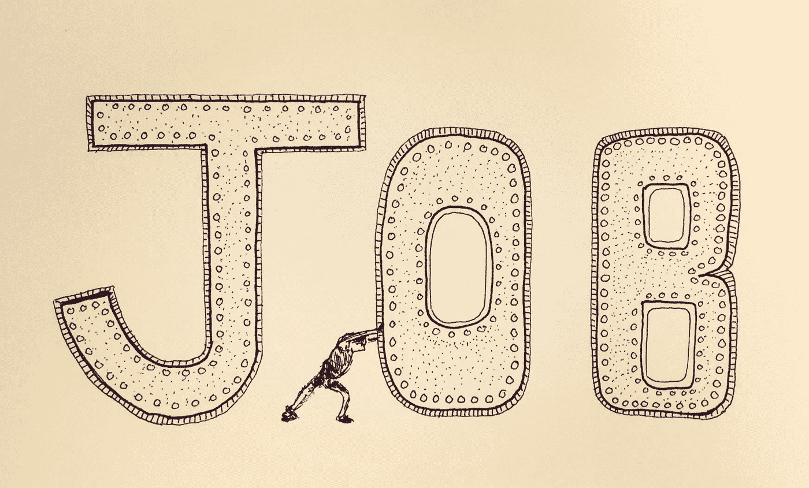

# 一些完全陈词滥调的职业建议…

> 原文：<https://medium.com/hackernoon/some-totally-cliche-career-advice-3756da3cfacc>

一些完全陈词滥调的职业建议…

*   找到你可以真正学习的人
*   寻找那些以真诚、非操纵的方式挑战你的人
*   你的个人职业生涯会比你工作的大多数公司持续更长时间
*   尽情享受事物真正流动的时光。他们艰苦奋斗，转瞬即逝
*   一家公司可能是“成功的”,但对其高比例的员工来说却是有害的
*   一个很好的工作场所(对某些人来说)可能是一个很糟糕的工作场所(对其他人来说)
*   组织成长、变化、衰退和死亡。不要和他们一起萎缩/死亡
*   有些问题绝对可以解决，但不值得去解决
*   所有公司都有问题。并非所有的公司都有慢性健康问题
*   只要有决心，你就能领导一场自下而上的革命。代价是什么？
*   有可能十年都在做“好工作”，但没有成长/学习
*   完全有可能“超越”你目前的角色。是时候向前看了。
*   成为你的手艺的学生，以及你的手艺如何能帮助人们
*   品味你的作品对现实世界的影响。当你感觉到的时候加倍下注
*   享受学习的机会…我们在自动驾驶上花了很多时间
*   如果你的公司没有提供学习机会……无论如何也要去做(利用他们的时间)
*   如果你找到一个地方，事情“通常会自己解决”…高兴吧！
*   尝试教学/指导。即使一周 30 分钟也能走很长很长的路
*   对你的忠诚要明智。是否得到了回报？
*   这不全是关于你的。我的意思是它可以，但你限制了自己
*   小心饮用库尔援助。你可能会对副作用视而不见(假糖)
*   小心微妙的操纵和永远不会到来的晋升
*   记住…煤矿里的金丝雀必须为“学习”而死
*   不要混淆你的个人需求和你公司的“需求”
*   不要把你的需求/期望强加给和你一起工作的每个人(懒鬼！)
*   读小说和诗歌！有一个爱好
*   假装你从没读过这篇文章，然后“犯最好的错误”