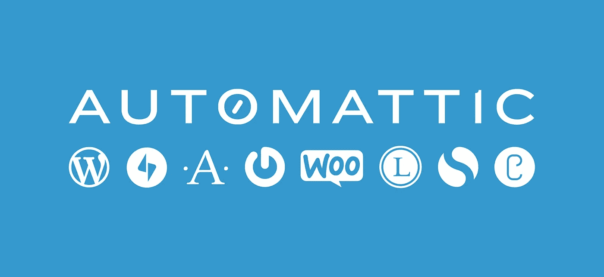
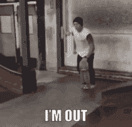

# 有时事情并不像预期的那样进行…

> 原文：<https://medium.com/hackernoon/sometimes-things-dont-work-as-expected-195fe46400c6>

## 我在 Automattic 公司做 TAE 试用者的两周经历。

今年 1 月 2 日，我刚刚在我当时工作的公司开始一天的工作，就收到了一封意想不到但令人兴奋的电子邮件:

*“对延迟回复表示诚挚的歉意。你还对 TAE 这个角色感兴趣吗？是这样，也许我们可以聊聊。”*

My face reading the email

我对这个消息感到震惊，同时也很高兴，当时是在一份新工作的第二个月，真的没有什么令人兴奋的工作，在那之前我没有分配任何工作，我在办公室里非常无聊，在任何情况下都不允许使用笔记本电脑处理任何个人事务，否则你可能会被解雇(这家公司真的很注重安全)。所以我当场回复了一个大大的是的，我感兴趣(当然是从我的手机上)。

在 1 月 12 日通过电子邮件进行了一些来回的交谈后，我们进入了第一次面试的快速电话会议。我很兴奋，但同时脑子里有一个问号，因为我从 2012 年开始与 [WordPress](https://hackernoon.com/tagged/wordpress) 一起工作，并且从 2014 年到 2015 年，我一直在阅读关于[自动化](https://automattic.com)文化、[分布式工作](https://www.inc.com/glenn-leibowitz/meet-the-ceo-running-a-billion-dollar-company-with-no-offices-or-email.html)以及他们的[信条](https://automattic.com/creed/)的内容。

Automattic is the company behind almost the 35% of the internet with WordPress and other products

所以这一天到来了，我从我的家庭办公室接到了 zoom 电话(2016 年和 2017 年，我在德克萨斯州的一家公司工作),我已经拥有了远程工作的所有设置和工具。我们谈了大约 30 分钟关于我和我的经历，招聘经理看起来对我的简介很感兴趣，当然他是一个非常友好的人，在整个过程中都很得体。

几个小时后，我收到了招聘经理的电子邮件，邀请我和一位同事进行第二轮面试。在通过电子邮件进行了一些来回的交谈后，我们再次在 2 月 19 日进行了电话沟通。通话非常顺利，和我通话的人非常坦率，但也很友好，我们聊了大约 25 分钟；这一次更多地关注远程工作、自我启动或工作授权以及其他个人事务。

**轰！**大约两周后，我收到了招聘经理关于第二轮面试的电子邮件，邀请我参加面试:

*“我们将带您进入招聘流程的下一阶段，也就是试用项目。”*

我和一些同事一起吃午饭，我对那封邮件感到非常高兴，以至于我的脸在那一刻表达了如此多的喜悦，坐在我旁边的人注意到了这一点，并开始问我有什么新闻。

When you get that email…trial? heck yeah!

我们试图协调开始试用的日期，但招聘经理在这之间有一些旅行，我们等了 3 个多星期才决定最初的日期。我们将审判安排在 2 月 26 日。

## 审判开始了

在 26 号之前的几天，我们交换了电子邮件，以进入松弛期，满足安全要求，并作为承包商签署了为期 4 周的试用合同(你可能知道，在这一点上，[自动化](https://hackernoon.com/tagged/automatic)进行[试镜](https://hbr.org/2014/04/the-ceo-of-automattic-on-holding-auditions-to-build-a-strong-team)作为他们招聘过程的一部分，所以在面试结束后，你要在其他团队成员的参与和不断的反馈下，根据你申请的角色进行试用)

因此，我的项目很简单(我不会破坏什么是 TAE 审判)，但对于一个了解一点设计思维和六适马的项目经理来说，应该是非常直接的事情；一点点创新，改进和大量的学习。

因此，第一天是团队介绍、试验简报、启动试验和澄清问题的快速电话会议。那天 30 分钟后，我准备出发了。

Thinking about that brief on the first day

因此，我开始思考这份简报，我如何能增加价值，展示我能快速学习，开始自己的工作，并把自己融入公司的文化。因此，我从在 slack 频道上分享我的想法开始，到第一天结束时，我已经为一个项目创建了一个提案

我的招聘经理是一位优秀的教练，他提供了很多指导，是一个非常坦率的人。因此，当我第一天分享我所有的想法时，他告诉我第二天跳到一个 zoom 电话上寻求一点指导。

我在第一天结束时做了过度的设计或者可能是过度的思考，可能是因为我试图尽我最大的努力，当然也给我的团队留下深刻印象，但这很简单。所以我决定采取一种更具设计思维的方法，学习-构思-测试。

所以第二天我开始学习每天的事情，理解问题，互动等等；我花了大约 4 天时间学习、阅读、提问、提出想法，到第一周结束时，我和我的招聘经理做了一次检查，一切都很好，我在 3 天内理解了这个过程，但花了几天时间深入挖掘。第一次反馈是积极的，所以我在第一个周末考虑了一下，在简报的基础上做了更多的工作，为下周做准备。

第二周开始，我专注于记录步骤和进行实际工作。经过一周的努力学习，我通过 slack 渠道与团队分享了文档、想法和改进(每天我打开 Slack，打招呼并开始工作，在一天结束时，我提供了一份报告，其中包含当天的进度和第二天的计划)，每个人都非常善于提供反馈和指导。我花了大约 2 天的时间想出了简报要求的具体交付内容，我只是记录并准备最终演示，这将结束我的第一部分试验。

我要求更多的反馈，以了解我的工作是否协调一致，一切似乎都很好。到第二周的星期三，我们同意了演示的日期，我们决定在星期五做，一切都进行得很好；我在周四之前准备好了演示文稿，文档在周四共享，并准备好交付需求。

在演示的那天，招聘经理邀请其他同事来评估演示，我非常乐意去演示。我提前 30 分钟准备好新煮的咖啡，一小时前洗了个冷水澡，早晨的阳光透过我家庭办公室的窗户照了进来。

我打开了缩放会议，每个人都开始加入，5 分钟后，我们准备好了重要的时刻。招聘经理向团队介绍了我自己，我们都打招呼并伸出手打招呼。

Say Hi with your hand is a great practice specially for remote work

我只有 10 分钟的时间，简单介绍一下我自己，谈一点简短的要求，然后谈谈我的可交付成果，最后用我在试验中使用的方法结束。我花了大约 14 分钟，因为我话很多，但最后每个人都很友好，招聘经理开始问了几个问题，没什么复杂的，只是想知道我是如何提出我的交付物的，其他同事问了一些具体的流程问题，最后一个问我对试验的感觉以及我对日常工作的看法(更不用说我不会破坏的简报的细节)

我们以一个 30 分钟的会议结束，它是为那些不能参加的人录制的。所以演示会结束后，我很感激每个人的合作，并等待招聘经理的反馈。

猜猜看…

他要求我周末向其他人展示演示文稿，并讨论我的交付，所以那个周末很有压力，但同时也很平静，我决定不去想它，只是享受和等待。

At that weekend waiting to hear from the hiring manager

周一早上，我从床上跳起来查看我的空闲时间，但我的频道上没有任何活动，招聘经理通常在美国中部时间早上 4:30 开始谈话(你知道分布式公司)

那天早上我去训练，在回家的路上吃了一顿快餐。当我到家时，我检查了我的手机，看看是否有任何新闻和…

…我从几个空闲频道和招聘经理的直接信息中得知，他们对我的项目和表现给予了表扬，但最后却带来了一些坏消息…

很抱歉，我们决定不再继续您的试用，而是继续聘用其他具备其他技能的候选人

你知道，自动测试很酷，可以更好地了解公司，还可以探索你是否可以远程工作和其他细节，但对他们如何关闭你也很冷淡，所以我有点准备好了。然而，当你有积极的反馈，但以消极的结果结束时，总是令人震惊。

My face during the whole afternoon after the bad news

就在我回复招聘经理 slack 之后；我向他寻求一些反馈(我确实知道 Automattic 不会在试验后向人们提供反馈),但我必须给它一个机会，并理解发生了什么。答案是:

*“让我出差回来，我会考虑一些反馈”*

所以我的假设是。没有即时反馈？…嗯，最后的反馈是:“你的项目管理技能和你处理项目的方式给我们留下了深刻的印象”我当时正从这种印象中走出来，我花了一整天思考这个问题。

我试着站在他们的立场上，我知道什么是 TAE，他们做什么，可能会出什么问题？当你评估某件事或某个人的工作时，如果你发现有什么需要改进的地方，你会立刻注意到……那么为什么没有反馈呢？我不得不等待招聘经理的回复，了解这段经历，提升自己，继续前进。

# 这次经历最精彩的部分

对我来说，生活中最重要的事情之一就是从你做的每一件事，你的背景，经历，你每天遇到的人，甚至是坏的或好的记忆中学习和借鉴，成为一个更好的你。我失败了很多次，但我并不悲伤，也不担心未来或失败本身(当然我很失望)，但[约翰·麦克斯韦](http://www.johnmaxwell.com/)在他的[书中教导道:没有限制:放开你的能力](https://www.amazon.com/No-Limits-Blow-Your-Capacity/dp/1455548286)情感强大的人不要让坏或好的时刻左右你的生活，所以他用 24 小时来庆祝成功或失败。我花了 24 小时思考我的决定和整个情况，现在我非常高兴有这个机会学习，现在我可以帮助别人避免我的错误，并追求他们的机会。

如果[马特·莫楞威格](https://medium.com/u/45af3b7db7a9?source=post_page-----195fe46400c6--------------------------------)审阅了我的简历并将其转发给招聘经理(是的，当你申请 Automattic 时，首席执行官是你简历的第一个筛选者)是因为他看到了我有能力做这份工作的某些东西，当然这个过程中有如此多的变量，你永远不会知道，直到你被录用，但如果你想一想；在与非常聪明的人进行了两次面试和几封电子邮件后，有机会获得试用机会几乎是整个过程的 50%,我也获得了试用的 50%。我很高兴我现在可以说出自己的经历(并且有大约 60%的可能性与他人竞争一家非常聪明的公司的职位)。

我知道我不是一个墨守成规的人，我为我的成就感到高兴，但让我们重新加载，迎接下一个挑战，并赢得它！

无论如何，这是一次很棒的经历，Automattic 是一家伟大的公司，是一家 100%分布式公司的典范，是他们所做的事情的领导者，为员工创造了伟大的价值观，拥有令人惊叹的哲学。

现在我正在前进，期待着下一次冒险，我知道上帝有一些神奇的:D

*PD:我已经检查了所有的远程工作板和可能的公司，项目管理角色现在不是很有吸引力，需要更新编程、设计和可能的产品管理。所以任何建议都将受到高度赞赏。*

如果你有问题或者只是想知道更多关于我之前申请或开始试用的经历；请随时通过[推特](https://twitter.com/jascorecr)联系我

Time to move forward