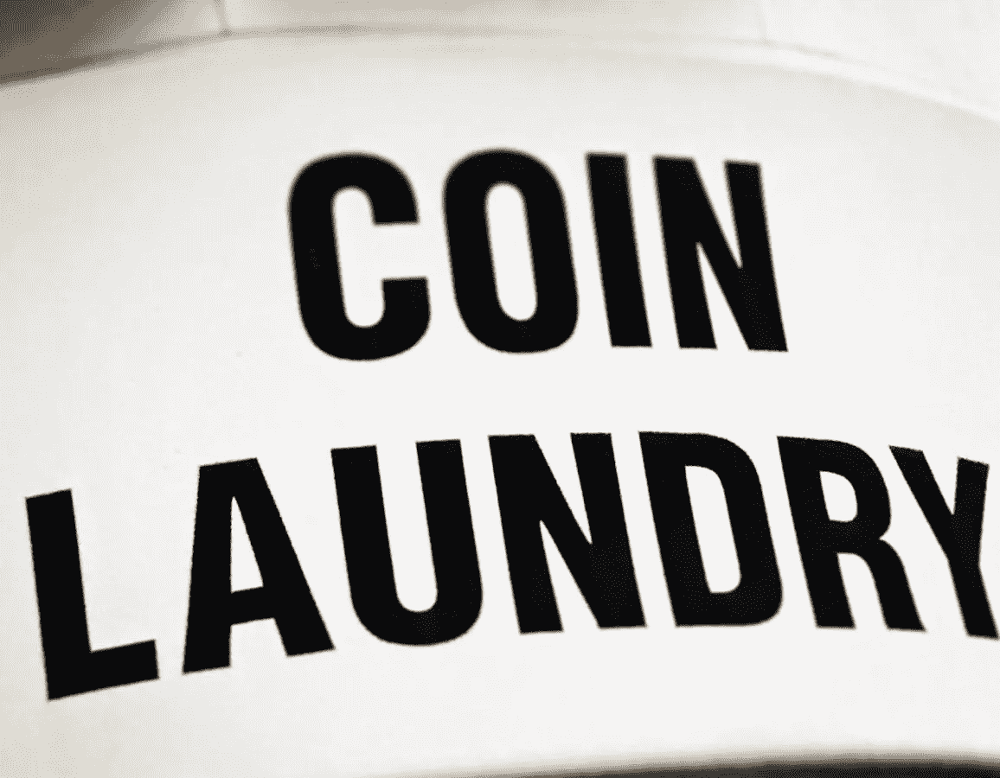
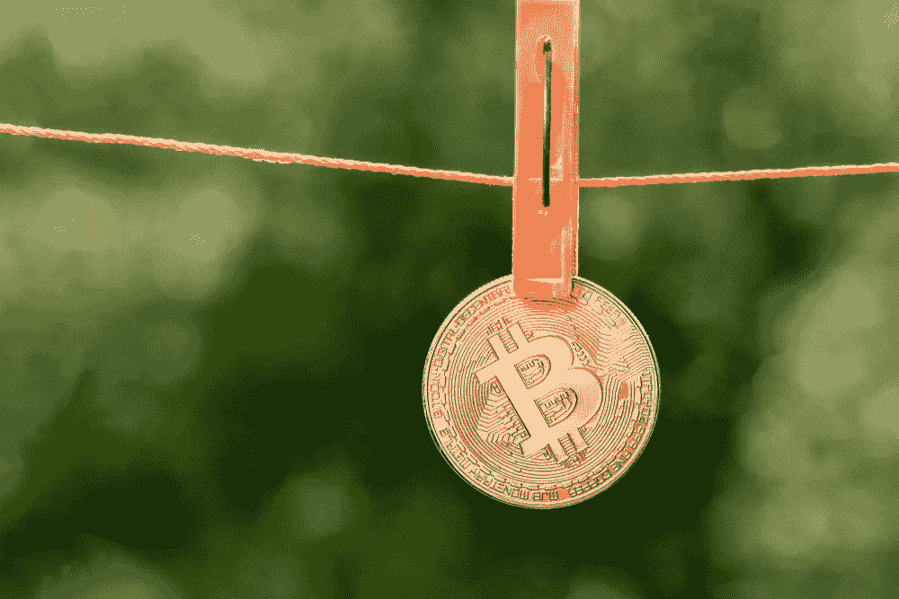

# 很快所有的比特币上都会有可卡因的痕迹。这是如何发生的，为什么有关系？

> 原文：<https://medium.com/hackernoon/soon-all-bitcoins-will-have-traces-of-cocaine-on-them-cdcfe369983>

*帕维尔·切尔卡申*

在最近一篇分析加密货币市场采用阶段的[帖子](/@mindrockcapital/more-hedge-funds-need-to-enter-the-cryptocurrency-market-for-it-to-reach-critical-mass-ff6190ee512e)中，我的同事 Kate Chichikashvili 认为，加密货币要实现大规模采用，大型机构参与者必须进入市场。

问题是，他们不能。

基金和银行等受监管的金融机构不能大量购买比特币，原因很简单:他们购买的所有比特币都被[要求](https://blockonomi.com/bitcoin-money-laundering/)100%“干净”——从它们被开采出来的那一刻起，它们在任何时候都不能有任何非法或可疑的记录。任何购买“肮脏”比特币的机构都被视为洗钱的参与者。

但事实是，许多比特币已经有非法活动的痕迹，很快，几乎所有的比特币都会有。没有可靠而有效的方法来检查大型交易中每一枚比特币的记录，以区分“干净”和“肮脏”，也没有专家来进行审计，这些专家将得到买家、卖家、监管机构以及交易中可能涉及的任何其他人的信任和接受。因此，确保你只购买“干净”比特币的唯一方法是直接从矿商那里购买——他们根本无法大量供应新开采的比特币。因此，受监管的金融机构无法进入加密市场，没有它们，市场就无法充分发挥潜力。

本文通过揭示比特币如何变得“肮脏”及其如何流通，污染全球加密货币池，探讨了加密货币广泛采用的关键障碍。

**比特币如何变“脏”**

数字货币是一种越来越流行的购买非法产品和服务的方式。这里有一个示例场景。Joe 想从他的供应商 Stephan 那里购买药物，他要求用加密货币支付。乔不是专业交易者或投资者。他不想了解购买和存储加密货币的所有细节。所以他去了几个街区外迈克刚刚开的一个街角小店，这是发展中国家涌现的数百个这样的中心之一。乔给了迈克一些现金，并得到了他购买毒品所需的比特币；Mike 将它们发送到 Joe 的钱包或直接发送到 Stephan 的账户。又快又省事，5–15%的佣金往往藏在汇率里。

世界上没有关于这种交易量的官方数据。但是让我们大胆猜测一下:

> 日交易量:20 万笔
> 
> 平均交易规模:500 美元
> 
> 每日总交易量:1 亿美元
> 
> 一个比特币的平均成本:7000 美元
> 
> 比特币日需求量:15000
> 
> 平均溢价:+10%

仅从这些交易中，流通中的 1700 万枚比特币中就有 0.1%被污染。

**大量比特币从何而来**

在像迈克这样的商店购买的 15000 个比特币来自哪里？其中一些在系统内再循环(例如，Stephan 可能会将他的比特币直接出售给 Mike)，但再循环受到安全和地理因素的限制。通过官方渠道——受监管的交易所和柜台交易(OTC)来满足剩余的需求几乎是不可能的；他们只是没有足够的流动性(要出售的比特币)，由于反洗钱(AML)和了解客户(KYC)的要求，他们的合规官不得不切断大多数客户。

因此，这些商店很可能从接受现金且不问问题的交易所和场外交易柜台获得比特币供应。

**对比特币的额外需求**

然而，这些自称为“流动性提供者”的人也为各种投资者和投机者服务:短期交易员和经纪人、兑现影子收入的亿万富翁、寻求更高加密交易阿尔法值的对冲基金等等。这些客户大幅增加了比特币的日需求量。让我们大胆猜测一下这个数量:

> 每日交易次数:1000 次
> 
> 平均交易规模:50 万美元
> 
> 每日总交易量:5 亿美元
> 
> 一个比特币的平均成本:7000 美元
> 
> 比特币日需求量:7 万
> 
> 平均折扣/溢价:从-1%到+3%(取决于客户的“干净”程度)

加上这些交易，交易所和 OTC 柜台现在每天需要约 85，000 个比特币的供应——占流通比特币总数的 0.5%。这种巨大的需求创造了一个不断增长的巨大的直接场外交易市场。比特币的批发提供商通过离岸公司实体运营，并根据虚构的“投资”或“商品交易”合同，以相当高的折扣(高达 10%)通过瑞士、香港、新加坡甚至美国的银行账户转移数十亿美元。

**供货背后的人**

但事实上，批发供应商是由少数个人代表的，他们宁愿呆在暗处，原因很简单:

物理安全是一个巨大的问题，因为与法定货币不同，没有办法隐藏数字资产。所有的信息都在账本里，一旦一个诱人的加密钱包的主人的身份为人所知，搜寻就开始了。

大量比特币的来源一直是个谜。这些卖家大多将自己定位为“矿工”或“采矿集团”，他们将各种采矿业务的比特币进行辛迪加，但在实际交易中，大多数卖家都会拿出一定比例的“赎回币”——从公开市场上流通回来的比特币。

让我们称这样的卖家为 Gabriel。

加布里尔隐藏身份，通过大型金融机构、律师事务所、个人理财顾问等几层中介进行操作；每个中介都为比特币的原始来源增加了一层合法性。

这是市场上当前形势的讽刺之处:使用传统金融工具购买或出售大量加密货币是不可能的——尽管该技术不需要买方和卖方之间的中介，但没有一个(或多个)中介，大宗交易就不会发生。

**世界上流通的“肮脏”比特币**

最终的循环方案如下所示:

> 1.加布里埃尔通过一系列律师、金融顾问和经纪人向交易所和场外交易柜台以 10%的折扣出售比特币。
> 
> 2.较大的场外交易柜台和交易所将比特币出售给较小的流动性提供商，最终以 0%的折扣出售给迈克。
> 
> 3.迈克以 10%的溢价将比特币卖给乔。
> 
> 4.乔将比特币支付给斯蒂芬。
> 
> 5.Stephan 将比特币返还给 Gabriel 进行“赎回”,折扣高达 15 %- 20 %(我猜)。

Source: Shutterstock

**应该禁止数字货币吗？**

如果我们假设全球比特币供应量每天都有 0.5%左右被重新流通(考虑到比特币的历史及其在黑暗网络上的活跃使用，我的估计可能过于保守)，很快世界上的每一枚比特币都会有非法活动的痕迹。对于每一张实体美元钞票来说，这可能也是真的——但是纸币对它的历史保持沉默，而数字硬币则记录了它们曾经放进过的每一个钱包。

对于世界上任何一名金融犯罪官员来说，整个加密货币市场就像一台巨大的洗钱机器，应该立即关闭。但事实是，洗钱早在加密货币发明之前就存在了，并且无论货币市场的监管或创新如何，洗钱都将继续存在。昨天，人们可以乘坐装满黑色垃圾袋的私人飞机飞往苏黎士，在一家大型私人银行安排特殊的反洗钱/KYC 治疗，该银行甚至会租赁专业的点钞机和保险箱，而不会对钞票上的血迹或毒品提出任何问题。明天，人们会在牛仔裤的后口袋里带一个存有大量加密货币的 u 盘。主要区别在于，任何人买卖的每一枚数字硬币都会在公共网络上发光，就像警察喷在贿赂金上的隐形墨水一样。

**前进的道路**

禁止加密货币不会解决问题，忽视加密货币可能会让洗钱和非法交易更容易隐藏在合法用户的背后。

保持进步的唯一方法是承认新的全球金融现实，并为文明使用数字货币创造深思熟虑的监管，以弥补现有金融体系中的缺口和低效。一旦发生这种情况，大型机构金融组织可以进入市场，使其进一步发展。

***

*帕维尔·切尔卡申(Pavel Cherkashin)是一位风险投资高管和企业家，作为创始人、投资者和董事会成员，他有着创建数十亿美元公司的成功记录。作为 Mindrock Capital 和 GVA 资本的联合创始人和管理合伙人，帕维尔投资于人工智能、区块链和自动驾驶技术。*