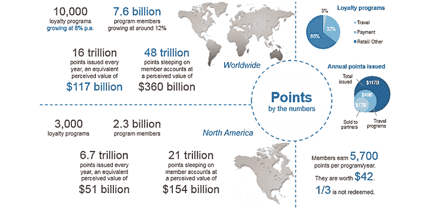

# 迟早你将不得不使用密码交换

> 原文：<https://medium.com/hackernoon/sooner-or-later-youll-have-to-use-a-crypto-exchange-854ebf06df67>

[source](http://www.henningfineart.com/leroy-neiman-1/leroy-neiman-1921-2012-1)

尽管加密货币、ico 和代币是我们大多数人可能已经习惯的东西，但加密交易所不同——在大多数人看来，它只是交易者的工具，而不是真正的加密用户，他们在钱包中持有一些代币，等待在未来的平台上使用它们作为支付形式。然而，随着市场的成熟和令牌数量的增长，越来越多的令牌在密码爱好者中传播，问题出现了:普通用户如何轻松地在令牌之间切换？密码交换可能是答案。

# 令牌的使用是不可避免的，原因如下

*代币和折扣代币的折扣*

想象一下这样一种情况，你既可以用信用卡支付购物的全价，也可以在你决定用现金支付时享受 20%的折扣。虽然这可能取决于购买的规模，但第二种选择似乎更有吸引力，对吗？现在想象一下，你经常购买这些东西——显然，现金成了你唯一的选择。

这个逻辑同样适用于代币。项目可能会为使用自己的代币提供折扣，以刺激对代币的需求，并分别提高代币的价值。

*   这种情况的一个很好的例子是 [BOLT](https://bolt-token.global/) ，一个向新兴市场提供廉价移动视频内容的平台和令牌。虽然用户可以用其他货币支付，包括法币，但是选择用代币支付费用的顾客[会得到很大的折扣](https://docsend.com/view/yhnw6i9)——第一年 50%，第二年减少两倍，第三年减少四倍。该公司还计划每季度用 20%的利润回购博尔特代币，直到其中 4 亿枚被收回。
*   Nexo ，一个提供即时加密贷款的平台，是另一个很好的例子。选择偿还 NEXO 代币利息的借款人将获得 50%的还款折扣。这还不是唯一的优势:在 Nexo 钱包中持有代币的用户有权获得股息——该公司将 30%的利润分配给代币持有者，以获得资产所有权。

[https://hackernoon.com/valuing-productive-cryptoassets-89cedad444e6](https://hackernoon.com/valuing-productive-cryptoassets-89cedad444e6)

折扣代币——那些在使用时不会被网络烧毁，而是由持有者持有的代币——也越来越受欢迎。CoinFund 的合伙人 Alex Felix，[解释道](https://blog.coinfund.io/the-fundamentals-of-discount-tokens-cc400c66198e),“…代币持有者有权获得服务的永久折扣，但其结构是折扣在数学上等同于收入或费用版税，但前提是您使用这些服务。”

随着越来越多的项目为他们的代币提供更好的交易，很明显你迟早会想要一个。

*空投*

这个世界上没有免费的午餐，但是在密码世界里，有免费的午餐。区块链公司有时会进行空投，这意味着[他们向已经持有一些密码(例如比特币或以太坊)的用户的钱包分发令牌](https://hackernoon.com/all-you-need-to-know-about-crypto-airdrops-aka-free-money-243e60b22493)，所有这些对最终用户都是免费的。尽管初创公司通常利用这些来吸引对项目的关注，并让初始用户使用该平台，但加密交易所以及区块链企业有时也会出于营销目的做同样的事情——奖励忠诚的客户或生成线索数据库。

空投可以让公司在竞争激烈的领域提高知名度，并让代币持有者在试图弄清楚如何处理新股份的同时，对项目进行自我教育。正如区块链分析师兼爱好者 Shaurya Malwa 所说,[说](https://hackernoon.com/all-you-need-to-know-about-crypto-airdrops-aka-free-money-243e60b22493)“快速回顾一下，比特币和以太坊拥有数百万用户。空投有效地将你的代币交到数百万人手中。即使只有 1%的用户真正参与到你的项目中，你也可能比最成功的代币销售获得更广泛的传播和更多的参与。”

通过空投获得的代币可以放在钱包里，用于以后的支付。一旦它们升值，也可以在交易所出售。

*忠诚度计划*

忠诚计划市场是一个巨大的市场，全球会员账户中约有 4800 万积分等待使用，总价值约为 3600 亿美元。尽管如此，[研究显示](http://www.therail.media/stories/2017/4/5/study-59-of-millennials-quit-loyalty-programs)这些项目的回报对千禧一代来说不够有价值，这是他们退出的主要原因。考虑到关于如何使用这些积分的所有限制，积分的货币价值通常低于正常水平。传统的忠诚度计划缺乏流动性。

[https://medium.com/sendy-token/why-customer-loyalty-programs-are-ripe-for-blockchain-disruption-ae4befe8d450](/sendy-token/why-customer-loyalty-programs-are-ripe-for-blockchain-disruption-ae4befe8d450)

这就是区块链进入游戏的地方。正如来自[【熊智娟】](https://sendy.network) [的亚伦·怀斯曼所说](/sendy-token/why-customer-loyalty-programs-are-ripe-for-blockchain-disruption-ae4befe8d450)“流动性赋予忠诚度积分超能力。为企业创建代币允许其成员相互交易，与其他企业交易，甚至将他们的忠诚度积分兑换成现金。它还为企业以无信任的方式进行协作提供了一个开放的协议。”

企业已经开始认识到忠诚度计划代币背后的潜力。例如，新加坡航空公司[推出了](https://www.coindesk.com/singapore-airlines-blockchain-based-loyalty-program-takes-off/)基于区块链的常客忠诚度计划。廉价航空公司亚洲航空[证实](https://www.ccn.com/bigcoin-major-airline-airasia-is-developing-a-cryptocurrency/)将把它的常旅客积分转换成一种新的加密货币 BigCoin。国泰航空集团也加入了这个行列，宣布了他们新的区块链奖励计划。不仅仅是航空公司——例如，EZ Rent-A-Car [向其客户提供](https://awards.e-zrentacar.com/)将他们的忠诚度计划积分转化为数字货币。

# 所有这些和密码交换有什么关系？

代币持有者享有诸多优势，很明显，有一天你将不得不买卖特定的代币，或者与他人交换你的代币，以获得代币带来的所有好处。那么你有什么选择？

*   ***直接在网上找买家/卖家***——显然，没有人能禁止你直接和某人交易，从钱包里送代币到钱包里。然而，这种选择的缺点是显而易见的——找到愿意出售或购买你感兴趣的代币的人很难，如果不是不可能的话。此外，定价成为一个问题，因为汇率必须由用户自己决定。
*   [***0x 协议和 Metamask***](/@bdaqio/buy-and-sell-tokens-without-an-exchange-7-steps-498d3b57cef0) — 0x 协议是用于交换 ERC20 令牌的开源协议，Metamask 是从浏览器访问支持以太坊的分布式应用的扩展。这两种产品的结合创造了一种安全、分散的方法来在以太坊上交易代币。虽然这是一个很容易使用的有前途的解决方案，但它对市场来说仍然是新的，它的开发仍在进行中。明显的限制是只有 ERC20 令牌可以这样发送。
*   ***交易所*** —目前，加密交易所是加密持有者买卖代币最简单的方式。集中式交易所为客户创造了一个巨大的流动性池，并允许使用各种支付方式将菲亚特换成密码。它们还消除了一些在加密领域普遍存在的个人风险。正如开发者和技术博客作者 David Petersson 所解释的，“由于所有的地址都是散列码和数字，人们有时会把钱汇错地址。而且由于不涉及银行，交易是不可逆的。”然而，大卫继续说道，“交易所可以帮助用户弥补这种损失”——正如首席执行官郑恩里所说的 [ABCC](https://abcc.com/) 所做的那样。

因此，加密交易所不仅面向交易者，也面向那些只想用代币支付产品和服务并享受折扣的代币持有者。如何为自己选择一个加密交易所？

# 对于初学者来说，理想的加密交换是什么样的？

加密交换因目的不同而不同。如果你对交易感兴趣，你可能需要找到一个拥有先进交易工具的交易所。然而，对于那些只需要为某项交易进行交易的新手来说，要求可能会有所不同。那么，对于新手来说，理想的密码交易所有什么特点呢？

[https://bitcoincharts.com/charts/volumepie/](https://bitcoincharts.com/charts/volumepie/)

*   ***流动性—*** 目前，99%的加密货币交易发生在集中交易所。剩下的就留给分散的吧。由于它们的节点是分布式的，它们降低了黑客和盗窃的风险，并且它们还为用户提供了匿名性，而这是集中式交易所通常缺乏的。然而，截至目前，此类交易所的流动性非常低，可能的原因是验证时间更长，缺乏加密货币供应，以及新手相对复杂。另一方面，集中交易为用户提供了更多的流动性，对于那些只想快速、轻松地兑换代币的新手来说，这是一个更好的选择。
*   ***安全*** *—* 如今，市场上有超过 200 家[密码交易所](https://icorating.com/report/exchange-security-report/)，而且这个数字还在不断增长。对数字货币如此高的需求引起了黑客的兴趣——根据 ICO 评级报告，在过去的八年中，31 个加密交易所被黑客攻击，从用户那里窃取了 13 亿美元。该报告显示，在 100 家加密交易所中，只有 46%为投资者提供全面的用户账户安全，只有 4%采用大多数最佳实践来消除与域名和注册服务商漏洞相关的风险。

尽管没有人能完全避免资产损失，但如果你遵循简单的安全指示并选择一个可靠的、过去从未遭受过网络攻击的加密交易所，风险是可以降低的。

*   ***用户友好且易于使用* —** 区块链解决方案的复杂性可能会让投资者不知所措——加密交易所不应该让新来者对这项技术更加困惑。用户界面对初学者来说尤其重要——简单的注册、清晰的导航和简单的网关是必须的。将资金轻松转移到交易所的能力也是一个优势——一些交易所与钱包集成在一起，这使它们成为投资者的一个好选择。

支付方式也很重要——正如 Techracers 的研究员、区块链爱好者[所说](https://hackernoon.com/7-best-cryptocurrency-exchanges-2018-9a160127a14d)“你应该选择一个为你提供多种支付方式的平台，而不是只有一种支付方式的平台。”

*   ***支持多种加密货币—*** 虽然这一因素可能不如安全性重要，但加密货币的供应对于愿意在交易所出售或购买代币的投资者来说非常重要。该交易所可能支持法定货币，但是，如果加密的选择有限，用户将不得不转向另一种服务，以获得特定令牌的交易。对于那些对常规交易不感兴趣，而是想完成一笔交易的投资者来说，从一个交易所转移到另一个交易所是浪费时间。

# 从理论到实践——哪些交易所符合标准？

在下面的列表中，我们列出了前 3 家交易所，在我们看来，它们符合所描述的标准，将是加密用户的良好选择。

[**比特币基地**](https://www.coinbase.com/) 是迄今为止最值得信赖的加密货币交易所平台之一，从未被黑客攻击过(比特币基地 Pro 根据 [ICO 评级研究](https://icorating.com/report/exchange-security-report/))是最安全的交易所。根据该公司的网站，超过 2000 万用户在该平台上交易了超过 1500 亿美元。该交易所对新人来说是一个很好的选择，因为它易于使用并支持菲亚特——你可以使用你的银行账户、信用卡、PayPal 或其他支付方式购买 crypto。不幸的是，比特币基地支持[八种加密货币](https://support.coinbase.com/customer/en/portal/articles/2630943-supported-digital-currencies)并且有地理限制——它只在 [33 个国家](https://www.coinbase.com/global)可用。

[**EXMO**](https://exmo.com/) 成立于 2013 年，是市场上历史最悠久的交易所之一。该公司拥有超过 150 万用户，支持 12 种语言的 30 多种加密货币和几种法定货币。该平台是面向安全的，因为它具有 [2FA](https://en.wikipedia.org/wiki/Multi-factor_authentication) (双因素认证)，并允许用户仅出于授权目的选择可信的 IP 地址。交易所将其大部分资金储存在冷钱包中，这消除了在网络攻击成功的情况下损失金钱的风险。安全性并不是 EXMO 成为投资者良好选择的唯一特征——这项服务有一个直观的用户界面，非常容易导航，因此买卖代币既快速又容易，即使对于不精通技术的人来说也是如此。

****币安是另一个既适合初学者又适合高级用户的著名交易所。这项服务目前支持 14 种语言的近 150 种代币和硬币。该平台允许用户在两种用户界面(基本或高级)之间轻松切换，这使得它非常用户友好且易于使用。就像 EXMO 一样，这个交换支持 2FA，被认为是安全的。您可以立即注册和交易，但是，如果您想每天提取超过 2 BTC，您必须提供带照片的 ID。****

********

****虽然这个列表还很不完整，但由于加密交换的范围非常大，这里列出了一些对初学者有帮助的主要交换，以引起您的注意。我们预计，随着市场代币化成为一种新的现实，投资者开始交换代币以最大限度地利用他们的资金，未来将有更多的密码交易所专注于它们的安全性和用户界面。****

*****免责声明:本文信息不应被解读为投资建议。在开始使用本材料中介绍的任何交换之前，需要做进一步的研究。*****

## ****关于作者:****

****[基里尔·希洛夫](http://twitter.com/kirills4ilov)——geek forge . io 和 Howtotoken.com 的创始人。采访全球 10，000 名顶尖专家，他们揭示了通往技术奇点的道路上最大的问题。加入我的**# 10k QA challenge:**[geek forge 公式](https://formula.geekforge.io/)。****