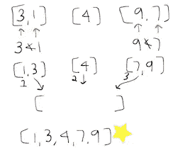

# 概念上的排序算法

> 原文：<https://medium.com/hackernoon/sorting-algorithms-conceptually-816026f476bf>

如果你对计算机科学感兴趣，或者只是对一系列数字的不同排序方式感兴趣，了解一些基本的 T2 排序算法会对你很有帮助。或者你可能对民族舞蹈感兴趣…那么这也是给你的帖子，因为**所有不同类型的分类标题都链接到一个视频，在那里通过民族舞蹈进行解释**！

首先你应该知道什么是数组。一个**数组**是一个数据结构，它包含一组数据类型相同的元素(都是字母，都是数字，等等)。).如果这个概念让你迷惑，每次我说数组的时候，只要在你的脑海中用单词列表(就像一个购物清单)来代替它。我将对数字数组进行排序。

*我们将在每个示例中从最小到最大排序*

[**选择排序**](https://www.youtube.com/watch?v=Ns4TPTC8whw)

* *对于图纸* *蓝色箭头指向我们正在查看的内容，红色箭头是我们正在与之进行比较的内容。数字周围有括号，表示这是一个数组。

1.  指向数组中的第一个元素，然后指向第二个元素，并比较这两个元素。因为蓝色数字比红色数字大，所以我们增加了一个参数(增加 1)并将当前的红色数字转换为新的蓝色数字。旧的蓝色号码不再被指向。
2.  我们一直比较数组中的两个元素，并停止指向两者中较大的一个。然后，我们继续将较小的数字与数组中的下一个元素进行比较，直到我们证明它是最小的，然后将它放在数组的前面。
3.  对于数组的长度，继续执行该过程，在放置当前最小数字的位置递增(增加 1)。最后几个元素不用太久，因为比较的东西比较少。

[**冒泡排序**](https://www.youtube.com/watch?v=lyZQPjUT5B4)

* *对于图纸* *蓝色箭头指的是我们正在看的东西，红色箭头指的是我们正在比较的东西。数字周围有括号，表示这是一个数组。

1.  指向第一个元素，并将其与数组中的第二个元素进行比较。
2.  如果第一个更小，则递增数组中蓝色数字所在的元素。如果你的蓝色数字大于你的红色数字，你交换元素。然后我们比较接下来的两个元素(以此类推)。
3.  在此之后，数组将不再排序。
4.  一旦你解析完了数组的末尾，然后再次遍历数组，做同样的事情。在每一遍中，我们并没有找到最大的元素，而是把它放在离最终位置更近的位置。
5.  如果你通过数组而没有进行交换，那么你就知道你已经完成了，数组已经排序了。

[**合并 Sor**](https://www.youtube.com/watch?v=XaqR3G_NVoo) **t**

* *对于图纸* *蓝色箭头指向我们正在查看的内容，红色箭头是我们正在与之进行比较的内容。数字周围有括号，表示这是一个数组。

1.  通过将数组分成两个数组来开始这个排序过程。如果可能的话，让它们大小相等。
2.  分割原始数组后，再分割各个边，直到它们被分解成包含一个元素的数组。只有一个元素的数组在技术上已经排序了。然后你把它和最接近的奇异数组合并(比较并排序)。
3.  然后重复，直到我们有一个原始边排序。我们对另一侧重复这个过程。
4.  然后，通过比较第一个元素并将两个数组中较小的一个放入一个新的第三个数组中，来合并这两个经过排序和拆分的数组。向新数组中添加元素时，在两个排序后的数组中递增(加 1)。你不断地比较，直到两个排序后的数组中不再有元素。
5.  *如果两个元素相等，你要写一行特殊的代码，说明在这种情况下从哪边取。

[**快速排序**](https://www.youtube.com/watch?v=ywWBy6J5gz8)

* *对于图纸* *红色箭头代表您的枢纽编号，蓝色箭头代表您当前正在与枢纽编号进行比较的编号。数字周围有括号，表示这是一个数组。

1.  你有你的未排序(洗牌)数组，然后随机选择数组中的一个数字作为你的“枢纽”数。
2.  现在，您将数组拆分为三个新数组。第一个数组是小于透视数的所有内容，第二个数组是透视本身，第三个数组是大于透视数的所有内容。
3.  然后，通过再次进行快速排序(随机选取一个透视数，然后将数组拆分为大于和小于透视数的所有数组)对第一个数组进行排序，并继续下去，直到小于透视数的数组和大于透视数的数组只包含一个数字。
4.  然后创建一个新的数组，将原来的第一个数组(现在已排序)放在原来的透视前面，将第三个数组排序(与第一个数组相同)放在透视后面。因为支点只有一个数字，所以它在技术上已经排序。
5.  我们现在有了一个排序后的数组。

如果这有助于你更好地理解排序算法，请在评论中告诉我！

> 👏这个帖子的掌声非常感谢👏