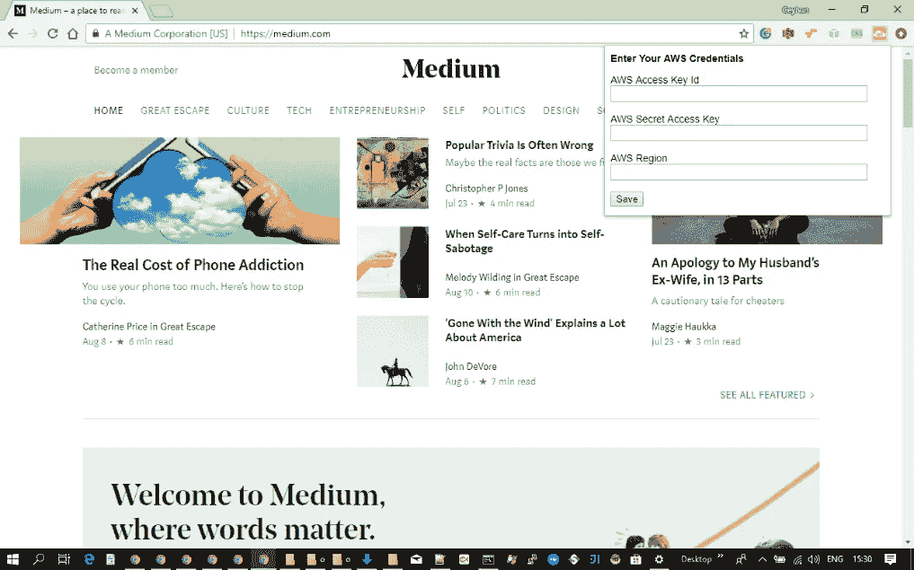

# 用这个 AWS 人工智能服务 Chrome 扩展来说话、翻译和观看

> 原文：<https://medium.com/hackernoon/speak-translate-and-see-with-this-aws-ai-services-chrome-extension-cba7a40edb8a>

我学习 [AWS](https://hackernoon.com/tagged/aws) 服务已经一年多了。一方面，我一直在学习如何使用它们，另一方面，我一直在博客上谈论如何轻松地使用它们。在我的博客中，我试图找到不同的用例，并思考不同的集成可能性。

在[我的](https://hackernoon.com/serverless-allergy-checker-with-amazon-rekognition-lex-polly-dynamodb-s3-and-lambda-35fd215b51b0) [以前的](http://ceyhunozgun.blogspot.com/2017/07/nobody-understands-you-theres-app-for-that-with-amazon-lex.html) [博客](http://ceyhunozgun.blogspot.com/2017/05/look-whos-talking-creating-web-application-that-talks-with-amazon-polly.html)中，我写过关于在 web 应用程序中使用 Lex、Polly 和 Rekognition 的文章。在[我的上一篇文章](https://hackernoon.com/ai-is-hard-its-child-s-play-with-this-aws-ai-services-scratch-extension-32bed8669d36)中，我开发了一个 Scratch 扩展，用于集成 Polly 和 Translate 与 Scratch，为我们的孩子提供一种简单的人工智能教学方法。

在这篇文章中，我将展示我们如何开发一个 Google Chrome 扩展来在 Google Chrome 中使用 AWS [AI 服务](https://hackernoon.com/tagged/ai-services)。通过该扩展，您可以使用 Polly 大声朗读所选文本，使用 Amazon Translate 翻译所选内容，并使用 Amazon Rekognition 检测图像中的文本。

您可以查看下面的扩展演示。

# 谷歌浏览器扩展

Google Chrome 扩展是专门打包的 web 应用程序，为 Google Chrome 浏览器提供了额外的功能。它们托管在 [Chrome 网络商店](https://chrome.google.com/webstore/category/extensions)。你可以在商店上搜索扩展，然后一键安装到你的谷歌 Chrome 浏览器。你可以在这里找到更多关于扩展架构的信息。

# 我们的分机

你可以从[这里](https://chrome.google.com/webstore/detail/speak-translate-and-see-w/hijkpjghojhbppoipnkjhkpcmcdolape?hl=en)使用 Chrome 网络商店安装扩展。你可以在这里找到扩展[的源码。](https://github.com/ceyhunozgun/awsAIChromeExtension)

我们的扩展由四部分组成。清单文件、后台脚本、内容脚本和弹出页面。

清单文件描述了扩展名。它定义了权限、将作为背景和内容脚本加载的脚本以及显示弹出页面的浏览器动作。

后台脚本是调用 AWS 服务的主要部分。后台脚本只加载一次，并接受来自加载到页面上的内容脚本的消息。

内容脚本被加载到页面上，并访问文本字段和图像等页面元素。此外，它还显示了接受输入和显示输出的对话框。它向后台脚本发送消息来调用 AWS 服务。

弹出页面用于配置 AWS 凭据。获取凭证后，它们将被发送到后台脚本，以便存储在特定于扩展的存储中。

# 清单文件

json 文件是描述 Chrome 扩展的清单文件。它列出了将作为后台和内容脚本加载的脚本以及所需的权限。此外，该文件中定义了弹出页面。

The manifest file

# 背景脚本

这个脚本为扩展提供了主干。它提供对 AWS 服务和存储的访问。此外，它还为页面创建了上下文菜单。

为了访问 AWS 服务，我们使用浏览器的 [AWS JavaScript SDK。AWS 凭证由弹出页面从用户处获取，并存储在特定于扩展的存储中。这种存储提供了类似 localStorage API 的功能。](https://aws.amazon.com/sdk-for-browser/)

加载扩展时会创建上下文菜单。Polly 和 Translate 服务用于选择，因此它们的命令是为选择上下文创建的。

Authy token read 命令是为 input 和 textarea 等可编辑元素创建的。

最后，为图像元素创建检测文本命令。

这些上下文菜单显示在参与选项卡的页面中。当用户选择一个菜单项时，在后台脚本中调用 onClicked 处理程序，如下所示。该处理程序将相应的消息发送到活动选项卡，以便在页面中显示对话框。

# 内容脚本

虽然后台脚本只加载一次，但对于每个选项卡，内容脚本会加载多次。内容脚本在后台脚本和它们被加载到的页面的页面元素之间提供了一座桥梁。

一旦加载到页面上，它就注册“contexmenu”处理程序来存储被单击的元素。

一旦选择了一个菜单项，后台脚本就会发送一条消息并执行 onMessage 处理程序。处理程序检查扩展的状态，并调用处理消息的 processContextMenu 函数。每个命令都显示其对话框，用于接收用户输入并显示输出。

例如，使用 Polly 朗读所选文本的 read selection 命令编码如下。

# 弹出页面

当点击 Chrome 工具栏中的按钮时，会显示弹出页面。该按钮在清单文件中声明。弹出页面用于配置 AWS 凭据。它获取凭证和 AWS 区域，并通过向后台脚本发送消息来保存凭证以供以后使用。弹出页面在 popup.html 文件中声明，如下所示。

# 摘要

在这篇文章中，我展示了如何开发一个 Chrome 扩展，以便在 Google Chrome 浏览器中使用 AWS AI 服务。使用该扩展，您可以使用 Amazon Polly 阅读页面中的选定文本，使用 Amazon Translate 翻译文本，并使用 Amazon Rekognition 检测图像中的文本。

未来打算增加 Amazon Rekognition 的名人识别和物体、场景检测功能，有兴趣请继续关注。

你可以在这里找到代码[。另外，你可以在这里找到关于使用扩展](https://github.com/ceyhunozgun/awsAIChromeExtension)[的详细信息。你可以从](https://github.com/ceyhunozgun/awsAIChromeExtension/wiki)[这里](https://chrome.google.com/webstore/detail/speak-translate-and-see-w/hijkpjghojhbppoipnkjhkpcmcdolape?hl=en)安装分机。

如果你喜欢这篇文章，你可能会喜欢我上一篇关于在 Scratch 中使用 AWS AI 服务的文章:

 [## AI 难？使用这个 AWS 人工智能服务 Scratch 扩展简直是小菜一碟

### 在我之前的帖子中，我提到过我们应该让我们的孩子为未来做好准备。在未来，为了成功我们的…

hackernoon.com](https://hackernoon.com/ai-is-hard-its-child-s-play-with-this-aws-ai-services-scratch-extension-32bed8669d36) 

如果你喜欢这个帖子，请鼓掌，关注并分享。