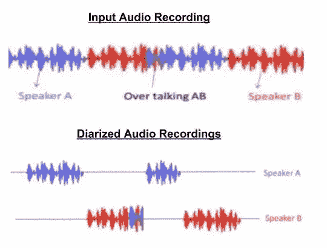
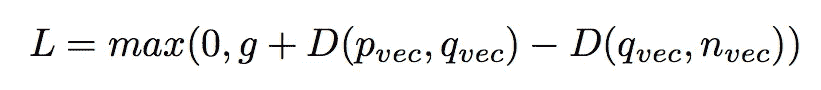
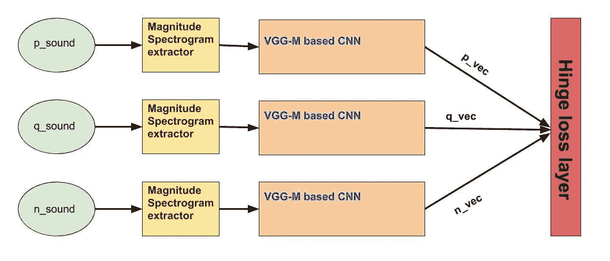
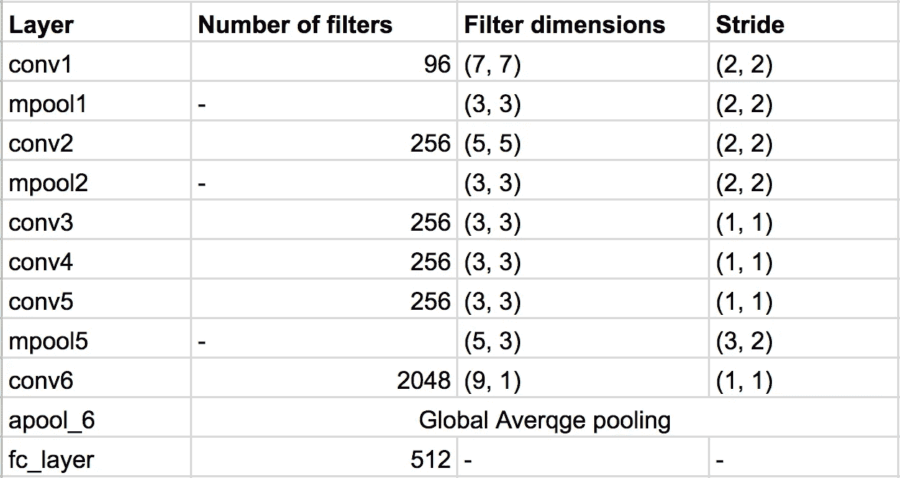
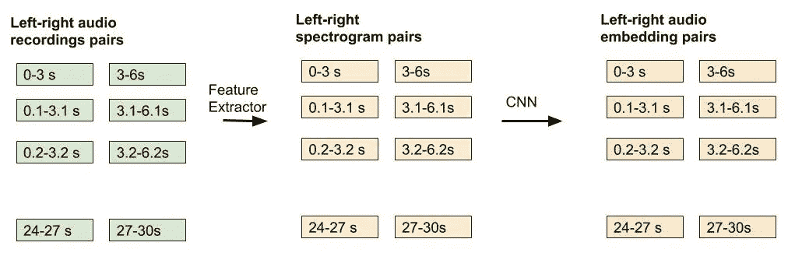

# 扬声器二进制化——团队方式

> 原文：<https://medium.com/hackernoon/speaker-diarization-the-squad-way-2205e0accbda>

[说话人二进制化](https://en.wikipedia.org/wiki/Speaker_diarisation)旨在解决多方录音中*时“谁说话”的问题。*

*在[小队](https://www.squadplatform.com/)，ML 团队正在为[小队语音](https://www.squadvoice.co/)构建一个自动化的质量保证引擎。在质量检查阶段，根据各种质量参数对呼叫代表的表现进行评分，例如:*

1.  *无论该代表是否在电话中催促，*
2.  *无论他是否在任何时候对领导无礼，*
3.  *他是否使用了恰当的语言，等等。*

*对呼叫记录的这种质量检查由主叫代表所说的“*是什么”和相同内容所说的“*如何”来指导。因此，我们需要确保座席发言的电话录音部分与客户或主管发言的部分分开。这是一个具有挑战性的问题，因为 Squad 在印度的云电话合作伙伴只能以单声道格式记录通话。单声道格式将双方的音频存储在单个声道上，与立体声格式相反，在立体声格式中，呼叫者的音频将存储在一个声道上，而被呼叫者的音频将写在不同的声道上。因此，作为质量检查的先决条件，需要一个扬声器二进制化系统。然而，我们有一个更集中的问题，因为我们用例的发言者数量固定为两个。***

******

## *****如何解决扬声器二进制化？*****

***说话人二进制化的问题相当复杂。老实说，这是我迄今为止解决的最困难的[机器学习](https://hackernoon.com/tagged/machine-learning)问题。这个解决方案利用了监督和非监督机器学习技术。此外，它依赖于最近的[深度学习](https://hackernoon.com/tagged/deep-learning)和传统的[凝聚聚类](http://scikit-learn.org/stable/modules/generated/sklearn.cluster.AgglomerativeClustering.html)模型的组合。所以让我们开始吧。***

***我们的说话人二进制化解决方案来自于[一次学习](https://www.youtube.com/watch?v=96b_weTZb2w&index=33&list=PLkDaE6sCZn6Gl29AoE31iwdVwSG-KnDzF)，作品使用的说话人识别架构:[“vox celeb:大规模说话人识别数据集](https://www.robots.ox.ac.uk/~vgg/publications/2017/Nagrani17/nagrani17.pdf)”，以及本作品中解释的说话人变化检测算法:[“TristouNet:说话人话轮嵌入的三重损失](http://herve.niderb.fr/download/pdfs/Bredin2017.pdf)。***

## *****扬声器差异化渠道*****

***我们利用三个基于 VGG-M 的 CNN 架构[具有共享的权重]来使用三元组损失优化范例进行训练，以便学习相同/(不同)说话者的音频记录之间的(不)相似性。我们称之为说话者差异化管道。***

***为了训练说话者区分管道，在模型训练的每次迭代中，生成三个一组的音频记录，由<q_sound p_sound="" n_sound="">表示。这里 q_sound 表示锚音频片段，p_sound 表示同一说话者的某个其他音频片段，n_sound 表示不同说话者的音频片段。然后，计算三元组中每个音频的幅度谱图，并将其推送到上述基于 VGG-M 的模型。在整个优化过程中，所有三个 CNN 共享相同的权重。最后，来自由<q_vec p_vec="" n_vec="">表示的网络的最后一层的嵌入被推到铰链损耗层，定义为:</q_vec></q_sound>***

******

***Loss function optimized for speaker differentiation***

***在上式中，D(x，y)表示两个嵌入向量之间的欧几里德距离，铰链损失函数中的“g”余量常数保持等于 1。***

******

***Speaker differentiation pipeline visualization***

******这一步要小心的几个陷阱*** :***

1.  **确保输入星等谱图是沿时间轴归一化的平均值和方差。直觉上，每个人的声音中会有一些更突出的频率，这有助于他们声带产生的声音的独特性。**
2.  **这将确保对应于在短时间帧内发音的不同音素的频率仓的能量被平滑。**
3.  **在最后一个全连接层中使用[***soft plus***](https://keras.io/activations/#softplus)激活函数，而不是 Relu，如果使用欧氏距离作为距离度量，这是因为平方根(x)在 0 处不可微。或者优化平方欧几里得距离，如果您希望使用 Relu。**

****

**Base CNN model trained for speaker differentiation**

**使用该模型的一个主要好处是，它将为模型的任何长度的音频输入提供相同的嵌入向量维数。然而，由于模型是使用批量梯度下降进行训练的，因此在训练阶段，我们将音频记录长度固定为 3s。**

## ****用于训练说话人区分管道的数据集:****

**为了训练管道，我们利用了通过 SquadVoice 发出的 IVR 任务呼叫的音频记录。我们采集了 100 个发言者的通话记录，每个发言者平均 12.06 分钟的音频，而每个 IVR 记录平均为 2.41 分钟。**

**此外，我们对这些 IVR 记录进行了预处理，如使用 [sox](http://sox.sourceforge.net/) 去除 IVR 语音并从通话记录结束时修剪静音。**

**接下来，我们从每个音频记录中计算出长度在(4.5，s 12.5s)之间的随机非重叠音频片段。因此，生成总共 8586 个音频片段的数据集，**

**最后，我们在每次迭代中将随机的 3s 音频记录作为输入传递给神经网络，并确保训练集和验证集音频片段都具有非重叠的说话者分布。也就是说，不存在其音频片段同时属于训练和验证分割的说话者。**

## ****说话人变化检测****

**我们应用从 TristouNet 工作中学到的知识，使用上面训练的模型找到说话者改变点。我们维护了持续时间为 3s 的左右滑动窗口的两个滑动窗口对，并以 0.1s 的非常小的步幅移动它们。然后，对于每个左右窗口对，获得它们相应的幅度谱图，并通过在步骤(1)中训练的 CNN 运行它们，以获得每个左右窗口对的嵌入。之后，我们计算左右嵌入之间的欧几里德距离，如果距离超过特定阈值，那么这将代表说话人改变点。例如，对于 30 秒的音频记录，我们将有以下工作流程:**

****

**Workflow for speaker change detection**

## ****用于对音频片段进行分组的凝聚聚类****

**我们根据扬声器更换点对音频进行了分解。即，如果检测到 5 个说话者改变点，则我们将音频分成 6 个音频记录，计算获得的片段的幅度谱图，然后使用之前训练的 CNN 计算说话者嵌入。随后在这些嵌入的基础上运行 ***凝聚聚类*** 来按照说话者将音频片段分组在一起。**

## ****实验结果及评价****

**这样就建成了完整的二化管道。当在 100 个呼叫记录的数据集上测试时。其平均[二进制化错误率【混淆部分】](http://pyannote.github.io/pyannote-metrics/reference.html#diarization)为 12.23%，根据行业标准，这是相当高的。此外，流水线在存在背景噪声的情况下也表现良好。作为例子，增加了一些原始版本的音频调用示例。所附录音是根据实际客户流程模拟的电话。**

```
**+---------------+-------------+-------------+---------------+
| original call | Calling Rep |    Lead     | Confusion DER |
+---------------+-------------+-------------+---------------+
| [call_1](https://drive.google.com/file/d/1kMW9sCcIt1exM_5s7AqA_RFRJ5CVNh_F/view?usp=sharing)        | [call_1_rep](https://drive.google.com/file/d/1BjaVDHHp7HkKNrvSgsptjmQUNOB3nMpt/view?usp=sharing)  | [call_1_lead](https://drive.google.com/file/d/18gsvjKs-lgMfIYN-b-3jSFvel63LdFN5/view?usp=sharing) |       5.5%    |
| [call_2](https://drive.google.com/open?id=1OdyLZVw2-x5MbXEeyw7HT50XJp5iJOcW)        | [call_2_rep](https://drive.google.com/file/d/1kiRxkPZ22H0TtEJAz1-oX8DbLZIGR2Kg/view?usp=sharing)  | [call_2_lead](https://drive.google.com/file/d/1Fu_dKunYk-GloTteK-Il-lBbnPhs9uDO/view?usp=sharing) |       6.44%   |
| [call_3](https://drive.google.com/file/d/1uFEi7TAx4Su3nub_YAVI6RrWLzXQ8wCD/view?usp=sharing)        | [call_3_rep](https://drive.google.com/file/d/1-awWVk62k347GtkjamOQ9CzvmvtKfTrh/view?usp=sharing)  | [call_3_lead](https://drive.google.com/file/d/1bpniRacLzblKqT6PLGpCfJq3FCrA4DCL/view?usp=sharing) |       6.26%   |
+---------------+-------------+-------------+---------------+**
```

## **承认**

**我要感谢[桑奇特·阿格瓦尔](https://www.linkedin.com/in/sanchit-aggarwal/)对管道设计和扬声器二化结果的讨论和审查，以及[普拉加·贾伊斯瓦尔](https://www.linkedin.com/in/pragyajswl/)和[维德·瓦苏·夏尔马](https://www.linkedin.com/in/ved-vasu-sharma-34588ba2/)在将管道转移到 SquadAI 代码库时进行的设计讨论和公关审查。我还要感谢[团队之声](https://www.squadvoice.co/)运营团队的重要投入。**