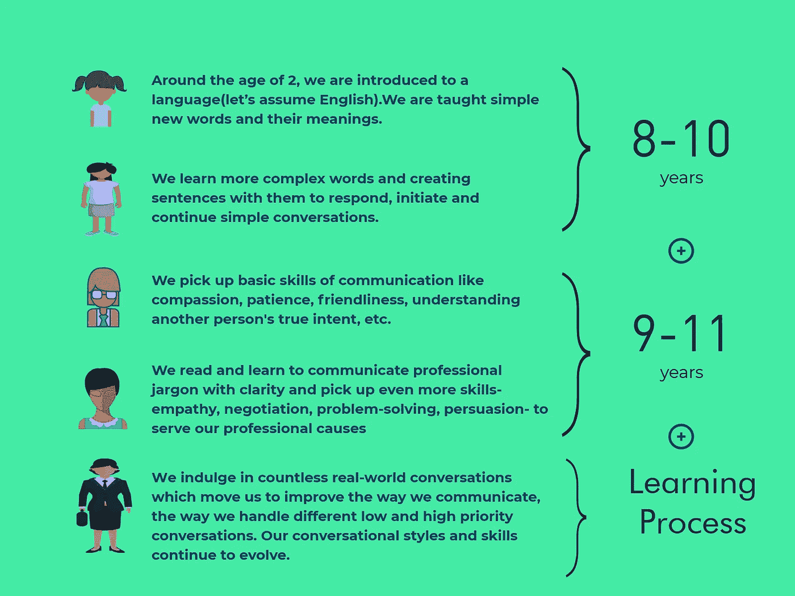
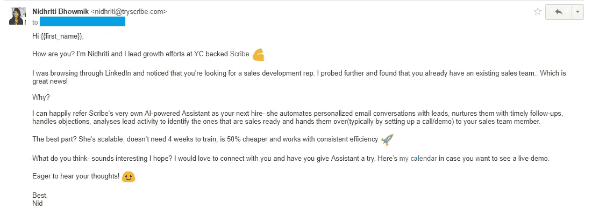
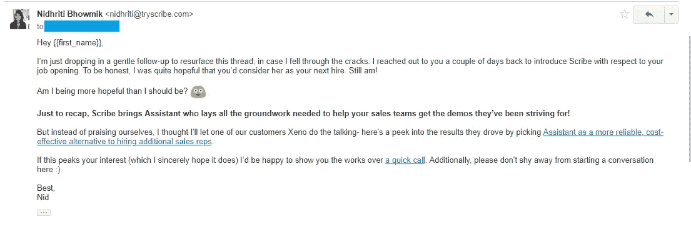
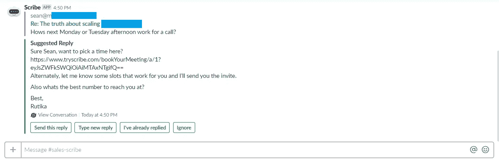
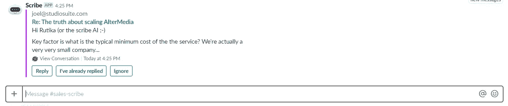
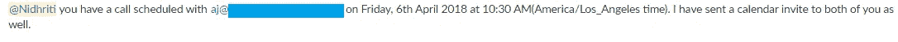

# 苦乐参半的交响乐 b/w 人类和人工智能

> 原文：<https://medium.com/hackernoon/speaking-of-ai-automated-sales-conversations-fb627374630c>

## 深入探讨如何充分利用对话自动化和人工智能助手

[Source](http://www.eranmendel.com/portfolio_project/robot-rave/). Illustration by the amazing Eran Mendel.

**我们以前听过这样的辩论:人工智能正在接管**(敢无视不祥的语气)**！**

人工智能在自动化耗时、重复的任务方面越来越好、越来越聪明、越来越快、越来越准确。不仅仅是需要极高处理能力的任务，如数据搜集和分析、情报收集、识别模式等，而是人类几十年来一直主导的任务。

**坚定的人工智能信徒有他们的观点——编写代码不再是为了服务于特定的任务。AI 在学习，而且 AI 学的很快。在这篇文章中，我揭示了人类的学习曲线，为什么人工智能也应该有这样的曲线，并对对话自动化进行了初步了解。**

*//完全披露:我最近刚刚加入 Y Combinator 背后的惊人团队，支持*[***Scribe***](https://www.tryscribe.com/)***，*** *一个人工智能驱动的销售对话工具，为帮助销售专业人士和领导者专注于销售和建立关系奠定基础。*

更新:截至 2019 年，Scribe 已被荡漾正式收购。 *//*

## 争论是这样继续的:**人工智能(AI)会变得和人类智能一样聪明**。更有趣的是，这个假设被太多的研究和预测所支持。

从那里，很容易想象一个充满竞争的世界，在这个世界中，人工智能和人工智能(姑且这么说吧，这样更方便)在每一个可以想象的行业和角色中都相互竞争，最终只有一个智能，自然人工智能统治一切！

这就是反乌托邦噩梦中的☠️😨

## 争论的实质

# 为什么很容易相信和相信反乌托邦式的人工智能将统治未来？

## 👉聊天机器人和助手，无处不在

面向公众的、有形的人工智能驱动的对话身份的兴起和流行，如语音/聊天机器人(由脸书、Drift、Chatfuel、IBM Watson 等公司推广)和品牌和企业采用的虚拟助手，使人工智能成为现实，并可供任何人、任何地方使用。更不用说，围绕人形索菲亚的沙特公民身份的嗡嗡声！

## 👉人工智能已经正式进入每一个可以想象的行业

从人工智能驱动的 CRM 到智能医疗应用，从娱乐平台(想想网飞和 Spotify)到自动驾驶汽车，人工智能现在正式成为几乎每个行业的重要组成部分。不管是不是流行语，人工智能显然已经流行起来，而且看起来不会很快消失。

## 争论的另一面

# 为什么很难想象一个反乌托邦的未来？

## 👉人工智能的聪明程度仍然值得怀疑

众所周知，人工智能并不像许多人认为的那样聪明。像每一项有前途的新技术一样，人工智能(尤其是 NLP)仅处于早期阶段，需要多年的发展才能真正接近人类智能。

如果你曾经和机器人交流过，你知道我在说什么！

尽管我们很想，但我们不能要求机器人做任何事情并期望得到完美的回应。抱歉，我没听懂。你能重复一遍吗？”- 你重复 3 次，瞧！对对话机器人的耐心和宽容将永远消失。

当谈到真正信任人工智能并将高优先级任务交给人工智能时，会有明显的犹豫。

## 👉我们人类有我们的优势

人工智能可能学得很快，但还不足以适应人类主导的技能，如移情、想象、谈判、批判性思维、决策、耐心、说服等等。

说到掌握这些‘人类’技能，人工智能还有很长很长的路要走。

# 有没有一个中间地带——一个 AI 和 HI 联手的世界？🤝

肯定有吧？作为一个集体，我们总是能找到方法赶上科技进步——有些比其他人更早。无论是工业革命，当我们抛弃我们的农场和土地去操作机器时，电脑的兴起带来了新的和改进的做生意的方式，还是互联网浪潮，在互联网的帮助下，我们创造了一个充满无数平台和网站的全新虚拟世界。

然而，当谈到人工智能时，我觉得我们忽略了整个要点！我们感知 AI 的方式必须从恐惧和犹豫转向兼容和机遇。我们以前听过这种说法，现在更是如此——我们必须共同思考人工智能如何让我们的生活变得更简单，我们的工作更容易，任务更高效。

***其中一项任务就是人工智能助手大规模模仿对话的能力。***

# 说到人工智能对话💬

与人际交往能力类似，进行引人入胜的对话的能力一直是人类的领域。

如果有人知道怎么说话，那就是我们！🤐🤐

但是，如果我们追溯到开始，问我们自己:*我们所有人实际上是如何擅长交谈的？*

*我们是如何教会我们的大脑在需要说服/谈判/承认/耐心等的时候进行自然推断的？*

对我们人类如何学会交谈的简单分析:

Conversational Skills: The Human Learning Curve

我们的父母和老师教了我们很多年。然而，我们仍然在自己的[学习](https://hackernoon.com/tagged/learning)曲线！

> 类似地，人工智能助手需要被教导和训练，我们是他们唯一的监护人！

现在，这提出了它自己的利弊。优点是人工智能优越的处理能力，快速的速度和丰富的数据存储，简单地说，这意味着他们比我们学得更快。

然而，缺点是它有自己的瓶颈。首先，知识是无限的，对话的边界是无限的。因此，即使开始教一个人工智能实体如何掌握所有可能的对话也是一个极其艰难的挑战，因为明显的限制，比如缺乏足够大的数据集来覆盖所有可能的对话！

> 因此，明智的做法过去是，现在仍然是，选择一个特定的行业和用例，并建立对话身份，以便**在该用例中服务于特定和受限的目的。**

Few of the popular bots and conversational identities that serve extremely constrained use cases

重要的是要理解，要建立一个有前途的对话式人工智能模型，真正理解并响应一种通用语言(比如英语)，需要两个高级步骤:

1.  收集**历史数据**，并在此基础上建立**预测模型**—*这就是人工智能开发人员的聪明才智发挥作用的地方！*💡
2.  给这个模型**输入新数据**，这样它就可以从中学习并做出**未来决策** — *这就是我们的用武之地！*💪

## 权力越大，责任越大！

所有对话助手都需要历史数据和新数据。没有历史数据，你会得到一个薄弱的基础，在大多数情况下不会理解意图或情绪。没有新数据，你的人工智能模型将缺乏信心+背景，从而无法进行对话。

从销售的角度来说，这些新数据将是您的使用案例、销售脚本和对您收到的最常见异议的固定回应。

例如，如果一个领导说—“*现在不是时候，你该怎么说？十月联系我。*

或者

*“我很好奇。多给我讲讲。”*

或者

我们的预算非常少。你的典型成本是什么样的？”

> 这些是销售中最基本也是最常见的异议，作为销售人员，你肯定知道如何应对。那么，为什么不把这些知识传授给你自己的助手呢？

> 毕竟人工智能对话都是关于 NLP 找到一种方法来识别和匹配文本(你的数据)中的模式，然后切割和切片这些文本以产生更多的文本模式(阅读:有意义的句子)。

# 应对销售对话:新方法🦄

如果说在当今这个时代有什么事情折磨着每一个销售人员的话，那就是花在跟踪和培养销售线索上的时间，以及随后出现的各种情况

I)没有联系到决策者-请再试一次

ii)主管不在办公室，因此需要稍后联系

iii)按顺序培养他们，等等。

然后是更有希望的销售线索，他们带着围绕公司本身、定价、竞争对手等的问题(理解为:异议)回来——销售专业人员今天在每一个销售线索上花费了大量的时间和精力,甚至在他们能够获得销售电话/演示之前。

事实上，专业销售人员花在实际销售上的时间[不到 36%](https://www.forbes.com/sites/kenkrogue/2018/01/10/why-sales-reps-spend-less-than-36-of-time-selling-and-less-than-18-in-crm/#36a3aa87b998)！

***如果一个人想要扩大目前的销售和收入，除了通过雇佣新人和新工具来支付大量现金之外，别无他法。***

> 当然，除非有一种方法可以自动完成预定销售拜访之前的所有典型电子邮件对话？这会提高效率吗？如果销售人员能够 ***控制*** 、 ***监控*** ，有时 ***帮助助理*** 照顾他们的销售线索，直到它们变成销售就绪的销售线索，他们会节省多少时间，从而用于更多创收任务？

这个助理一定非常棒！

你可能已经猜到了，这正是 Scribe 的技术团队着手做的事情(这个团队是我见过的最活跃的工作团队之一！)🚀

他们找到了一个聪明的方法来分析、分类和标记每一个可能的销售对话(下周发布技术总结！)划分为一系列明确定义的销售类别，其主要目标是:自动化所有促成销售拜访的对话，以便销售专业人员可以专注于达成交易和建立关系。

## 最终的结果是:来自 Scribe 的助手，一个人工智能驱动的对话工具

**🔥将电子邮件对话自动化引入 Slack**

**如何？**用户可以在 Slack 上写下他/她想要发送的电子邮件的副本，并让 Scribe Assistant 根据他们的销售线索状态和各自的使用案例为他们的整个销售线索列表个性化和安排电子邮件(类似于电子邮件排序[工具](https://hackernoon.com/tagged/tools))。

**🔥喜欢接受训练**

**如何？**类似于初级代表通过参考销售脚本、固定回复来处理销售线索异议，高级代表甚至可以通过参考知识库和高级代表来处理异议。

首先，用户可以随时向 Assistant 的知识库添加异议及其回复。

最棒的是:当 Scribe 收到新的异议(尚未添加到知识库中)时，她**会立即向培训她的销售专业人员/团队发送一个关于懈怠的警告**。

> 简而言之，作为销售人员，除非他们需要我立即关注/表现出真正的兴趣/预约电话，否则我不必为销售线索费心。我对 Scribe 代表我收到的新异议回应得越多，我的异议知识库就越强大、越全面，Scribe 自然就能代表我处理越来越多的端到端对话。

**🔥精简好的销售线索和坏的销售线索，并安排与已做好销售准备的销售线索进行通话/会面**

**如何？** Scribe 分析销售线索的行为和活动，以识别“热情”和“热门”销售线索，从而将它们从不好的销售线索中剔除。

从一开始，Scribe 的主要意图就是始终获得销售就绪线索的电话/演示，这样她就可以成功地将线索移交给能够转化和成交的销售专业人员。

## **说了这么多，我自然要亲自试一试。**

# 吃我们自己的狗粮

**👉所以我设置了这封电子邮件，发送给一批 100 个目标明确的潜在客户—**

Scribe personalized this email I wrote for my 100 recipients

**👉并在他们没有回复的情况下安排跟进—**

很快，我开始在我专用于 Scribe 的 Slack 频道上看到这些—

**👉引导 Scribe Assistant 在空闲时间发送给我的回复和异议以及建议回复**

All I had to do was review and approve!

**👉需要我介入的异议，因为我没有训练 Scribe 处理这些异议**

I didn’t train Scribe for all possible objections, hence this^

**👉然后是最精彩的部分:我开始看到很多这样的东西—**

你可以想象我有多兴奋！

> 我本可以轻松地花 3-4 个小时回复我所有的线索，但有了[书记员](/@nidhriti93/humans-at-the-helm-of-automated-ai-conversations-fb627374630c)，我在一个 5 天的工作周中只花了 30 分钟。

# 底线:帮助人工智能，帮助我们！

Scribe 恢复了我对人工智能和人类携手合作、相互提高效率的未来的信心。这从来都不是单方面的收益！

我和许多其他人一样，想象着一个人工智能服务于一个相当便利的目的的世界——与以前所有重大科技进步的目的相同。我们的目的是让我们的生活更加高效、便捷，从而为更多的进步创造空间。

所以，我们越早跳上人工智能的马车，我们就能越早让自己保持领先🏄🏄

***//这里一拍，那里一拍，大有作为:如果你喜欢这本书，请*👏 👏为了让更多的人看到这篇文章。**

***乐于围绕 AI/自动化/销售/介于两者之间的一切展开对话，所以请不要羞于伸手！//***

[GIF Source.](https://giphy.com/gifs/disney-walt-disney-animation-studios-big-hero-6-baymax-N7Uq00XtBpUuQ)