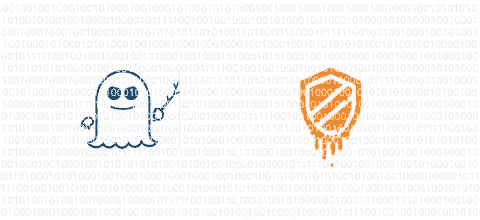
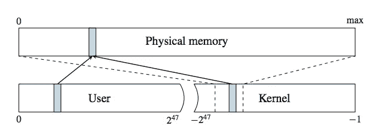

# Spectre & Meltdown 处理器漏洞:技术介绍

> 原文：<https://medium.com/hackernoon/spectre-meltdown-processor-vulnerabilities-a-technical-introduction-e3d09d6699a6>

## 《幽灵和熔毁》的重要技术方面



在之前的一篇[帖子](/revissolutions/spectre-meltdown-processor-vulnerabilities-what-you-need-to-know-587ebb37f2dc)中，我们讨论了最近披露的名为 Spectre([CVE-2017–5753](https://nvd.nist.gov/vuln/detail/CVE-2017-5753)、[CVE-2017–5715](https://nvd.nist.gov/vuln/detail/CVE-2017-5715))&Meltdown([CVE-2017–5754](https://nvd.nist.gov/vuln/detail/CVE-2017-5754))的处理器攻击。虽然我们知道我们的大多数读者是技术用户，他们只是想在安全性方面做得更好(并且对技术不感兴趣)，但我们也知道我们的一些读者喜欢深入一点技术领域。在本帖中，我们将重点介绍《幽灵党》和《熔毁》中的一些关键技术。

虽然这是一篇技术博客文章，但这并不意味着教授攻击。相反，它强调了攻击提出的一些关键技术原则。这篇博客是基于[技术文章](https://spectreattack.com/)，应该参考这些文章以全面了解这些攻击。

# 关键术语

在我们讨论 Spectre 和 Meltdown 中到底发生了什么之前，我们必须了解一些关键术语:

## 侧槽

信息安全中的侧信道是系统的一个功能或特征，它会泄露非预期的信息。

物理世界中的一个例子:你家中灯光的可见性是一个侧面通道，用于识别是否有人在你的房子里，而无需实际观察房子里的人。或者，如果每天同一时间有一盏灯亮着，而没有其他灯亮着，这是一个识别居住者可能不在城里的辅助通道。因此，一个辅助渠道寻找被披露的信息，并试图利用它。侧信道不一定是特定系统中的技术弱点。

这在技术上的一个例子是:注意计算机的温度差异来推断系统正在做什么。 [Wired](https://www.wired.com/2015/03/stealing-data-computers-using-heat/) 在实践中有一篇关于这方面的好文章。

## 隐蔽通道

秘密渠道比旁门左道更具侵略性。虽然侧信道只是被简单地“观察”，但隐蔽信道通常会改变它攻击的系统。这种改变产生了将数据从特权上下文转移到不应该访问该数据的上下文的能力。

现实世界中的一个例子:一个对手通过在你的墙上隐藏麦克风来窃听一所房子。他们改变了房子，现在可以偷听特权对话。

技术上的一个例子是:一个恶意程序通过修改合法数据包的 IP 标识字段来泄露数据。然后，攻击者从网络上嗅探这些数据包。通过将数据封装在合法数据包的 IP 标识字段中，恶意程序可能能够绕过系统监控。

在这两种情况下，隐蔽通道引起系统的“变化”，而侧通道是被动的。(请注意，按照通俗的说法，这些术语有时可以互换使用，只是为了表示一种无意的信息泄露方法)。

## 核心

操作系统有一部分被称为“内核”。它被加载到受保护的内存空间中，并控制程序和系统底层硬件之间的交互。

## 虚拟内存

计算机将一个进程的内存与其他进程的内存隔离开来。但是每个程序都认为它可以访问系统的所有内存。中央处理器(CPU)为每个进程提供一个虚拟内存空间，并维护一个将虚拟内存转换为物理内存的“页表”。

## 物理内存

这些是基于硬件的内存模块，物理上位于您的计算机中，容纳构成随机存取存储器(RAM)的实际位。CPU 将虚拟内存映射到物理内存。

## 流水线、无序/推测性执行、瞬时指令

现代 CPU 的架构设计导致了 Spectre 和 Meltdown 漏洞。具体来说，指令流水线。程序用人类可读的语言(如 Python、Ruby、JavaScript)编写，然后[将](https://en.wikipedia.org/wiki/Compiler)编译成[机器代码](https://en.wikipedia.org/wiki/Machine_code)，这些代码可以被 CPU 执行。

为了提高效率，现代 CPU 实现了指令流水线。这意味着处理器试图让 CPU 的每一部分都被某种东西占据。因此，当 CPU 的一部分正在获取数据时，CPU 可能会继续执行下一条指令，即使这取决于获取数据的结果。这导致指令的无序执行。CPU 对下一步将执行什么指令做出最佳猜测。这也称为推测性执行。

如果 CPU 采用不正确的逻辑路径，推测执行的结果将被忽略。这些被忽略的指令被称为“瞬时指令”。虽然这些瞬态指令不会改变实际的程序流程，但是在这些瞬态指令的推测性执行期间，CPU 的“微体系结构状态”会发生变化。具体来说，CPU 缓存会受到影响。

## CPU 缓存

为了进一步加快访问速度，CPU 维护片上缓存，用于存储频繁访问的内存的值。

## 竞争条件

信息安全中的竞争条件是一种漏洞，它要求攻击系统成为“第一个”响应数据请求的系统，或者在数据消失之前第一个访问数据的系统。竞争条件的一个很好的技术示例是 MySQL 中的 [2017 漏洞。实质上，如果攻击者能够向系统写入文件，他们就可以覆盖在特权 MySQL 操作期间生成的临时文件。如果他们在文件创建之后、操作完成之前替换了临时文件，他们可以在 MySQL 中将权限提升到。](https://support.alertlogic.com/hc/en-us/articles/115004516766-09-01-2017-MySQL-Database-Race-Condition-my-copystat-Privilege-Escalation)

## 用户空间与内核空间的内存空间

最后，明确区分内核空间内存和用户空间内存非常重要。用户空间虚拟内存保存运行程序(即进程)的内存。用户空间虚拟内存被映射到物理内存的特定部分。

内核有自己的虚拟内存空间**，但是这个内核空间虚拟内存被映射到整个物理内存**(我们将在讨论 Meltdown 时看到其后果)。

CPU 维护一个页表，其中包含内核空间和用户空间内存的映射。这个页表将虚拟内存转换为物理内存。重要的是要记住，内核空间内存被映射到所有物理内存，其中也包含用户空间内存。



Virtual memory page table layout, Source: [Meltdown paper](https://meltdownattack.com/meltdown.pdf)

当在用户空间操作和内核空间操作之间切换时，CPU 指示使用的虚拟内存是用户空间虚拟内存还是内核空间虚拟内存。它通过设置或取消设置“管理位”来实现这一点。这将当前 CPU 操作的内存访问限制在虚拟内存的特定页面。

定义好所有这些术语后，让我们看看 Spectre 和 Meltdown 如何利用现代 CPU 架构设计。

# 孤立不受尊重

这两个漏洞所利用的关键设计缺陷是，放置在缓存中的**内存没有受到保护，其他进程不能访问原始的、未缓存的内存。**

利用所有这些漏洞，恶意程序会将数据写入 CPU 缓存，然后通过旁路攻击读取这些数据。这种旁路攻击依赖于恶意程序在 CPU 缓存被覆盖之前读取它的竞争条件。

# 幽灵

Spectre 的后果是一个对抗性的程序可以读取其他程序的进程内存。

正如我们上面提到的，现代 CPU 使用推测性执行来提高处理效率。CPU 对推测性执行采取最佳猜测方法。通过观察最近的执行模式，CPU 在运行中“训练”自己更频繁地遵循某些逻辑路径。

Spectre 利用了这种设计，并训练 CPU 遵循期望的推测路径。Spectre 有两种变体:条件分支预测失误利用和间接分支利用。

## 条件分支预测失误利用

编程的一个强大方面是编写条件逻辑的能力。即“如果这个那么那个”。这被翻译成机器码级别的“条件分支”逻辑。为了利用 Spectre，恶意程序重复执行具有相同结果`true`或`false`的条件测试。

条件分支操作的伪代码:

```
x = 6
if x equals 6
   print 'x equals 6'
```

如果我们重复执行上述动作，CPU 将训练自己在推测执行期间遵循`true`路径，即使在后面的操作中结果不是真的。

现在，让我们假设在稍后的推测分支操作中，我们试图访问特权内存

```
x = 2
if x equals 6
   y = my_array[x * 256]  ; memory outside of the current program
```

条件测试将失败。**但如果我们对 CPU 进行了适当的训练，在它测试失败之前，CPU 会执行***`**true**`***条件分支*** **的瞬态指令。*处理器将在程序内存空间之外的内存中`my_array`之前 512 字节的数组`my_array[x * 256]`的内存地址查找值。**

**如果条件分支实际上评估为真，这将导致抛出内存访问冲突错误，程序将崩溃。但是如果条件评估为`false`，则不抛出错误，并且忽略瞬态指令的结果，但是瞬态指令的结果(在`my_array[x * 256]`的值)现在位于 CPU 缓存中。**

## **间接分支剥削**

**间接分支机器代码指令使 CPU 评估存储器中其他地方的机器代码指令，而不是继续指令的顺序处理。**

**示例机器代码操作跳转到存储器地址`0x12345678`执行指令:**

```
**jmp 0x12345678**
```

**如果恶意程序可以训练 CPU 对执行已知计算的代码进行推测性跳转，该计算可以改变 CPU 缓存的微体系结构状态。**

**条件分支预测失误利用和间接分支利用之间的关键相似之处在于，这两种方法都训练 CPU 采用推测性逻辑路径，从而导致利用程序所需的执行。它最终会被忽略，但在这种丢弃发生之前，它会改变 CPU 缓存。**

**两者的关键区别在于机器码的位置。条件分支预测失误利用的代码位于恶意程序的内存空间中。另一方面，间接分支利用的代码位于内存中的其他位置，但仍然执行所需的计算，从而改变 CPU 缓存。**

## **从 CPU 缓存中收集数据**

**然后，CPU 缓存被恶意程序用作辅助通道。在条件分支错误预测利用或间接分支利用之后，恶意程序执行基于时间的旁路攻击，以推断对高速缓存进行了什么改变，随后获知存储在这些高速缓存中的特权信息。这些攻击在其他研究中有记录，不在这篇博文的讨论范围之内。**

**因此，作为一个完整的攻击进程，Spectre 使用 CPU 缓存创建一个隐蔽通道，将数据从用户空间内存中的一个进程移动到用户空间内存中的一个恶意程序。最终，Spectre 将特权信息透露给了一个恶意程序。**

**与两个 Spectre 漏洞不同，Meltdown 攻击只有一个变种。它也使用 CPU 缓存作为隐蔽通道，但在攻击的技术实现方式上有一些重要的不同。**

# **灾难**

**Meltdown 的后果是恶意程序可以读取内核空间内存。由于内核空间内存映射到所有物理内存，这意味着恶意程序可以读取所有内核空间内存和所有用户空间内存。**

**Meltdown 是一种针对 CPU 逻辑电路的攻击，因此它主要局限于基于英特尔的处理器。Meltdown 不需要针对特定软件环境定制的代码。相比之下，使用 Spectre，攻击必须针对受害者系统的软件环境进行定制，但它们可以在运行英特尔和非英特尔架构的系统上工作。**

**此外，Meltdown 攻击滥用了一个权限提升漏洞:英特尔 CPU 允许用户空间进程的瞬时指令访问内核空间内存。**

## **剥削**

**Meltdown 没有训练 CPU 采用特定的逻辑分支，而是直接尝试访问特权内核空间内存页面。当用户空间进程试图访问特权内核空间内存时，CPU 会抛出一个访问冲突异常错误。恶意程序“[捕捉到](https://en.wikipedia.org/wiki/Exception_handling)访问违规异常。通过捕捉这个异常，恶意程序不会崩溃。但是，CPU 仍然执行瞬态指令，内核空间内存放在 CPU 缓存中。**

**然后，恶意程序执行 Spectre 用来读取 CPU 高速缓存的相同的旁路攻击。**

**对于这两类攻击，有不同的缓解步骤。**

# **减轻**

**让我们看看幽灵和熔毁的技术解决方案。**

## **熔化 migitagion**

**熔毁是两者中较容易缓解的。一些补丁已经缓解了熔毁。**

**Meltdown 依赖于对内核空间内存的访问，因为该内存已经被指定为特权内存，所以 CPU 在执行推测性指令时只需尊重这种隔离。**

**2017 年 6 月，在这些漏洞被披露之前，Linux 内核实施了一个名为内核地址隔离的补丁，以有效地删除侧通道(KAISER)，以防止通过侧通道泄露随机内核空间内存。KAISER 将内核空间页表和用户空间页表完全分开。使用 KAISER，内核空间页表仅在执行内核操作时可用。**

**Meltdown 的目标是从随机内核空间内存访问转变为系统内核空间内存访问。由于恶意程序运行在用户空间内存中，并且不再能够访问内核空间页表，KAISER 补丁无意中缓解了崩溃。Mac 和微软都在实现他们自己版本的 KAISER，通常被称为内核表页隔离(KPTI)。**

## **幽灵缓解**

**不幸的是，Spectre 很可能会“困扰”我们很长一段时间。这是因为攻击发生在同一个内存空间(即用户空间内存)，并且在推测性执行期间很难隔离内存访问。**

**研究人员提出了几个可能的缓解步骤:1)暂停潜在敏感的推测性执行路径，直到早期逻辑得到解决，2)在进程之间切换时刷新分支预测模型。第一种解决方案会“严重降低性能”，我们已经看到在撰写本文时提供的补丁下，基准性能下降了 2%-14%。第二种解决方案目前在研究中被认为是一种假设，作者承认它可能不会减轻所有的幽灵病例。**

## **结论**

**这些绝不是容易理解的漏洞。他们深入研究 CPU 的核心工作，模糊了软件和硬件之间的界限。除了了解这里写的所有内容，要执行攻击，您还必须了解以前的文献，这些文献详细介绍了如何对 CPU 缓存执行侧通道攻击，我们认为这是理所当然的。(这主要是因为我不完全理解如何在比理论更深的层次上实现它们)。**

**我希望这能帮助您理解这些漏洞的更深层次的技术方面。我自己也在不断学习，所以如果你注意到技术上的错误，请留下评论！**

***此帖出自* [*以赛亚·萨居*](https://medium.com/u/c9fabda04fb1?source=post_page-----e3d09d6699a6--------------------------------) *对* [*的修正解*](https://www.revissolutions.com/) *。如果你喜欢这个帖子一定要鼓掌，查看他在* [*修正解决方案博客*](https://medium.com/revissolutions) *上的其他帖子，并关注推特*[*@ isaiahsarju*](https://twitter.com/isaiahsarju)*、*[*@修正解决方案*](https://twitter.com/revissolution)**