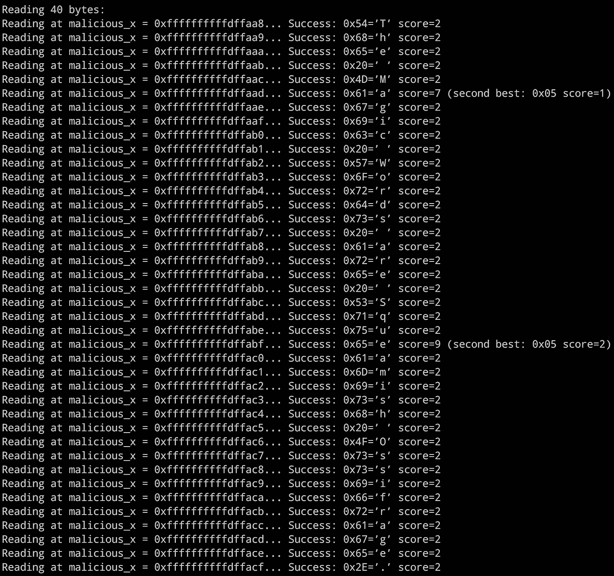

# 库贝内特斯河畔的幽灵，概念验证

> 原文：<https://medium.com/hackernoon/spectre-on-kubernetes-a-proof-of-concept-baade68284f8>

*TL；DR:一个 PoC 演示* [*厉鬼*](https://spectreattack.com/) *，这个讨厌的 CPU bug，在 Kubernetes 上运行。*

如果你没有生活在岩石下，你一定听说过 [Meltdown 和 Spectre](https://spectreattack.com/) ，这两个非常严重的硬件错误影响了许多现代(台式机和服务器)CPU。

因此，当我仔细阅读这两个家伙时，我问自己:他们如何影响一个 [Kubernetes](https://hackernoon.com/tagged/kubernetes) 集群和/或在其上运行的应用？假设有一个适用于 Spectre 的[示例 C 源代码，将它放入](https://gist.github.com/ErikAugust/724d4a969fb2c6ae1bbd7b2a9e3d4bb6)[容器](https://quay.io/repository/mhausenblas/spectre)中会更容易，如下所示:

然后在 Kubernetes 中运行它，例如，使用:

```
$ kubectl run spectre \
          --image=quay.io/mhausenblas/spectre:0.1 \
          --restart=Never
```

事实证明这是可行的。使用以下方式检查日志:

```
$ kubectl logs spectre
```



就是这样！

嗯，2018 年确实开始了，呃，非常有趣。我们将有很多工作要做——我已经看到第一个[问题](https://github.com/kubernetes/kops/issues/4188)正在处理——目前我们能做的最好的事情是不要从不受信任的注册表中随机抽取图像并在我们的集群中运行，但是我想你已经知道了这一点，并且(希望)无论如何不要这样做。

一些想法和免责声明:这个 PoC 是一个容易实现的结果，它使用了一个太大的图像(见鬼，500MB！)，并不能证明任何一般性的攻击，只是说已知的漏洞利用可以打包成一个容器，运行在一个 Kubernetes 集群中。此外，我不是代表我的雇主或以任何官方身份发言，我只是对在集装箱化的环境中进行这项工作有多难感兴趣。