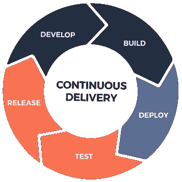

# 功能交付的速度，而不是匆忙

> 原文：<https://medium.com/hackernoon/speed-not-haste-in-feature-delivery-f95936aa6df1>

说到编程，我们很多人对“[速度](https://hackernoon.com/tagged/speed)这个词的理解是有分歧的。一些人认为，速度扼杀了创新，并创造了一个让人感觉你总是在“救火”的环境。

在这篇博文中，我想指出*速度*和*匆忙*是有区别的。如果做得好，速度真的是一项非常强大的运动。我们从在[班](https://www.squadplatform.com/)练习速度中受益的无数优势激励我与你们分享我的想法。

这里有一些关键点-

## **更高的团队士气**

我认为提高团队士气是最大的好处之一。当我说团队时，我不仅仅指开发团队，还指在[团队](https://hackernoon.com/tagged/squad)新成立的‘求解团队’(Spotify 的人在这里[很好地解释了这个概念](https://labs.spotify.com/2014/03/27/spotify-engineering-culture-part-1/))。

Continuous Delivery for Speed

当改进进展迅速时，工作永远不会变得单调，团队中的每个人都开始从事新的工作，因为产品以更快的速度不断成熟。

此外，其他团队(如运营和销售)不必等到下一个部署窗口才期待新的小功能。事实上，他们可以今天请求一个特性，第二天就可以得到它(只针对关键的优先特性，否则它会被添加到 backlog 中)。

(阅读 [Squad 参加乔尔测试](/squad-engineering/squad-takes-the-joel-test-9189709a6235)以深入了解 Squad 的文化)

## 更快的开发和错误解决

快速发布意味着在小版本而不是大版本中部署特性。由于发布版本更小，所以可以快速测试和修复，而不是测试整个发布版本，然后花费大量时间找出为什么会出现一堆错误。这也是为什么小队没有 [QA 团队](https://en.wikipedia.org/wiki/Quality_assurance#Software_development)的原因。每个开发人员对他们自己的发布负责，并且在发布之前在测试环境中进行严格的测试。

如果您有与大型团队合作的经验，您会知道发布和修复周期比实际的特性开发消耗更多的开发时间。较小的版本在很大程度上消除了这一点，导致更多的特性开发时间和更少的错误修复时间，从而提高了开发团队的士气。

我的意思是，谁想修正错误呢？我们都想继续建设。毕竟我们是工程师。

## **更好的产品质量**

解决 bug 和任何反馈可以立即保持产品的高质量。错误不会积压，任何重大/关键问题都会立即得到解决。这意味着产品稳定。谁知道速度会影响产品稳定性？

## **好多了 UX**

大量发布功能迫使用户在短时间内适应大量变化。有时变化可能如此剧烈，以至于您的客户成功团队需要指导用户如何适应这些变化。

另一方面，当你定期发布小更新时，你的用户不需要一下子接受大惊喜。在新的一天，对他们来说，这不是不同的产品。对他们来说，产品每天都在进步。

另一个主要优势是，如果用户对某个功能需求有建设性的反馈，我们可以在几天内快速开发并发布。没有什么比认真对待用户的反馈并迅速采取行动更能向用户表达“我们在乎”了。你可能刚刚赢得了一个忠实的客户。

## **更好地调整优先顺序**

随着所有用户反馈和建议的到来，以帮助您的产品朝着正确的方向发展，有时有些东西确实是产品的完美附加值，您希望立即构建它。

当你的团队已经为 [sprint](https://blog.trello.com/beginners-guide-scrum-and-agile-project-management) 的任务做好准备，并且任何变化都可能影响 sprint 最终版本时，这是一个艰难的情况。但如果你总是在运输，就不是这样了。一旦下一个特性发布，您就可以优先考虑新任务，并在实现 sprint 目标的同时构建它。

## **无滞留**

我们的每个版本都是独立的，因此开发人员不必等待其他人的代码出现问题。这意味着可以运行的代码不必排队等待其他代码。我们有时在同一个版本中有多个特性，但它们只是整体的一部分，在其中一个出现问题的情况下，仍然完全可以从其余部分中分离出来。每一个特性都可以独立地收回，其余的版本仍然可以发布。

在这一点上，你可能会认为这一切看起来如此完美。也许太完美了。我们真的实现了这一切吗？对此，我的回答是*大部分是*。

我们是一个*学习团队*，我们从错误和实验中学习。这些要点是我们经历过的，对我们有用，也可能对你有用。有些实验失败了，可能不会有结果，但这就是它的全部——从失败中学习。调整你的策略，尝试新的实验。寻找可能有用并帮助我们成长的东西。

*想在一个鼓励快速运输产品的环境中工作吗？。***。**