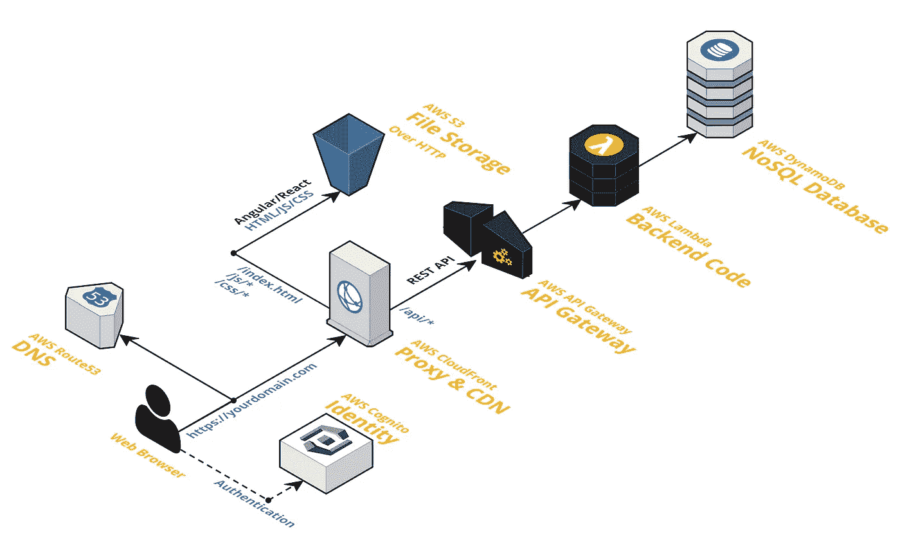
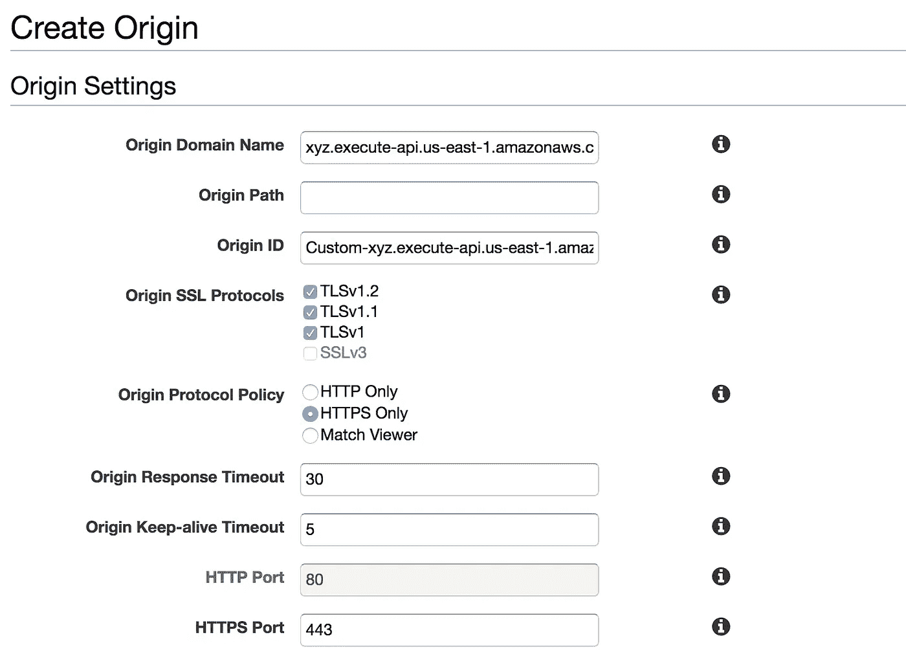
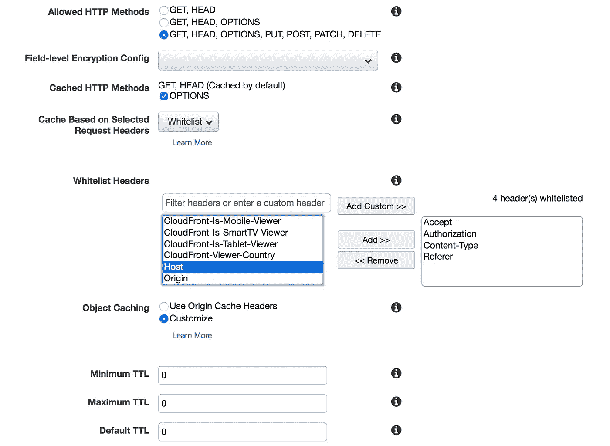

# 加速 AWS 中无服务器 Web 应用的 5 个技巧

> 原文：<https://medium.com/hackernoon/speedup-serverless-web-apps-in-aws-12fa25b94600>

你是否使用 CloudFront、API Gateway、Lambda 在 AWS 中部署了无服务器 Web 应用程序，但仍然发现它的性能没有达到预期？

> 这篇文章主要关注提高无服务器 Web 应用程序性能的 5 个技巧。

# 1.保持 Lambda 函数温暖

AWS Lambda 功能具有相当长的冷启动时间。尽管当您增加单个函数的内存时，它会减少，但它仍然可以为您的 web 应用程序提供显著的效果。

实现一种机制来保持 Lambda 函数的热度。您可以使用以下两种方法之一来实现这一点。

*   使用一个称为“Ping”的特殊端点，从外部调用时，它只调用成功回调。您可以使用 AWS [CloudWatch](https://read.acloud.guru/how-to-keep-your-lambda-functions-warm-9d7e1aa6e2f0) 调用该功能，或者使用带有预定事件的 [Lambda。](https://docs.aws.amazon.com/lambda/latest/dg/with-scheduled-events.html)
*   使用无服务器[预热插件](https://serverless.com/blog/keep-your-lambdas-warm/)。

# 2.通过使用相同的来源访问您的 API 和前端来避免 CORS

如果你已经将你的前端(Angular，ReactJS，VueJS App)部署到 S3，并使用 API Gateway 提供 API，你将遇到 CORS(跨源资源共享)。这不是一件坏事，但问题是当你发送像授权(或除了基本头以外的任何东西)这样的头时，modern Browser 在发送实际请求之前发送一个特殊的请求，首先称为预检请求。

这就产生了瀑布效应，为整个请求的实现增加了两倍的延迟。为了避免这种情况，你可以使用 AWS CloudFront 和 Plugin API Gateway 和 S3 两者到同一个域，并在那里配置路由。

当将 API Gateway 连接到 CloudFront 时，请确保执行以下操作

*   创建始发时，将始发协议策略设置为 HTTPS

*   确保您选择了 API 来源。
*   适当地设置路径模式(例如；***/开发阶段/资源/**** )
*   在创建行为时，**不要转发**主机报头(将其余部分列入白名单)
*   同样将 TTL 值设置为 0，除非您想要缓存 API(即使您计划缓存，也要为各个路径创建单独的行为)。

# 3.将您的 API 网关部署为区域端点

当您部署 API 网关时，它会在内部附加一个 CloudFront 发行版。这造成了延迟，因为它为请求转发增加了另一跳。

您可以将端点类型设置为区域端点，以将其部署为区域端点来避免这种情况。

*   如果您使用无服务器框架，请参考[配置端点类型](https://serverless.com/framework/docs/providers/aws/events/apigateway/#configuring-endpoint-types)。
*   如果您使用 AWS SAM 或 AWS CLI 部署 API 网关，请根据需要添加“值”:“区域”。

# 4.优化前端

即使你使用 AWS CloudFront 来服务前端，你也可以通过使用 GZIP 压缩 JavaScript、CSS 等文件并上传到 S3 来进一步提高性能。还要确保使用正确的内容编码:gzip 头。这将在几个方面减少下载文件所需的带宽。

此外，在 CloudFront Behavior configuration 中启用 Compress Objects Automatically，为请求头中包含 Accept-Encoding: gzip 的 web 请求自动压缩内容。这允许 CloudFront 为亚马逊 S3 和定制源压缩某些类型的文件。

由于 CloudFront 在边缘位置的服务器不忙时会尽最大努力(不保证)将文件压缩到 GZIP，因此存储压缩的文件可以提供更好的性能。

# 5.为你的 Lambda 函数使用合适的内存

当你为 Lambda 使用较小的内存时(例如；128MB)它使用，较低速度的 CPU 也匹配内存。这可能会对您的 Lambda 性能产生不利影响。因此，根据函数处理的逻辑适当地增加内存(至少 512MB 用于生产应用程序)是很重要的。