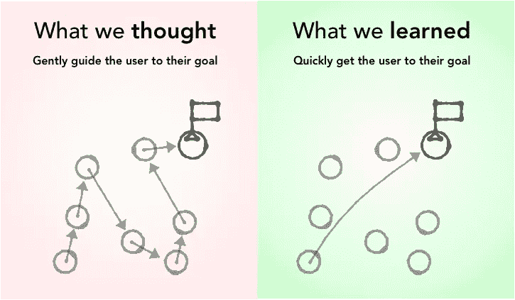
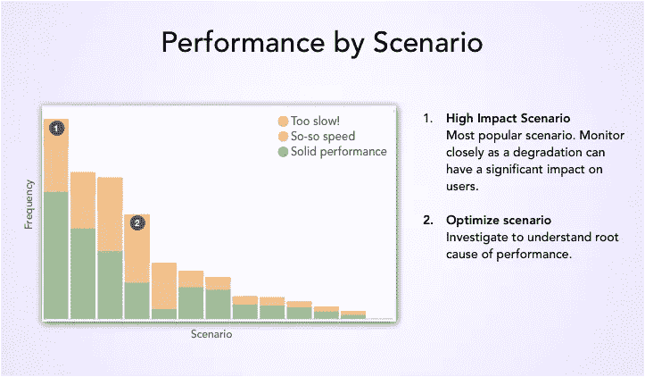
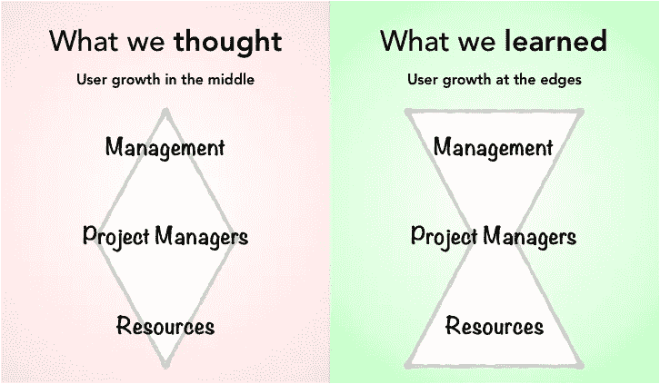
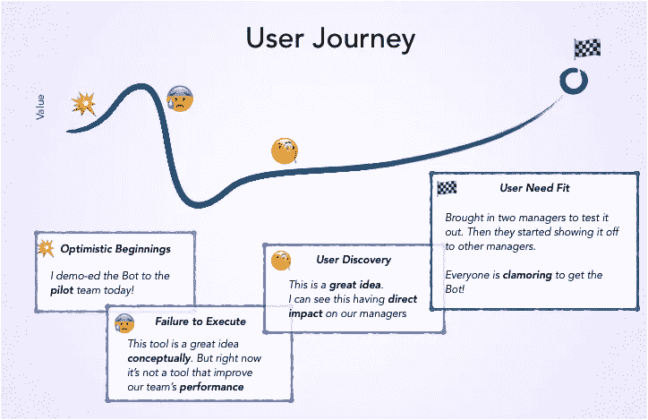

# 产品经理指南，寻找适合我们聊天机器人的产品市场

> 原文：<https://medium.com/hackernoon/spend-time-with-your-market-if-you-want-to-find-product-market-fit-cd2b0108e572>

## 构建企业 bot 的经验教训

Toy is my neighbor’s © Vincent Huang.

这是分享我们从启动机器人中学到的两个帖子之一。第一个是启动你的第一个机器人的指南。这第二次强调了经验教训，使其成为我们用户的宝贵经验。

2018 年，我们[推出了](https://www.clarizen.com/bot-slack/#)一个注入人工智能的机器人，一个帮助我们的客户管理他们的项目和投资组合的企业机器人。我们从一个用例开始——项目经理在空闲时间掌握项目状态[的能力。在过去的一年里，我们系统地提高了 MVP，扩大了产品的价值。回顾过去的一年，我想分享我们在走向](https://slack.com/apps/A63JPUAH5-clarizen-bot)[产品](https://hackernoon.com/tagged/product)市场适应的过程中所学到的三个见解——两个是我们一路学到的，一个是我们正确的。

# **洞察力 1:找到你的常青树产品价值观**

不可否认，我们陷入了为机器人[编写脚本的困境，而没有理解用户在与机器人互动时的目标。我们梦见我们的用户进行对话，我们的机器人告诉用户他们下一步需要做什么。这导致用户与机器人的对话一步一步进行。](https://uxdesign.cc/how-to-design-a-robust-chatbot-interaction-8bb6dfae34fb)

当我访问我们的早期采用者之一时，我注意到冠军在使用机器人一天后，正试图键入电源命令。在粗略地体验了这个机器人之后，用户想要快速地获得信息，而不需要一步一步地完成。

Just give me what I want!

我们的产品价值观是错误的。正如杰夫·贝索斯所描述的:

> Y 你可以围绕那些在时间上稳定的东西建立一个商业战略……当你知道某件事是真的，即使是长期的，你也有能力投入大量精力。"

我们最终重组了我们的产品策略，专注于*常青树*的产品价值。我们以三个核心价值观结束:

*   **更快:**我们的用户希望更快地达到他们的目标
*   **更容易:** [学习](https://hackernoon.com/tagged/learning)一个新的 app 总是很难。通过让产品更直观来减少学习如何使用产品的摩擦
*   **更主动:**我们的用户想要确保没有任何东西被遗漏。

例如，我们的用户希望体验更快。机器人的责任是让用户尽快完成自己的意图。这体现在两个方面:用户采取更少的步骤，并加快机器人的反应时间。团队花了几个小时苦思如何将步骤从三步减少到两步。

为了加快机器人的反应时间，我们开始跟踪性能，以确定优化工作的优先顺序。

Figure out what’s slowing you down so that you can speed up

> 弄清楚你的客户总是想从产品体验中得到什么，并努力实现这个崇高的目标。

# **洞察力二:使用不同的镜头**

另一个遗漏的假设是谁是我们的增长用户。我们假设我们的核心用户是项目经理角色——毕竟我们是一个项目管理应用程序。

然而，虽然项目经理推动了强劲的使用，我们发现我们的增长用户是一个完全不同的角色。我们错误地认为我们的核心用户和我们的网络产品完全一样。

从机器人中发现更多价值的用户与我们的应用程序有更多的因果互动。他们要么是想要一些轻量级报告来查看他们的团队如何工作的经理，要么是负责记录他们在项目上的时间的个人贡献者。

原来我们的最佳位置不是在中间，而是在边缘:

Your growth market may not be who you think

> 当你扩展到一个新的渠道时，不要假设你在一个平台的核心用户是相同的。从渠道的好处出发，运用不同的视角来寻找你的核心受众。

# **洞察 3:在用户所在的地方与他们见面**

我们已经能够在用户的帮助和建议下发展产品。我们做得对的是不断地与我们的用户沟通——即使是那些在早期阶段说“不”的用户。当有人对你的产品说“不”时，那是因为采用的成本超过了感知价值。要让他们说'*是*'，你需要证明[的价值是成本](https://hbr.org/2006/06/eager-sellers-and-stony-buyers-understanding-the-psychology-of-new-product-adoption)的 9 倍。

> 客户因为共同的愿景而与我们合作，
> 但因为我们未能执行而离开。

## 找到想爱你的用户

在寻找牵引力时，你最好的用户是那些曾经说“*是*”但现在说“*否*”的人。每个月，我们会继续更新所有用户(包括那些翻炒的用户)一份关于我们进展的简单月报。在更新中，我会包括新的改进，并问一个简单的问题。更新让他们意识到发生了什么，但问题让他们投入到发生了什么。

持续的交流成为我们从错失的机会中恢复的反馈回路。最终，我们能够找到要解决的热点问题，并成功地执行它。

> 与以前和现在的客户开诚布公地沟通

Ride the rollercoaster of value with your user

在过去的一年里，我们学到了很多关于如何为我们的企业用户群建立更好的团队聊天体验。今年，我们将机器人从 [Slack](https://slack.com/apps/A63JPUAH5-clarizen-bot) 扩展到[微软团队](https://appsource.microsoft.com/en-us/product/office/WA104381748)。我们发现增长市场的能力很大程度上归功于以下见解:

1.  **找到你的常青树产品价值观**
2.  **使用不同的镜头**
3.  **在用户所在的地方与他们见面**