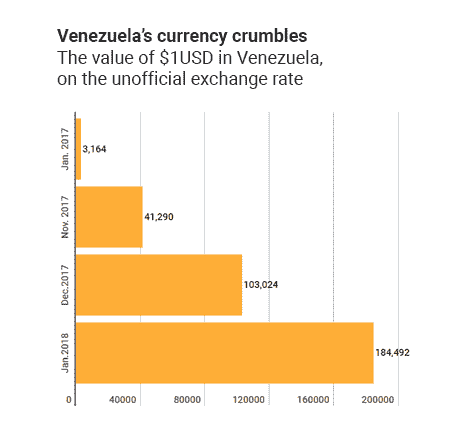

# 在当今的数字时代花钱

> 原文：<https://medium.com/hackernoon/spending-money-in-todays-digital-era-94dec884a8c6>

从世界各地的旅行者到当地市场的购物者，从试图相互汇款的朋友到海外付款的人；我们的生活围绕着花钱和收钱。我们中的许多人都会随身携带一些现金以防紧急情况，所以在这个现代技术时代，我们携带等同于数字的东西是有道理的。在这篇文章中，我们将探索为任何财务状况做准备的最简单的方法，不管你在哪里，也不管你将不得不使用哪种货币。将你的思维转移到数字时代是至关重要的，因为你永远不知道什么时候你会需要比钱包里的一些零钱更多的东西。

能够发送和接收加密货币可以为你打开世界，减少你兑换法定货币的需要和对汇率的担忧。加密货币也将对你的本地生活产生重大影响，为你提供一种保持你的资金[独立于你的国家经济](http://money.cnn.com/2018/01/17/news/economy/venezuela-cash-crisis/index.html)的方式；世界上大部分地区都可以从中受益。

# 支付方式

无论您是想通过区块链支付、使用预装卡支付还是使用可扫描条形码支付，都有多种选择可供您使用，以确保您为未来做好准备。我们花钱的方式正在改变，这种改变带来了更大的便利和可及性，导致费用更低，你最终运气不佳的情况更少。我们将研究三种可以轻松使用加密货币的不同方式。

# 实体卡支付

拥有一张实体卡既方便又安全，它能让你通过自动取款机或直接用它购物来存取你的资金。我们中的大多数人可能已经拥有与银行账户相关联的借记卡，甚至是可以用于日常购物的信用卡。当人们想到加密货币时，他们往往会想到一种存在于区块链或在线交易所的抽象令牌，而不是可以在不改变你的常规习惯的情况下使用的货币。访问您的比特币、莱特币或以太币进行日常交易的技术已经存在，您只需向您的钱包中添加一张新卡。

想象一下，你正在国外旅行，虽然你在国内银行账户里有钱，但你的数字钱包里也有一定份额的 LTC。如果您想从自动取款机中提取一些当地货币，您可以使用您的 [TenX](https://www.tenx.tech/) 卡来访问您的 LTC 资金，提取当地货币，然后通过应用程序锁定您的 TenX 卡，这样即使您丢失了它也是安全的。你不仅可以保持你国内银行账户的安全和隔离，而且还可以省去通常在自动取款机上收取的高额汇率费用。或者，如果你想完全跳过自动取款机和现金处理过程，你可以直接去商户，在接受 Visa 的任何地方使用你的 [Revolut](http://www.revolut.com) 卡访问你的加密货币。

虽然这些都是很好的选择，但 TenX 和 Revolut 是基于既定的法定或不稳定的加密货币，而不是他们自己的硬币；让你成为市场价格变化的奴隶。如果你以一个价格买了 BTC，这可能会很烦人，但当你想花掉它时，你意识到市场已经下跌了一点，你比你“应该”花的多花了 10%，因为市场变了。

克服这一点的最简单的方法是使用一种被设计成价格一致的硬币，几乎可以作为波动性更大的货币之间的中介。比方说，你在价格下跌时买入了 ETH，并乘着上涨的浪潮上涨了 5-10%，干得好！现在，因为这种增长可能是暂时，你可能会想把你的 ETH 换成类似于[fiicoin](https://fiii.io/)的东西，因为它有自己的区块链和更可预测的市场。像 Fiiicoin 这样的东西的真正魅力不在于它基于自己的区块链，而是通过 FiiiPOS 支付的便利性 FiiiPOS 可以处理超过 1500 种不同的加密货币，无论是线上还是线下。

# 使用移动设备支付

如今，我们一周 7 天 24 小时都带着手机，如果你能不再带着钱包，而只带着手机，那不是很吸引人吗？想象一下，在镇上度过一个夜晚会有多方便，用手机订购往返服务，用 NFC 支付晚餐费用，在应用程序中即时接受朋友支付的餐费，而不必担心钱包丢失或被盗。听起来很棒，对吧？

NFC 并不是一项新技术，Apple Pay 等公司已经在利用它让客户只需将手机放在支付终端附近，就能使用信用卡和银行卡支付。Apple Pay 目前使用的技术的一个主要问题是缺乏安全协议，小偷有时可以很容易地使用窃取的信用卡数据，将其上传到 Apple Pay，[并耗尽账户](https://www.forbes.com/sites/thomasbrewster/2016/03/01/apple-pay-fraud-test/#544139eb46c6)。尽管 iPhone 集成了指纹扫描仪，但指纹本身并不直接链接到你的卡，而是链接到卡所连接的 Apple Pay 帐户。这种缺乏安全感是为了换取便利(以及某种程度上银行和信用卡公司的懒惰)，但事情不一定非要这样。

将你的银行账户和主要信用卡链接到 NFC 并不一定是危险的，利用加密货币等中间账户可以增加另一个安全级别，防止你的资金流失。Fiii 应用程序将有能力把你的手机变成一个包罗万象的钱包，不会遭受 Apple Pay 经历的同样的安全漏洞，因为你使用的是初级 Fiii 卡，而不是上传信用卡信息。它将允许你使用 NFC 和代码扫描支付，无论你是支付给朋友还是企业。或者，如果你不是支付业务的人，你仍然需要向支付业务的朋友汇款，在这种情况下，Revolut 将为你们两人提供保险；允许您轻松发送各种货币。货币之间的转换会产生少量费用，通常为 1.5%，但这些费用不会基于地理位置，因此将钱汇往国外就像汇往隔壁一样简单。

这种以极低的费用在国内和国际间转移各种货币的能力使这些应用程序也成为支付员工的理想选择。如果你雇佣一个居住在国外的自由职业者来完成一个平面设计项目，并且不想依靠银行转账或者电汇(这往往费用很高！)，您可以使用当前汇率将他们喜欢的货币发送给他们。无论我们想把钱汇往哪里，现代的方法似乎都收费高，等待时间长。我不知道你怎么想，但是我们不能用自己的钱做我们想做的事情，这种想法有点荒谬。幸运的是，随着更加分散的思维方式在金融界蔓延，这些限制似乎正在松动。

# 网上支付

通过像 [Venmo](http://www.venmo.com) 和 [Paypal](https://www.paypal.com/) 这样的应用向朋友付款很棒，但是我们完全依赖第三方，不仅要验证交易，还要及时转账。最重要的是，这些公司告诉我们每天、每周和每月允许我们发送多少钱，强加了他们任意的限制，迫使我们在想要发送更多金额时使用多种支付方式。如果出了问题，通常要花大量的电子邮件和电话给客户服务来解决所有问题，浪费了本可以更好利用的时间。用区块链取代第三方是一个简单的解决办法，让双方在不必信任对方的情况下达成财务共识。 [TenX](https://www.tenx.tech/) 希望通过 [COMIT](http://www.comit.network/) 网络更进一步，旨在成为区块链生态系统和现实世界之间互动的一站式中心。区块链对普通用户有益，原因如下:

*   交易一旦完成，就无法撤销(不会再有连续几周的费用被神秘地取消或增加)。
*   费用表由机构群体协商一致(而不是基于中介公司的管理费用)达成一致。
*   未经同意，政府不能干涉公民的事务。

特别是在 FiiiPOS 的帮助下，Fiii 可以将您的手机变成蓝牙支付设备，即使您没有 Wi-Fi 或移动数据，也可以在企业中使用。这意味着，当你在国外旅行时，你甚至不必担心国际 SIM 卡或随身携带钱包；Fiii 会掩护你的。除了蓝牙支付，FiiiPOS 还可以通过近场通信(NFC)、代码扫描、全球定位系统和面部识别进行交易。您可以选择交易的安全性，如果您担心资金被盗，可以选择更高的安全性(如面部识别)。或者，如果你更喜欢方便而不是安全，你可以降低设置，使用二维码扫描轻松完成交易。伪造一个二维码显然比复制一张脸容易得多。不过，无论你选择何种方式完成交易，你都可以在区块链上跟踪你的购买和支付情况，确保只有你一个人在花钱。

# 这一切对你意味着什么

在过去的十年里，管理你的钱，你挣钱、储蓄和消费的方式已经发生了巨大的变化。主流技术正迅速与我们的日常生活更加紧密地交织在一起，我们现在正在养成一些习惯，而这些习惯在 10 年前可能是我们做梦也想不到的。这些变化只会继续增加，随着新公司进入该领域寻求开拓市场份额，走在曲线前面可以帮助您节省大量费用。无论你的财务需求是什么，管理它们都应该像发短信或刷卡一样简单。不要仅仅因为新技术对你来说是陌生的就回避它，相反，要寻找新的机会，随着它们在一个肥沃的市场中蓬勃发展，与它们一起成长。

在我们的[博客](https://howtotoken.com/explained/5-ways-the-money-spending-process-is-changing/)中阅读更多关于区块链世界的信息。

## 关于作者:

基里尔·希洛夫——geek forge . io 和 Howtotoken.com 的创始人[。采访全球 10，000 名顶尖专家，他们揭示了通往技术奇点的道路上最大的问题。加入我的**# 10k QA challenge:**](http://twitter.com/kirills4ilov)[geek forge 公式](https://formula.geekforge.io/)。