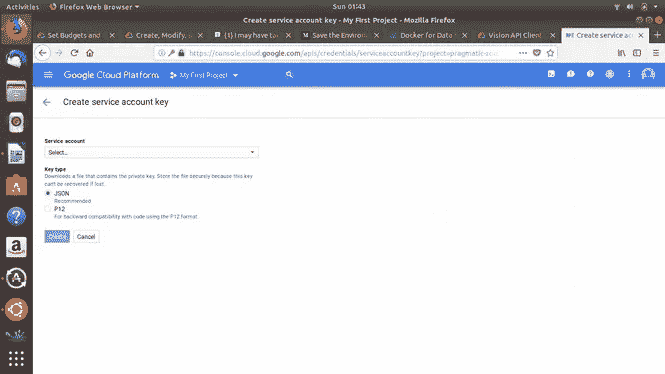
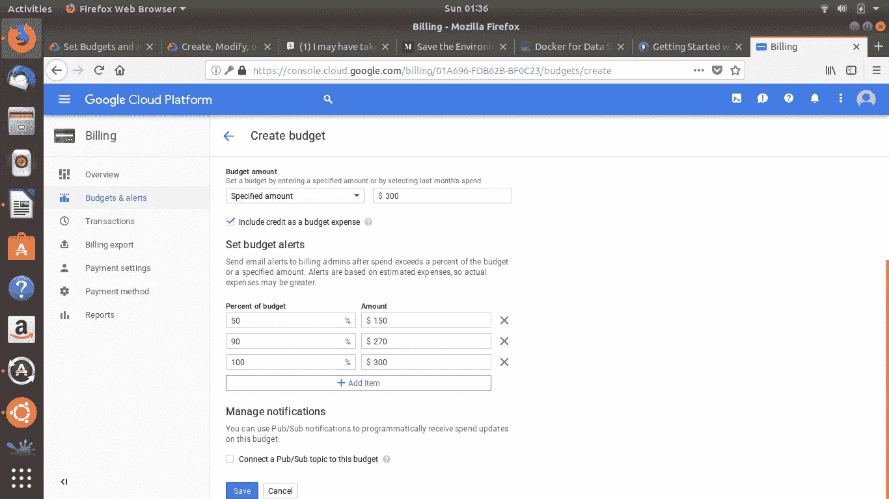
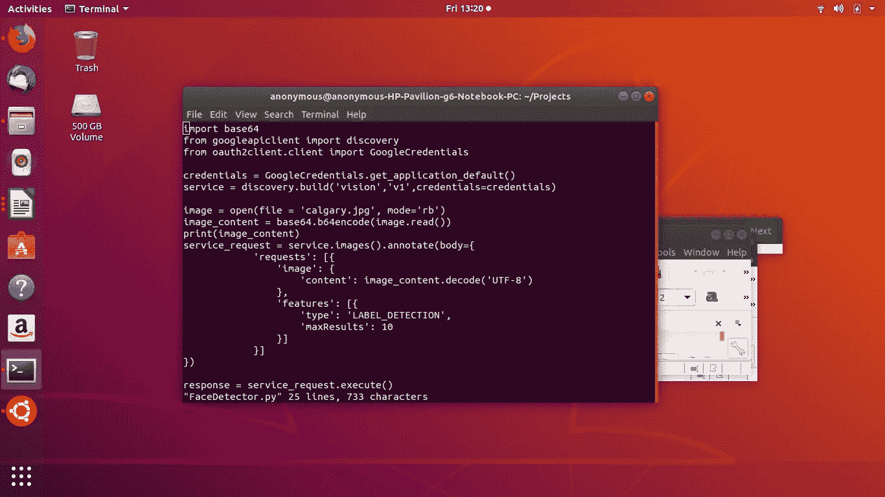
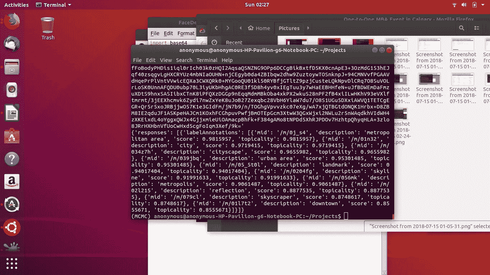
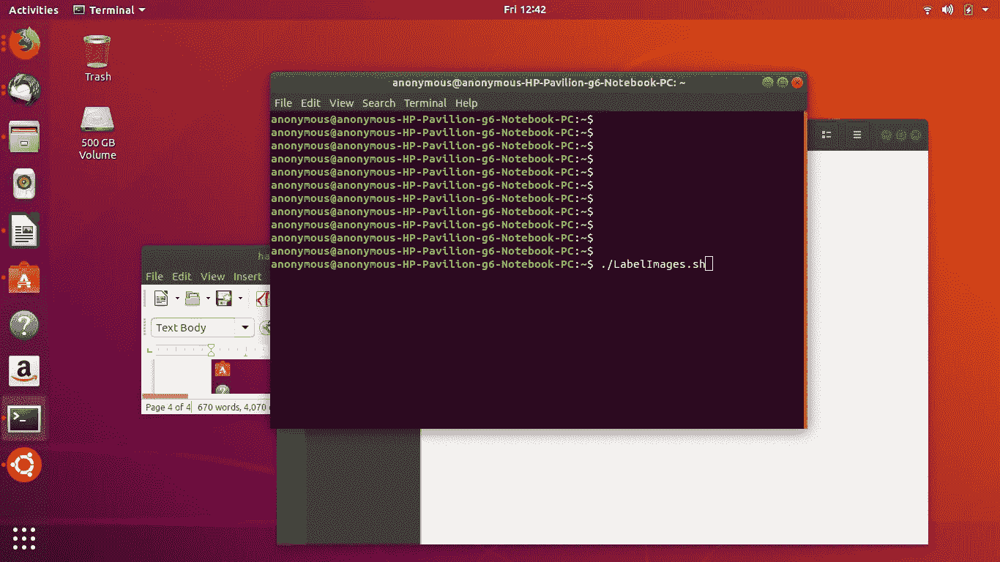
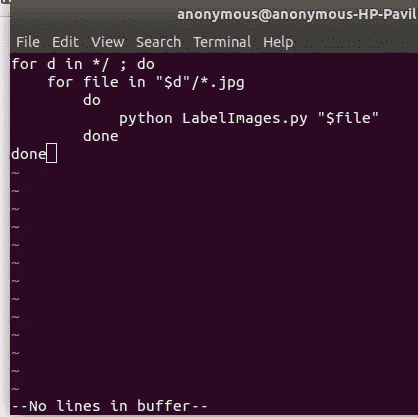

# 用计算机视觉给 Bash 脚本增添趣味

> 原文：<https://medium.com/hackernoon/spicing-up-bash-scripts-with-computer-vision-86d4b9f19247>

戴恩·索维斯托

## 现在的问题是:你有一个目录(或许多目录)充满了图像、视频和其他媒体格式。也许你的旧硬盘里满是你多年前录制的度假照片和视频，你想快速有效地筛选。

## 让我们将问题变得更具挑战性，假设您正在寻找一个非常具体的图像或视频文件，但是您没有时间手动整理所有文件、观看所有视频或搜索所有图像。您希望有一种方法可以编写一个 bash 脚本来帮您做到这一点……好吧，确实有。

计算机视觉如今使用非常强大的面部识别和物体检测算法，这些算法最近在 ML 社区掀起了波澜。在这篇文章中，我将向你展示一种快速而简单的方法，在你自己的应用中使用计算机视觉，而无需了解任何算法。

## **第一步:编写一个 Python 脚本来进行 API 调用**

随着围绕 ML 的所有热情，许多崭露头角的数据科学家都对高级算法着迷，如“LSTM”、深度学习和 oways，以做像对象检测这样的事情。API 调用不仅易于在代码中实现，需要很少的模块/库，而且最重要的是可以在最先进的 ML 模型范围内实现测试数据的目标精度。API 调用也是将计算机视觉集成到您的应用程序中的一种非常灵活的方式，特别是如果您没有诸如超参数调整等复杂主题的实践经验，或者没有资源来训练您自己的计算机视觉算法。

当然，和往常一样，使用 API 调用也有利弊。其中最明显的是 API 调用可能被称为“黑盒”方法，这意味着您放弃了作为开发人员对 API 调用的一些控制。

我打算让自己轻松一些，只使用谷歌云 ML 引擎。这不是免费的，需要积分，但我会使用这个演示免费试用。如果你不想在云中进行 API 调用，你可以用 scitkit-learn 或者 python 中其他成千上万的 ML 库来替换它。

> 谷歌云平台由谷歌提供，是一套云计算服务，运行在谷歌内部用于其最终用户产品的相同基础设施上，如谷歌搜索和 YouTube。

通过使用云作为计算机视觉处理的后端，这是非常资源密集型的(高 CPU 负载和内存使用)，您可以轻松地将您的解决方案移植到任何支持互联网的设备上。这确实是我在云中使用 Google 的秘密原因，我在一台没有 GPU 的旧笔记本电脑上运行这个演示，尽管像迁移学习这样的高级技术可以让我跳过计算密集型的培训步骤，但对于这个演示来说，云提供了完美的解决方案。

谷歌云平台有一个云 ML 引擎，允许你使用 TensorFlow 和 scikit-learn 或 keras 等框架训练[机器学习](https://hackernoon.com/tagged/machine-learning)模型，而不必规划等式的基础设施规模——这是由谷歌为你管理的，你所要做的只是进行一次 API 调用。事不宜迟，让我们记录下这 4 个步骤:

## **步骤 1 创建服务账户**

如果你阅读了 Google 的 Vision API 的文档和教程，你会发现有不止一个选择来认证云。另一个选择是获得一个开发者 API 密匙。然而，这是不安全的，特别是如果你要从生产中进行 API 调用，你会想要一个更持久和安全的解决方案，建议创建一个服务帐户。

认证 **API** 请求。为了向**视觉 API** 发出请求，您需要使用一个**服务帐户**。一个**服务账户**是一个**账户**，属于你的项目，被 **Google** 客户端 **Python** 库用来发出 **Vision API** 请求。

> 创建一个提醒，这样你就不会超出预算

创建服务帐户后，您可以生成一个服务帐户密钥——只是一个 JSON 文件，其中包含您的凭证信息。您应该将它存储在一个安全的文件系统中，并根据最小特权原则设置适当的权限。在生产应用程序中，建议您使用 Google 云存储而不是本地文件系统来存储该文件。

## **步骤二。启用视觉 API**

谷歌云平台要求你在开始使用一项服务之前启用它，像 Cloud Vision API 这样的服务在默认情况下是禁用的。在您的项目中启用 API 可以通过点击下图中 API 库中的“Enable”来完成。

## **第三步。测试您的 API 调用**

我写了一个简单的 [python](https://hackernoon.com/tagged/python) 脚本，名为 LabelImages.py 代码来对 Google cloud 进行 API 调用。你拿回来的数据应该是 JSON。

## **第四步。编写有用的 Bash 脚本**

您可以轻松地编写一个 bash 脚本，为存储在一个目录中的每个图像运行 API 调用(这个目录可能在云上，也可能在您的本地计算机上)。这有许多应用，但我用它来对图像进行分类，并在图像目录中组织/标记文件名，该目录包含从各种来源收集的以多种格式存储的 100，000 多幅图像。我将把创建这个脚本的细节留给您。

当然，您也可以从命令行使用 xargs 将每个文件传输到您的计算机视觉 API 调用，如果您有许多文件，该调用将并行运行。

## **结论**

在四个步骤中，我演示了如何创建一个使用计算机视觉来标记图像的简单实用程序。有趣的计算机视觉应用远比我在一篇博客中所能列出的要多得多。下面给出了一些关于从哪里开始调查的资源。你甚至可以将代码移植到你的支持互联网的 Raspberry Pi 设备上，用谷歌云(或者任何你喜欢的云服务)作为你的处理后端，构建一些非常实用的计算机视觉应用。只要确保设置一个预算和警报，这样你就不会超出预算，因为每次 API 调用都会向你收费。

额外资源

https://cloud.google.com/billing/docs/how-to/budgets

【https://cloud.google.com/docs/authentication/ 