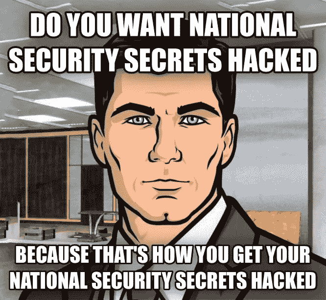
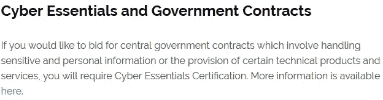
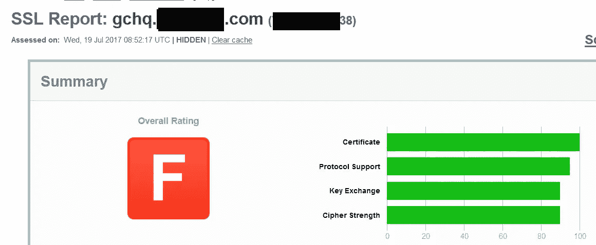
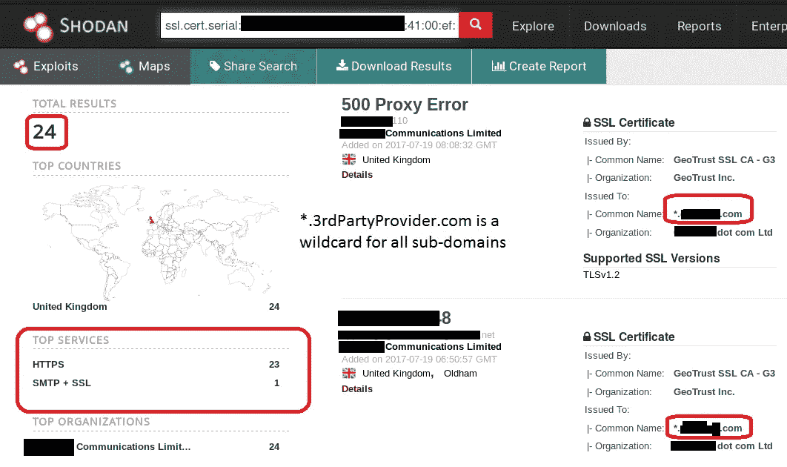
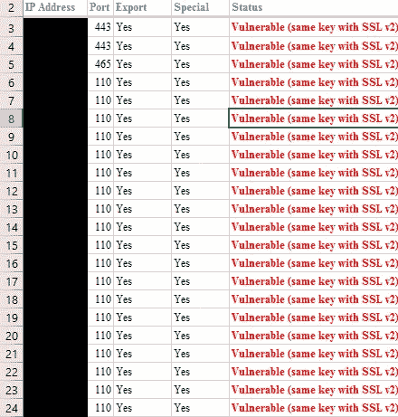
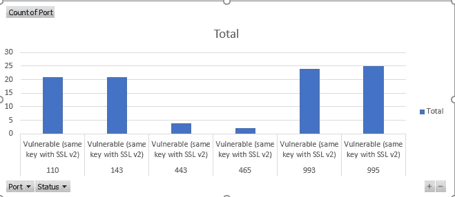
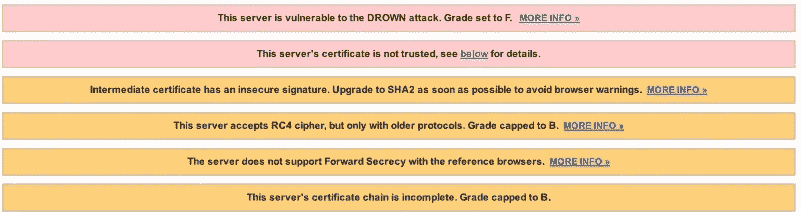
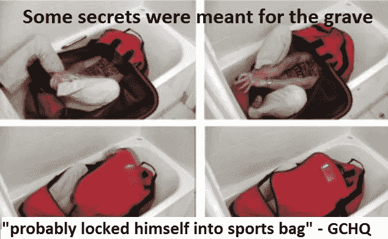

# 像我们这样的间谍

> 原文：<https://medium.com/hackernoon/spies-like-us-4fb3e9030261>

## 第三方提供商很难保护，即使对间谍来说也是如此

Or ants

多年来，我在互联网上收集了各种政府加密证书的总体健康状况的数据。尽管大多数都随着时间的推移有所改进，但它们并不是 100%最新和安全的。可以理解，没有什么是 100%无风险或安全的。然而，有一种感觉。并非基于现实，政府在安全方面会比我们这些凡人做得更好。直到我 5 岁的时候，我都相信有圣诞老人，但那并不意味着他是真实的。

**信息被净化**

目标信息被净化。出于本文的目的，我们将使用 GCHQ.3rdPartyProvider.com 的*来代替真正的第三方提供商。*

*我在许多场合试图通过 NCSC-英国负责任地向 GCHQ 报告这些和其他问题。然而，在新闻媒体的恳求和与英国某部的私下交谈后，NCSC-英国在部长伸出援手后迅速伸出了手。有一个主要问题，信息是敏感的，通过电子邮件发送时必须保证安全。大多数 [CERT](https://en.wikipedia.org/wiki/Computer_emergency_response_team) 类型的组织使用 [PGP 或类似方法来加密电子邮件通信](https://vuls.cert.org/confluence/pages/viewpage.action?pageId=25985026)。NCSC-英国发给我的唯一的 PGP 密钥，用来保护信息。一个两年前过期的 PGP 密钥，来自另一个已解散的组织。以前的英国证书的 PGP 密钥。让我无法负责任地向 GCHQ 透露。*

***新的英国政府第三方网络安全要求***

*像大多数政府机构一样，GCHQ 使用各种第三方来提供一些技术服务。最近，英国启动了一项新计划，以帮助提高必要的网络安全水平，特别是与英国政府有业务往来的公司。Cyber Essentials 计划是 2014 年 10 月 1 日后公布的英国中央政府合同所必需的。所需的计划上层包括技术审查、审计和渗透/漏洞测试。不知道为什么或如何这个特定的技术服务提供商没有被要求成为赛博 Essentials 计划的一部分。但是，这是为什么要审计第三方服务的一个很好的例子。*

**

*The scheme highlights technology products and services*

*GCHQ 的第三方技术服务提供商之一，没有发布 Cyber Essentials 认证。**T3【3rdPartyProvider.com】T5 为英国政府提供服务；以及 22，000 家英国企业。***

**

*Nice, a **Bad** rating posted on their website ;-)*

***GCHQ 正在监听，但加密不太好***

*第三方提供的*GCHQ.3rdPartyProvider.com SSL 证书被评为 F，不及格。由于使用了 [SSL 版本 2](https://en.wikipedia.org/wiki/Transport_Layer_Security#SSL_2.0) ，不完整的证书链和脆弱的加密元素。**

****

**[Qualys SSL report fail](https://www.ssllabs.com)**

**除了一个弱证书之外，服务提供商似乎对其所有 IP 地址使用相同的 ***通配符** HTTPS 和 SMTPS 加密证书。使用 Shodan 中的 SSL 证书序列号，我能够在 24 个不同的 IP 地址上使用相同的序列号快速发现 24 个实例。相同的加密证书出现在整个第三方提供商网络中使用。 ***通配符**可能将所有其他企业暴露给 GCHQ 监听，并将 GCHQ 通信暴露给所有其他 22，000 个企业和 IP 地址。相反，每个人都使用同一个据说是私人的钥匙。不是很私密…**

****

**HTTPS, email SMTPS, * wildcard**

**“通配符证书”( *** wildcard)** 是一种证书，其包含包含“`*`”字符的名称作为可能的服务器名称。详情见 [RFC 2818 第 3.1 节](http://tools.ietf.org/html/rfc2818#section-3.1)。底线:当服务器证书包含`*.example.com`时，它将被客户端接受为任何服务器的有效证书，该服务器的*外观名称*与该名称匹配。[堆叠交换](https://security.stackexchange.com/questions/8210/what-vulnerabilities-could-be-caused-by-a-wildcard-ssl-cert)**

**使用三个基于网络的工具，Shodan.io、Censys.io 和 Qualys SSL labs。结果是一样的，GCHQ 第三方在多达 98 个不同的面向互联网的 IP 地址上使用了完全相同的 ***通配符**加密证书。**

****

**Sanitised IP addresses, too many for a screen shot**

****

**Pivot table by port/service using the same vulnerable SSL key**

****结论****

**GCHQ 第三方加密的主要问题:**

1.  **很难或几乎不可能负责任地向 GCHQ 的 NCSC-英国(英国的证书替代者)报告。**
2.  **第三方提供商为 HTTPS 网络和电子邮件服务使用了相同的弱证书。给客户一种虚假的安全感，并可能相互暴露商业客户和 GCHQ 的敏感数据。**
3.  **为什么 GCHQ 使用第三方加密证书？这意味着第三方和情报机构之间的信任。**
4.  **网络必需品，在哪里？因为技术服务合同不是一般的英国政府合同，所以要求被免除了吗？合同失败了吗？是否故意使用了 ***通配符**？问题依然存在。**
5.  **对于一个直接处理加密的组织来说。第三方利用弱加密算法和元素，如 SHA-1 与 RSA，RC4，与所有 IP。***TLS _ RSA _ WITH _ RC4 _ 128 _ SHA(***`***0x5***`***)TLS _ ECDHE _ RSA _ WITH _ RC4 _ 128 _ SHA(***`***0xc011***`***)等…*****

****

**The warning on all the 98 IP addresses using the same wildcard certificate**

**坦率地说:第三方供应商和技术提供商是最难获得的。这个简单的例子表明，即使是一流的专业人士也面临挑战。没有神奇的网络电缆可以放弃你所有的网络东西，维奥拉，神奇的安全。我没想到会发现一个情报组织的第三方使用了加密 ***通配符**。这些问题是使用基于 web 的搜索和证书检查工具发现的。没有“黑客”，未经授权的访问或解密发生。如果我轻而易举地找到他们，其他国家的超级秘密间谍也可以。最后，我想明确声明: [**我没有运动包**](https://en.wikipedia.org/wiki/Death_of_Gareth_Williams) ，*以防万一* …..:0**

****

**Again, for the record, unlike Gareth Williams. **I do not own a sports bag****

**这篇文章是我即将出版的书《透过镜子看世界》中的一个案例。这本书是基于开源情报收集工具和技术，使用各种情报和政府机构作为目标。这个例子不涉及非法活动(根据荷兰法律)。没有认证或加密的破坏发生。**

**留个鼓掌(或者 **50+** )和 a 请随意评论。**