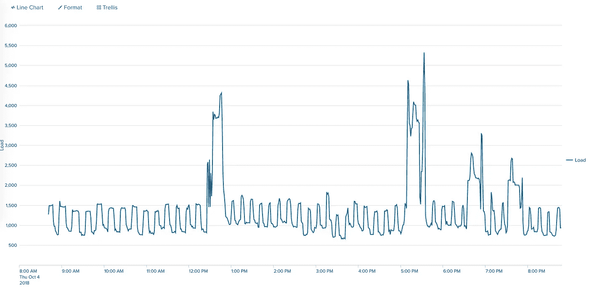

# 劈啪作响的电源

> 原文：<https://medium.com/hackernoon/splunking-power-mains-6620505aa4af>

拿 Splunk，一个无线智能电表，一个 api 接口，会怎么样？挥霍你整个家的电源干线，不要碰任何一根电线！这使得整个房子都可以实时查看所有消耗的功率。唯一的要求是网络上的 raspberry pi、某处的 splunk 实例和插入 pi 的 usb 适配器。

等等，什么是智能电表？最近，主要的电力公司都在四处走动，用新的智能电表取代每个家庭的旧电表。这基本上只是一个 zigbee 功能的电表，允许电源车在街上行驶并快速收集所有读数，而无需抄表员步行挨家挨户。[https://www . comed . com/smart energy/SmartMeterSmartGrid/Pages/for your home . aspx](https://www.comed.com/SmartEnergy/SmartMeterSmartGrid/Pages/ForYourHome.aspx)此页面或类似提供商的页面在识别安装的电表类型时非常有用。然后识别与智能电表兼容的 usb 加密狗，大多数网站都有这些设备的列表。然后订购并通过电力公司注册。一个简单的过程，但它需要文书工作和一些筹备时间。这里将使用的设备是雨林 EMU-2 能源监测装置。【https://www.amazon.com/gp/product/B00BGDPRAI】T4/

有足够的准备时间投入进去。大部分工作将通过 python 脚本完成，该脚本从 usb 适配器读取数据，USB 适配器被认为是 pi 上的一个串行端口。然后，我们将 python 脚本作为一项服务安装在 pi 上，这将允许它在引导时运行，并且容易重启和监控。

python 脚本:

这里有两个需求 pyRaven 和 Splunk_hec_handler，它们可以在这里找到:
[https://github.com/vavarachen/splunk_hec_handler](https://github.com/vavarachen/splunk_hec_handler)
[https://github.com/nonspecialist/pyraven](https://github.com/nonspecialist/pyraven)
Splunk HEC 处理程序也可以在 pypi 中找到，但是在编写 pypi 上的版本时被破坏了，无法在 pip 中安装，转而去寻找源代码，然后执行`python setup.py install`

太好了，我们有了要求和剧本。这个脚本非常简单，它连接到串行端口，当数据流过时，它会监听串行端口并进行解析。这就是 usb 设备的可怕之处，它有查询 api 的选项，但有 4 秒钟的延迟，在此期间，相同的数据会自动吐出，然后再从查询中吐出。坐在那里听消防水管的声音真的很容易。不管怎样，pyraven 库完成了所有的工作，我们正在插入它以获取 json 对象并将其传递给 splunkhec 函数。splunkhec 函数接收数据，附加所需的包装器并发布事件。事件的发布然后由 splunkhec 库处理，因为当我们可以使用库来做这件事时，为什么要重新发明轮子和处理 rest 帖子。这为我们提供了一个加载到 splunk 中的 json 对象。

在我们检查数据后，我们可以看到一个简单的 splunk 搜索，会给我们下图。

> host = gate | time chart avg(event . raw _ demand)as Load span = 1m

服务:为了让 pi 自动运行这个脚本，使用并安装了一个服务模板。该服务假设上面的 emu.py 将存储在`/home/pi/`文件夹中。

好的，下一步是确保 python 脚本是可执行的，然后安装服务模板并让它运行。这些都可以通过下面的代码片段来完成。

这就是它的全部，服务运行 python 脚本并输出一大堆好的数据来玩。一旦获得数据，就有无限的可能性从 splunk 中监控和报告高使用率或异常使用率。

* * *附加信息:(解析需要 JQ)为了将数据导入 splunk，需要一个 HTTP 收集器令牌。使用 curl 生成一个令牌:

链接:

 [## 使用 CLI 管理 HTTP 事件收集器| Splunk

### Splunk 对来自任何应用程序、服务器或网络设备的数据进行实时索引和搜索，包括日志、配置…

dev.splunk.com](http://dev.splunk.com/view/event-collector/SP-CAAAE7D)  [## 雨林自动化/Emu-串行-API

### 这个存储库允许您通过它的串行接口访问雨林自动化 Emu2

github.com](https://github.com/rainforestautomation/Emu-Serial-API)  [## vavarachen/splunk_hec_handler

### Splunk HTTP 事件收集器(HEC)的 Python 日志处理程序。- vavarachen/splunk_hec_handler

github.com](https://github.com/vavarachen/splunk_hec_handler)  [## 非专家/皮拉文

### 与雨林自动化 RAVEn USB 设备的接口-非专业人员/pyraven

github.com](https://github.com/nonspecialist/pyraven)