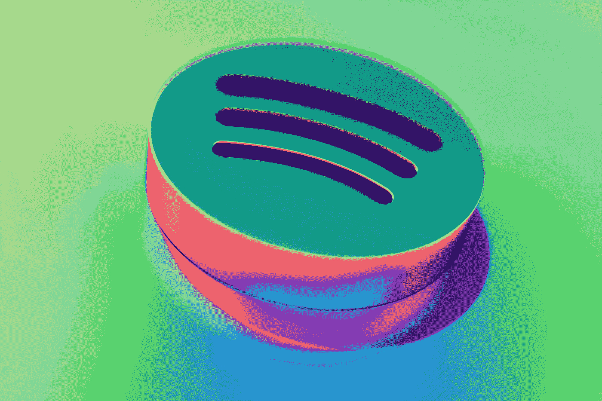

# Spotify、SoundCloud 和价值链上的竞赛

> 原文：<https://medium.com/hackernoon/spotify-soundcloud-and-the-race-up-the-value-chain-ca62c9c85d2>

众所周知，音乐产业是一块难啃的骨头。尽管拥有庞大的消费者网络，Spotify 、 [Soundcloud](https://hackernoon.com/tagged/soundcloud) 以及一系列其他音乐行业初创公司都难以实现盈利。Spotify 的服务拥有惊人的[7000 万用户](https://www.statista.com/statistics/244995/number-of-paying-spotify-subscribers/)，然而它的收入成本仍然是 79% 。从订阅费中获得的每一美元收入，它都必须将其中的 79%支付给唱片公司(以及其他各种费用)。这在很大程度上是由于音乐供应商的定价权。与其他聚合网站相比，Spotify 不得不为其内容支付更多的费用，而且谈判能力更弱。网飞的收入成本仅为 66 %, Zillow 能够强迫其供应商(多家上市服务公司)屈服，因为它们各自为政。另一方面，Spotify 几乎只从 3 家公司获得所有的供应；华纳、索尼和环球。这些公司拥有巨大的谈判能力，直到最近才慷慨地与 Spotify 重新签订合同以降低成本。然而，这种慷慨不能永远依赖，如果 Spotify 想要盈利，最终它将不得不反抗。

# 互联网聚合市场简介

要理解 Spotify 目前所处的位置，有助于了解许多类似市场在互联网繁荣过程中遵循的一般轨迹。随着时间的推移，互联网通过将关键业务流程民主化，打破了传统的竞争壁垒。

Over time markets disrupted by the internet tend towards perfect competition. This does not mean that a market will touch every stepping stone but that rent-seeking behavior becomes more difficult to defend.

旅游业和 AirBNB 就是一个很好的例子。几十年来，旅游住宿业一直处于垄断竞争阶段。最终，AirBNB 所做的是将这些酒店的供应权力民主化，并释放大量被浪费的价值。虽然这个行业还没有完全竞争，但 AirBNB 的崛起让这个行业明显向右移动了。

音乐行业目前处于寡头垄断阶段，因为其定价权的来源尚未分散。AirBNB 通过向市场倾销大量供应扰乱了传统酒店的定价能力，Spotify 将不得不寻找一种方式来民主化唱片公司的核心功能，或者干脆自己成为一家。

# 现在是时候了

有趣的是，Spotify 之前曾在 2016 年年底就收购 SoundCloud 进行过谈判。谈判破裂的原因是，Spotify 认为这会激怒唱片公司，从而对其 IPO 上市产生负面影响。最终，Spotify 似乎把握住了完美的时机。他们最近通过谈判达成了一项协议，以降低成本，并计划在 2018 年完成上市。这种财务定位给了 Spotify 开始真正盈利的余地。有很多方法可以解决这个问题:

1.  **复制网飞**——网飞通过开发自己的节目直接与内容制作商竞争。Spotify 可以采取这种方式，创建自己的唱片公司。坦白地说，我不知道这是否可能。唱片公司和保险公司一样受到保护，风险共担。唱片公司预先与艺人签约，并付给他们一大笔钱以获得未来利润的权利，这就是为什么每笔交易都有风险。这一事实使得简单地“打入”唱片公司市场变得相当困难，尽管 Spotify 的垂直整合可能是拼图的最后一块。
2.  **多元化**——Spotify 已经讨论过拓展其他更有利可图的内容分发形式，如播客和有声书。这将成功利用 Spotify 庞大的用户群，但范围有限。如果 Spotify 在其所有音乐分销上实现盈亏平衡，这将是一个巨大的机会损失，并最终意味着向唱片公司投降。我认为这是最有可能的，因为到目前为止，我们几乎没有看到 Spotify 大胆的战略定位。
3.  收购 SoundCloud——这是我最喜欢的可能性，不为别的，只为它有多么大胆。请原谅我，因为这可能看起来有点牵强，但实际上这是我看到 Spotify 从音乐行业获得一盎司可持续利润的唯一方式。要真正实现盈利，Spotify 别无选择，只能摆脱唱片公司。如前所述，成为一家唱片公司是不太可能的，所以我建议像 AirBNB 一样实现音乐产业的民主化。

# 音云与唱片公司的民主化

Soundcloud 在音乐行业处于独一无二的地位。它的价值主张实际上与网飞或 Spotify 这样的聚合没有任何关系，相反，它似乎是免费音乐的这片奇怪的绿洲。这对 Soundcloud 来说成本很高，而且他们似乎没有办法独自实现大规模盈利。然而，他们确实拥有一种被严重低估的网络效应，这种效应还没有被充分利用。这是 Spotify 一直在寻找的音乐行业去中心化的关键。这里的见解是，音乐人远比其他网络上的内容创作者更强大。网飞可以通过制作自己的节目来复制很酷的电视节目。你不能用同样的方式来设计音乐家(或者至少现在还没有做到)。唱片公司不制作自己的内容，他们从音乐人创造的内容中获取利润，并提供音乐人自己不知道如何表演的辅助服务。凭借 Soundcloud 拥有的音乐创作者网络，他们距离创建自己的 AirBNB(T2)只有一步之遥，他们所需要的只是在这个平台上增加唱片公司的专业人士。

如果 Soundcloud 建立一个支持专业人员的网络，允许服务提供商和音乐家之间直接签订个人合同，这将使每个人的生活更轻松。较低的合同管理费用，更多的个人服务提供商选择他们个人喜欢的行为的自由，以及以创造性控制的形式对艺术家较少的限制。不幸的是，这可能会降低音乐人的谈判能力，这就是为什么 Spotify 在苹果音乐中有竞争是一件好事。

# 结论

事实是，Spotify 是新互联网时代最不赚钱的聚合网站之一。像它的所有前辈(Zillow、网飞、Hulu、脸书等。)它最终将不得不转向制作自己的内容，否则将注定平庸一生。我认为最好的方法是收购 Soundcloud，颠覆唱片公司的业务，但更安全的解决方案是简单地让他们的内容多样化。我们将看到 Spotify 最终决定吞下哪颗药丸。