# 聚焦加密熊市:如何最好地生存

> 原文：<https://medium.com/hackernoon/spotlight-on-the-crypto-bear-market-how-to-best-survive-899943e4e165>

熊市已经让我们痛不欲生有一段时间了。

由于硬币和加密团队花了太多时间查看加密货币图表，我们决定与您分享 3 月至 4 月熊市的一些数据。

作为投资者，你需要知道什么时候买入，什么时候持有。因此，我们决定回答一个关键问题— ***哪种加密货币在熊市中存活得最好？***

让我们找出答案。

***我们将看看加密货币的每一种主要类型以及该类别中的具体硬币。***

[Major Coin Types](https://www.honorablecrypto.com/cryptocurrencies/)

# 案例研究

免责声明——这只是一个有趣的话题，并不构成法律意见。投资风险自担。

我们开始吧。

加密货币的一般类型有 [**【隐私币】****储值币****真币****平台****公用令牌****安全令牌**](https://www.honorablecrypto.com/cryptocurrencies/) 。

我们将关注的熊市是从 3 月初到 5 月初，这是我们在 2018 年看到的最长的熊市。

首先，整个市场发生了什么？以下是所有硬币的总市值。这是威尔将要比较的基线。

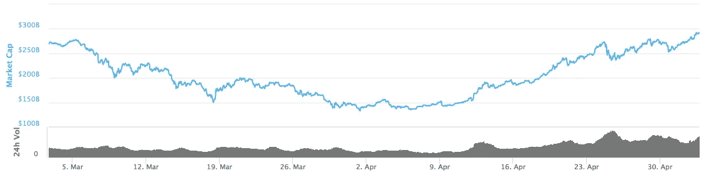

[Total Market Cap](https://coinmarketcap.com/)

## 案例研究#1:隐私币

隐私币是一种加密货币，旨在实现交易的私密性。通过不同的过程，这些硬币能够隐藏发送者/接收者的身份和交易的细节。

隐私币能在熊市中存活多久？让我们以 Monero (XMR)和 Dash (DASH)为例来研究一下，因为它们是两种主要的隐私硬币。

***3-5 月 Monero (XMR)图***

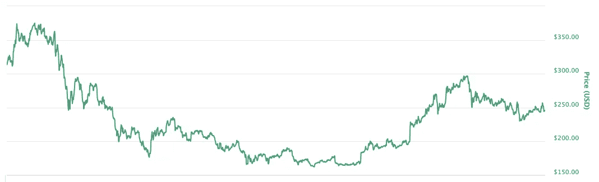

***3-5 月 Dash(破折号)图***

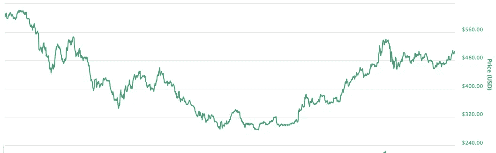

这些图表看起来如此相似，令人难以置信。

我们看到 Monero 和 Dash 都在 4 月中旬受到重创，并在 5 月初反弹。

就他们在熊市中生存下来的能力而言，他们做得相当不错。然而，这些绝对不适合手牌弱的投资者，因为中间的低点对他们来说相当可怕。在这次熊市中，买入下跌股票会让投资者受益匪浅。

## 案例研究#2:价值硬币的储存

价值储存是能长期保持其价值的东西。黄金和农业用地一直被认为是现实世界中的价值储存手段。加密货币之所以合适，是因为它们“防通胀”。

比特币(BTC)是价值储存最主要的例子，以太坊(ETH)是它的补充。我们将使用这两个作为价值硬币存储的例子。

***3-5 月比特币(BTC)走势图***

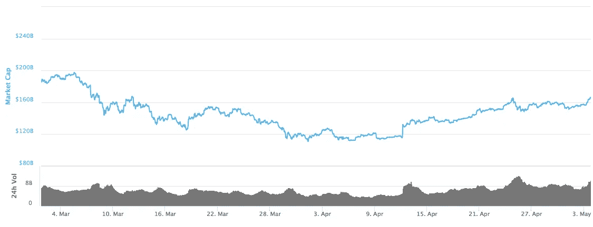

***三月至五月以太坊(ETH)走势图***

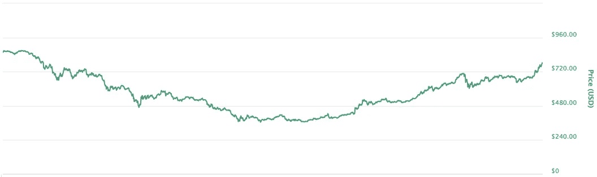

这两个图表实际上看起来也很相似！

从 3 月到 4 月中旬，我们看到了缓慢而稳定的下降。储值硬币的波动性似乎比许多其他硬币要小得多。有可能在整个熊市中，仅仅是品牌价值就让这两者保持了相当高的价值，这意味着“价值储存”正在发挥作用。

以太坊反弹至其进入熊市时的水平，而比特币离这一水平不远。

价值储存看起来非常适合在熊市中生存，尽管没有真正的大幅下跌可买，但它们在这些时候是安全的持有点。

## 案例研究#3:真实货币

真正的货币是加密货币，交易费用低，可扩展性高，非常适合在日常交易中使用。

我们将使用的两种真正的货币是莱特币(LTC)和瑞波币(XRP)。

***3-5 月莱特币(LTC)走势图***

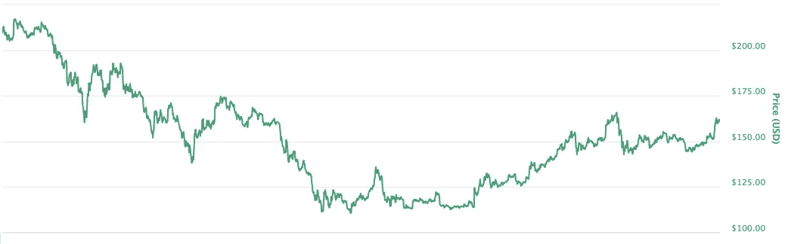

***三月至五月涟漪(XRP)走势图***

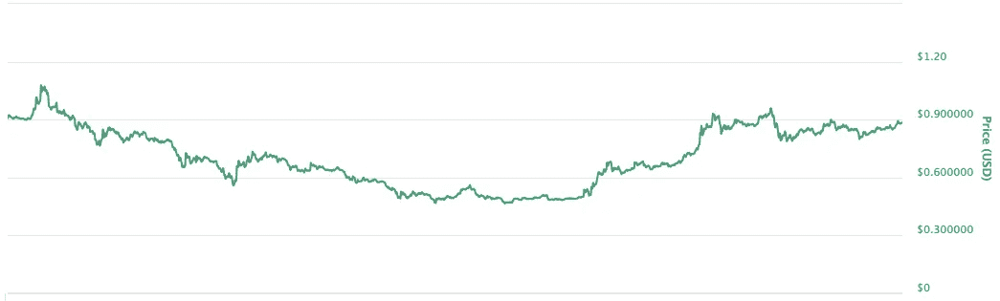

这是前两张看起来完全不同的图表。

对于莱特币，我们看到一个相当急剧的下降，然后逐渐增加到一个离起点还相当远的点。

在 Ripple 中，我们看到了一个与比特币和以太坊非常相似的图表。没有真正的大幅下跌，而是相当强劲和稳定的复苏。

真正的货币似乎是一个大杂烩，也许应该在个案的基础上来看待。这很可能是因为许多真正的货币在做着彼此完全不同的事情。

## 案例研究#4:平台

平台是区块链，其他硬币通过 ICO 建立在其上。以太坊是第一个，也是最大的一个平台的例子。然而，由于以太坊更适合价值储存，我们不会在这里使用它。

为了研究牛市对平台的影响，我们将以恒星流明(XLM)和 Qtum (QTUM)为例。

***三月至五月恒星(XLM)走势图***

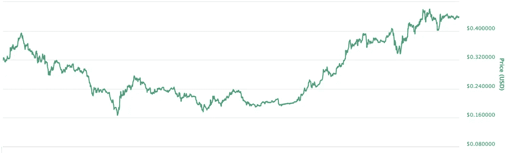

***三月至五月 Qtum (QTUM)图***

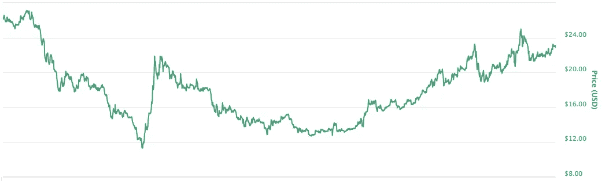

哇，这些图表真有趣！

这两者都有很多高峰和低谷。我们看到 Stellar 和 Qtum 在多个点上都有相当大的下降。

然而，当市场反转时，这两种硬币都有良好的反弹。Qtum 反弹到它开始的地方，Stellar 甚至远远超过了它的起点。

总的来说，我们看到了很多波动，但它们都挺过来了。

## 案例研究#5:实用令牌

[实用令牌](https://strategiccoin.com/ico-101-utility-tokens-vs-security-tokens/)用于平台上的特定用途。你可以把它们想象成应用程序中的货币。

我们将使用的两个实用令牌是 Tron (TRX)和基本注意力令牌(BAT)。

***三月至五月创(TRX)走势图***

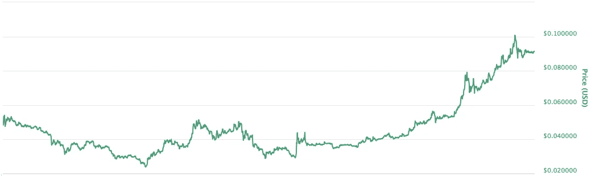

***3-5 月基本注意力 Token (BAT)图表***

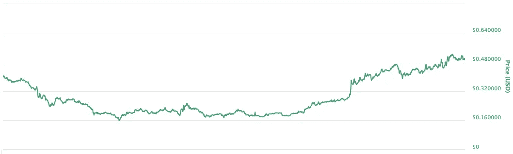

我们在这两张图表中都看到了相当大的波动。

使用创，在牛市的早期会有很大的波动。首先，它迅速下降并恢复，然后再次下降。然而，Tron 的复苏势头强劲，远远超过了它的起点。

以基本的注意力表征，下降比较平稳。它很难在遇到阻力(多次)时保持反弹，使其回到熊市开始时的位置。

这两种硬币都很好地走出了熊市，尽管一路经历了坎坷。

## 案例研究#6:安全令牌

安全令牌不同于实用令牌。安全令牌的价值来自于对价值增长的预期。在一个这样的例子中，NEO 用汽油(另一个令牌)奖励拥有汽油的用户。虽然 NEO 也是一个平台，但这使其资产成为一个安全令牌。

我们将使用 NEO (NEO)和 PIVX (PIVX)作为安全令牌的示例，尽管两者也适用于其他类别。

***三月至五月 NEO(近地天体)走势图***

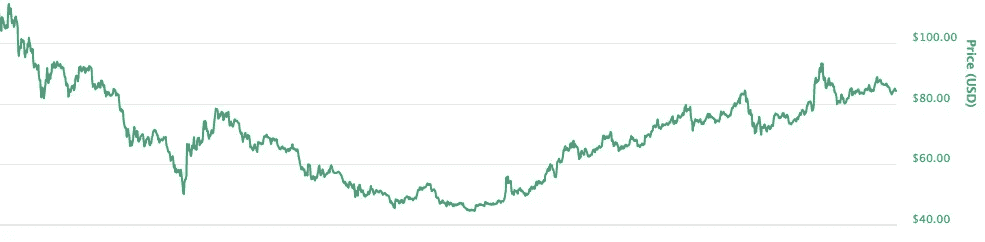

***三月至五月 PIVX (PIVX)图表***

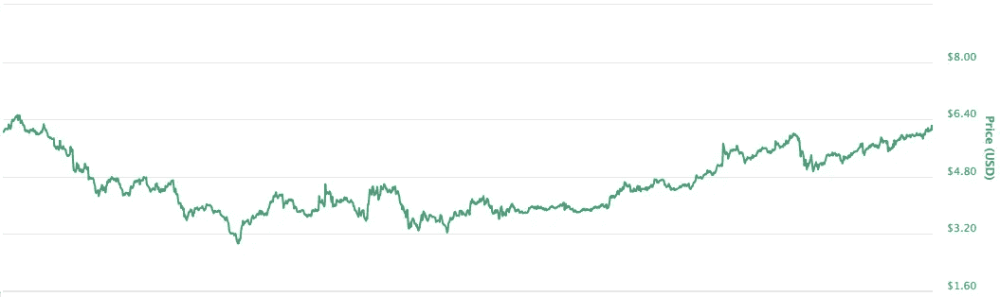

这两者在熊市中都有过相当不稳定的时期。

近地天体在 3 月下旬有一个相当陡的下降，随后是一个跳跃，之后是一个更稳定的下降。

在熊市期间，PIVX 的跌幅更小，整体价格相当平稳。

熊市结束后，两种硬币都稳步上涨。

# 结论

正如我们在上面看到的，有些硬币比其他的更能经受住熊市。

隐私硬币大幅下跌，然后反弹。

价值储存硬币在经济低迷时期最能保值，但缺乏大的反弹。

真正的货币是不可预测的。

平台、公用事业和安全令牌是最不稳定的，但当市场好转时也有最大的反弹。

加密货币有很多好的投资机会，但肯定会有熊市。对熊市的到来做好心理准备可以决定输赢。

## 喜欢这篇文章吗？这里还有一些你会喜欢的东西！

我们开发了一个工具，可以让你同时止盈止损。所以你可以花更少的时间跟踪信号，花更多的时间**得到结果**。
👉[https://signalgroups.com](https://telegram.coinandcrypto.com/medium3)

